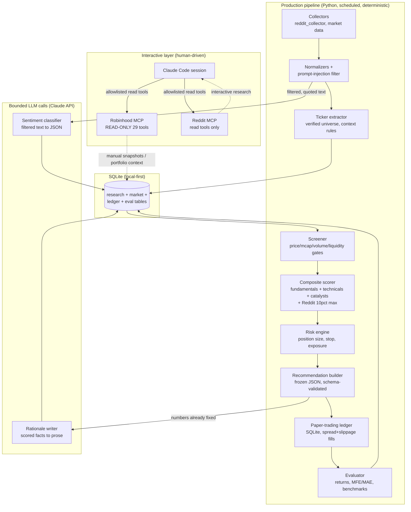

# Agentic Trading Desk

> **Research and paper-trading only. Live trading is not implemented anywhere in this codebase. Not financial advice.**
>
> Local-simulated paper execution is the default. Milestone 11 added an explicit, operator-initiated external paper-execution path limited to Alpaca's paper-trading account only (never a live/production broker endpoint) — it previews and submits real Alpaca **paper** orders, but only when an operator explicitly enables it in configuration and explicitly invokes preview/submit; it is disabled by default, and recurring/scheduled runs never submit externally. See [External Paper Broker (Milestone 11)](#external-paper-broker-milestone-11) below.

A personal AI-assisted stock research and paper-trading desk that combines a **deterministic Python pipeline** (screening, scoring, risk management, paper ledger, evaluation) with **bounded Claude AI reasoning** (sentiment classification, rationale writing) and a **read-only Robinhood MCP** interface for interactive portfolio-aware analysis.

The ruling principle: **Python computes; Claude explains; you decide and approve.**

---

## Table of Contents

1. [Project Overview](#1-project-overview)
2. [Architecture](#2-architecture)
3. [The Three-Pillar Scoring Framework](#3-the-three-pillar-scoring-framework)
4. [Module Reference](#4-module-reference)
5. [Configuration](#5-configuration)
6. [Setup & Installation](#6-setup--installation)
7. [CLI Reference](#7-cli-reference)
8. [Deterministic Scripts](#8-deterministic-scripts)
9. [Paper Trading](#9-paper-trading)
10. [Shadow Operations](#10-shadow-operations)
11. [Security Model](#11-security-model)
12. [Development Milestones](#12-development-milestones)
13. [Testing](#13-testing)
14. [Deployment](#14-deployment)
15. [Guardrails & Non-Negotiables](#15-guardrails--non-negotiables)

---

## 1. Project Overview

This system is designed to:

1. **Discover** stock candidates from the configured universe (sub-$25, growth-oriented).
2. **Analyze** them using fundamentals, technical indicators, catalysts, SEC filings, market conditions, and Reddit discussions.
3. **Score** candidates with a deterministic, explainable composite framework.
4. **Produce** daily watchlist recommendations.
5. **Simulate** trades in an isolated paper-trading ledger with realistic fills.
6. **Measure** recommendation performance over time against multiple benchmarks.
7. **Support** portfolio-aware interactive analysis via Robinhood MCP (read-only).
8. **Gate** any future real trading behind strict human approval, hash-pinned payloads, and statistical validation criteria.



---

## 2. Architecture

The system follows **Option C — Hybrid Architecture** (see [docs/AI-Driven-Stock-Trading-Architecture.md](docs/AI-Driven-Stock-Trading-Architecture.md)):

| Layer | Technology | Role |
|---|---|---|
| Interactive research & development | Claude Code + Robinhood MCP (read-only) | Manual analysis, portfolio-aware Q&A, system building |
| Production pipeline | Python 3.10+ (`src/trading_research`) | Scheduled: collect → screen → score → risk → paper → evaluate |
| Bounded reasoning | Claude API (structured JSON, schema-validated) | Sentiment classification of filtered text; rationale writing |
| Storage | SQLite (local-first, single file) | Audit trail, market data cache, paper ledger, evaluation |
| Risk & order math | Deterministic Python (`risk/` module), unit-tested | Position sizing, stops, exposure — LLM may explain, never set |
| Human approval (future) | Hash-pinned approval records + CLI flow | Required for every real order; auto-invalidated by state drift |

### Why not alternatives?

- **Option A (Claude Code as orchestrator)**: fails on reproducibility, scheduling, cost, and auditability.
- **Option B (pure Python)**: discards the valuable interactive layer for portfolio-aware Q&A.
- **Option D (existing frameworks)**: Backtrader (stalled ~2023), zipline-reloaded (maintenance-only), VectorBT (research adjunct only), LEAN/NautilusTrader (production live-trading engines — wrong posture for this project).

---

## 3. The Three-Pillar Scoring Framework

Each analyzed asset is scored across three independent pillars, each ranging **-2 to +2**, for a total range of **-6 to +6**.

### Pillar 1 — Trend (`scripts/score.py`)

- Price position relative to **EMA 20**
- Structural EMA crossovers: EMA 20 > EMA 50 and EMA 50 > EMA 200
- Slope direction of **EMA 200** (measured 5 bars ago)

### Pillar 2 — Momentum (`scripts/score.py`)

- **RSI-14** using Wilder's smoothing (neutral zone 45–55)
- Sign of the **MACD (12, 26, 9)** histogram
- **TRIX-15** (triple-EMA rate of change) vs. its EMA-9 signal line
- **Bollinger Bands** (20/2σ): `%B >= 1` flags exhaustion (supporting signal only, does not alter score)

### Pillar 3 — Macro-Sentiment (`scripts/macro_pillar.py`)

Cross-asset regime analysis:

| Component | Description |
|---|---|
| RSP/SPY | Market breadth (equal-weight vs. cap-weight S&P 500) |
| 10Y-2Y spread | Yield-curve state (injected from Investing.com) |
| HYG/LQD | Corporate credit risk appetite |
| IWM/SPY | Size factor (small caps vs. large caps) |
| SPY/TLT | Asset preference (equities vs. bonds) |
| XLY/XLP | Sector rotation (cyclical vs. defensive) |
| SPY-TLT correlation | Inflationary regime detector |

Returns a macro score from **-2 to +2**.

### Composite Scoring (Production Pipeline)

| Pillar | Weight | Factors |
|---|---|---|
| Fundamentals | 35% | Revenue growth, earnings trend, margins, FCF, cash/debt, dilution, valuation |
| Technicals/momentum | 30% | Relative strength, price/volume trend, momentum, volatility |
| Catalysts & risk | 25% | Upcoming catalysts, earnings risk, analyst changes, SEC risk flags, macro context |
| Reddit sentiment | **<=10%** | Mention aggregates, growth, engagement — Python-computed, never LLM-counted |

### Decision Outcomes

| Decision | Context |
|---|---|
| `EXIT / TRIM` | Holding — bullish momentum exhausted |
| `EXIT` | Holding — bearish momentum relentless |
| `RE-ENTRY (new cycle)` | Flat — rebound with healthy EMA structure |
| `TACTICAL REBOUND (counter-trend)` | Flat — rebound inside a death-cross (reduced size, tight stop) |
| `HOLD (ride the cycle)` | Holding — trend and momentum positive |
| `HOLD (under review)` | Holding — weak signals, no full exit trigger yet |
| `WAIT (do not chase)` | Flat — healthy trend but no fresh entry trigger |
| `STAY OUT / AVOID` | Flat — relentless bearish, no rebound |
| `HOLD / OBSERVE` or `OBSERVE` | Mixed signals — watch next close |

---

## 4. Module Reference

All production Python code lives in `src/trading_research/`.

```
src/trading_research/
├── analysis/           # Screener, scorer, sentiment aggregation, ticker extractor
├── batches/            # Claude API batch job management
├── collection/         # Reddit collector, prompt-injection filter, market data
├── config.py           # Typed config loader (.env -> Config object, secret redaction)
├── evaluation/         # Per-recommendation and portfolio metrics
├── evidence_providers/ # SEC EDGAR, market data (Alpaca), news, corporate status
├── execution/          # Trade intent validation and paper execution dispatch
├── hashing.py          # Payload hashing for approval integrity
├── logging_config.py   # RedactingFormatter — secrets never appear in logs
├── mcp/                # MCP adapters: Robinhood, Reddit, mock adapters for CI
├── models/             # Pydantic-style domain models
├── paper/              # Simulated ledger (orders, fills, positions, snapshots)
├── paper_books/        # Isolated paper portfolios (BASELINE, ENHANCED books)
├── processing/         # Batch processing pipeline orchestration
├── recommendations/    # Frozen recommendation builder + schema validation
├── reporting/          # Daily watchlist report generator
├── research/           # Scheduled research cycle runner
├── risk/               # position_sizing.py — deterministic, fail-closed risk math
├── runtime/            # LumiBot paper runtime adapter (isolated process)
├── services/           # Shared service helpers
├── shadow/             # Shadow operations: scheduler, health, budget, alerts
├── storage/            # SQLite schema, repositories, migrations, database.py
├── universe/           # Verified ticker universe, ambiguous-symbol list
└── cli.py              # Unified CLI entry point
```

### Key Source Files

| File | Purpose |
|---|---|
| `scripts/indicators.py` | Deterministic EMA, RSI, MACD, TRIX, Bollinger Bands — stdlib only, zero network |
| `scripts/score.py` | Three-pillar scorecard + decision engine |
| `scripts/macro_pillar.py` | Macro regime detector and cross-asset sentiment scorer |
| `scripts/inventory_mcp_tools.py` | MCP tool capability snapshot and classification |
| `scripts/milestone_batch.py` | Claude Batch API job management |
| `src/trading_research/storage/trading_schema.py` | Complete SQLite DDL for all 25+ tables |
| `src/trading_research/risk/position_sizing.py` | Deterministic position size, stop, R:R, exposure; fail-closed |
| `src/trading_research/paper/ledger.py` | Simulated orders/fills with spread + slippage + T+1 settlement |
| `schemas/recommendation.schema.json` | JSON Schema draft-07 for frozen recommendation rows |
| `config/tool_policy.yaml` | MCP tool allowlist/denylist; unknown tool → prohibited |

---

## 5. Configuration

### Environment Variables

Copy `.env.example` to `.env` and fill in locally. **Never commit `.env`.**

```bash
cp .env.example .env
```

| Variable | Description |
|---|---|
| `ANTHROPIC_API_KEY` | Claude API key for bounded reasoning tasks |
| `ANTHROPIC_MODEL` | Model for research (default: `claude-sonnet-5`) |
| `RESEARCH_DATA_DIR` | Local data directory (default: `./data`) |
| `RESEARCH_DATABASE_PATH` | SQLite database path (default: `./data/research.sqlite3`) |
| `REDDIT_CLIENT_ID` / `REDDIT_CLIENT_SECRET` | Read-only Reddit app credentials (anonymous = HTTP 403) |
| `ALPACA_MARKET_DATA_API_KEY` / `ALPACA_MARKET_DATA_API_SECRET` | Market-data read-only credentials |
| `ALPACA_API_KEY` / `ALPACA_API_SECRET` | **Paper-runtime process ONLY** — isolated LumiBot process |
| `ALPACA_IS_PAPER` | Must be exactly `"true"` — anything else fails closed |
| `ALPACA_BASE_URL` | If set, must be exactly `https://paper-api.alpaca.markets` |

> **Do not set** `REDDIT_USERNAME`/`REDDIT_PASSWORD` — leaving them unset keeps the MCP's write tools inoperable.

### YAML Configuration Files (`config/`)

| File | Controls |
|---|---|
| `screening.yaml` | Hard screening gates (price, mcap, volume, OTC, distress flags) |
| `scoring.yaml` | Composite score pillar weights |
| `research.yaml` | Research cycle parameters |
| `evidence_providers.yaml` | SEC EDGAR, market-data, news provider settings |
| `tool_policy.yaml` | MCP tool allowlist/denylist (fail-closed: unknown → prohibited) |
| `shadow_operations.yaml` | Shadow cycle scheduler, budget, pause/kill controls |
| `paper_books.yaml` | Isolated paper portfolios (BASELINE, ENHANCED books) |
| `paper_runtime.yaml` | LumiBot paper-runtime process config |
| `execution.yaml` | Execution parameters |

> All production paper-trading is **disabled by default**. Config alone cannot activate execution — explicit operator activation is always required.

---

## 6. Setup & Installation

### Prerequisites

- Python 3.10+
- macOS (primary; Linux compatible)
- Robinhood account with Agentic Trading access (for interactive analysis)
- Read-only Reddit app credentials (for live collection; mocks work without)

### Install

```bash
# Clone the repository
git clone <repo-url>
cd agentic-trading-desk

# Create virtual environment
python3 -m venv .venv
source .venv/bin/activate

# Install in editable mode (includes dev dependencies)
pip install -e ".[dev]"

# Configure environment
cp .env.example .env
# Edit .env with your credentials
```

### Verify Installation

```bash
# Run all tests offline (no network required)
pytest -q

# Run the score.py self-test with synthetic data
python scripts/score.py
```

---

## 7. CLI Reference

The unified CLI is invoked as:

```bash
python -m trading_research.cli <command> [options]
```

### Research & Analysis

```bash
# Analyze one ticker end-to-end (offline with mocks)
python -m trading_research.cli analyze <TICKER>

# Run the full screening pass
python -m trading_research.cli run-screen

# Show current paper portfolio status
python -m trading_research.cli paper-status

# Run evaluation metrics
python -m trading_research.cli evaluate
```

### Shadow Operations

```bash
# Run a single shadow cycle manually
python -m trading_research.cli shadow-run-cycle

# Check shadow readiness / activation state
python -m trading_research.cli shadow-readiness

# Explain shadow health diagnostics
python -m trading_research.cli shadow-health-explain

# Pause or kill the shadow scheduler
python -m trading_research.cli shadow-pause
python -m trading_research.cli shadow-kill
```

### Paper Books

```bash
# Integrate a research cycle into a paper book
python -m trading_research.cli paper-book-integrate-cycle \
  --cycle-id <id> --experiment-policy BASELINE_ONLY

# Run position lifecycle (exits, stop-loss, profit targets)
python -m trading_research.cli paper-book-lifecycle-run --as-of <ISO-8601>

# Reconcile book state
python -m trading_research.cli paper-book-reconcile --book-id BASELINE
```

### Recurring Paper Scheduler (Milestone 10)

```bash
# Two-step activation (explicit operator action required)
python -m trading_research.cli paper-recurring-request-activation \
  --activation-review-id <id> --operator <name> --reason "<reason>"
python -m trading_research.cli paper-recurring-activate \
  --request-event-id <id> --operator <name>

# Deactivate
python -m trading_research.cli paper-recurring-deactivate \
  --operator <name> --reason "<reason>"

# Enqueue a cycle for processing
python -m trading_research.cli paper-recurring-enqueue-cycle \
  --cycle-id <id> --operator <name> --reason "<reason>"

# Run one scheduler tick (manual invocation)
python -m trading_research.cli paper-recurring-run-once \
  --now <ISO-8601> --owner-id <unique-owner>

# Show scheduler status
python -m trading_research.cli paper-recurring-status
```

### External Paper Broker (Milestone 11)

```bash
# Check external paper account connection
python -m trading_research.cli external-paper-account-check --book-id BASELINE

# Preview a paper order before submission
python -m trading_research.cli external-paper-preview \
  --book-id BASELINE --intent-id <id> --operator <name>

# Submit (explicit operator command only)
python -m trading_research.cli external-paper-submit \
  --book-id BASELINE --intent-id <id> --preview-id <id> \
  --operator <name> --reason "<reason>"

# Inspect or explicitly cancel
python -m trading_research.cli external-paper-order-show \
  --book-id BASELINE --client-order-id <id>
python -m trading_research.cli external-paper-cancel \
  --book-id BASELINE --client-order-id <id> \
  --operator <name> --reason "<reason>"

# Reconcile against external broker
python -m trading_research.cli external-paper-reconcile --book-id BASELINE

# Retry only after reconciliation persisted authoritative NOT_FOUND evidence
python -m trading_research.cli external-paper-retry-submit \
  --book-id BASELINE --intent-id <id> --operator <name> --reason "<reason>"

# Show the submission queue's live, derived status (Milestone 11.1; read-only)
python -m trading_research.cli external-paper-queue-show --book-id BASELINE
```

See `docs/milestone11-1-external-paper-safety-closure.md` for the Milestone
11.1 corrective safety fixes (reservation lifecycle, order-scope leasing,
duplicate-order detection, credential isolation, and more) applied on top of
this integration.

External paper execution is disabled by default, limit/DAY/whole-share only,
and restricted to one configured book per paper account. Credentials never
enable it. The recurring scheduler only queues external-enabled intents as
`AWAITING_OPERATOR_EXTERNAL_SUBMISSION`; it never submits or cancels them.

---

## 8. Deterministic Scripts

These scripts use **Python stdlib only** — zero network dependencies during execution. They are called by the agent during interactive sessions and by the production pipeline.

### `scripts/indicators.py` — Raw Indicators

```bash
python3 scripts/indicators.py input_ticker.json
```

Input format:
```json
{ "close": [100.5, 101.2, 102.0, ...] }
```

Computes: EMA 20/50/200, RSI-14 (Wilder), MACD (12/26/9), TRIX-15, Bollinger Bands (20/2σ), TRIX signal line.

### `scripts/macro_pillar.py` — Macro Sentiment

```bash
python3 scripts/macro_pillar.py macro_input.json --json
```

Input format:
```json
{
  "as_of": "2026-07-02",
  "yield_spread": -0.15,
  "series": {
    "SPY": [450.1, 452.3, ...], "RSP": [152.0, 151.8, ...],
    "IWM": [...], "HYG": [...], "LQD": [...],
    "TLT": [...], "XLY": [...], "XLP": [...]
  }
}
```

Returns a macro score from **-2 to +2**.

### `scripts/score.py` — Three-Pillar Scorecard

```bash
python3 scripts/score.py ticker_input.json        # human-readable table
python3 scripts/score.py ticker_input.json --json  # machine-readable output
python3 scripts/score.py                           # self-test with synthetic data
```

Input format:
```json
{
  "symbol": "AAPL",
  "close": [220.5, 222.1, 221.8, ...],
  "macro_score": 1,
  "holding": true
}
```

---

## 9. Paper Trading

### Design Principles

- **Own ledger, own cash** — SQLite tables track simulated orders, fills, positions, and daily snapshots.
- **No broker interaction** — the paper ledger never touches any broker API.
- **Realistic fills** — next available price after recommendation timestamp (no same-bar look-ahead) + spread/slippage model: `fill = midpoint ± max(half-spread, slippage_bps × price)`.
- **T+1 settlement** — unsettled cash cannot be redeployed; matches real cash-account behavior.
- **Every recommendation preserved** — including ones not acted on (`recommendations.acted = 0`), enabling full-stream evaluation.

### Isolated Paper Books

Two parallel books with independent cash and positions:

| Book | ID | Purpose |
|---|---|---|
| Baseline | `BASELINE` | Standard scoring (no Reddit sentiment) — enabled by default |
| Enhanced | `ENHANCED` | Full composite score including Reddit — disabled by default |

Cross-book verification catches divergence between books.

### Risk Controls (all deterministic — LLM cannot override)

| Parameter | Default | Description |
|---|---|---|
| `max_position_weight` | 10% | Max allocation per position |
| `max_order_notional_usd` | $1,000 | Max single order value |
| `max_daily_new_notional_usd` | $5,000 | Max new capital deployed per day |
| `minimum_cash_buffer_weight` | 10% | Always keep this fraction in cash |
| `max_open_positions` | 20 | Portfolio concentration limit |
| `reject_stale_market_price_seconds` | 900 | Fail closed on stale prices |

### Position Lifecycle

- **Stop-loss**: 8% below entry (configurable)
- **Profit target**: 15% above entry (configurable)
- **Maximum holding period**: 20 market days (configurable)
- **Recommendation reversal exit**: close on score flip

---

## 10. Shadow Operations

Shadow operations (`src/trading_research/shadow/`) add a controlled scheduler layer:

```
explicit activation
  → scheduled wake-up
  → singleton lease acquired
  → preflight gates (pause/kill, budget, market calendar, readiness, alerts)
  → run research cycle
  → health evaluation + alerts
  → budget settlement
  → post-cycle bookkeeping
  → lease released
```

### Health States

```
HEALTHY | DEGRADED | PAUSE_REQUIRED | CRITICAL
```

A `PAUSE_REQUIRED` state automatically suspends the scheduler. Reactivation is never automatic.

### Evidence Completeness Vocabulary

Corporate-status uncertainty uses a six-value vocabulary — never collapsed to a boolean:

- `CONFIRMED` / `NOT_FOUND_IN_SEARCHED_SOURCES` / `UNKNOWN`
- `SOURCE_UNAVAILABLE` / `POINT_IN_TIME_UNSAFE` / `CONFLICTING`

`NOT_FOUND_IN_SEARCHED_SOURCES` is **never** converted to `FALSE`. Absence of evidence is not evidence of absence.

### Scheduler Deployment

Template files are in `deploy/launchd/`. Installation is always a manual operator action.

```bash
# Review the inert launchd template (not installed)
cat deploy/launchd/com.agentic-trading-desk.shadow.plist.example
```

---

## 11. Security Model

### Multi-Layer MCP Permission Defense

The Robinhood MCP has 17 write/order tools that cannot be removed server-side. They are blocked at three independent layers:

1. **`.claude/settings.local.json`** — Claude Code allowlist permits only read tools
2. **`config/tool_policy.yaml`** — fail-closed classifier (unknown tool → prohibited)
3. **No execution code path** — the production pipeline has zero write-tool calls

### Prompt Injection Protection

All external text (Reddit, news, web) flows through `collection/prompt_injection_filter.py`:
- HIGH-risk text never enters LLM context
- All text stored raw with injection-risk annotation
- LLM only receives explicitly-quoted, filtered excerpts
- LLM output is schema-validated JSON (no tool access)

### Credential Safety

- `.env` is gitignored; no real values in `.env.example`
- `RedactingFormatter` scrubs secrets from all logs at the formatter level
- Reddit write tools (`create_post`, `reply`, `edit`, `delete`) stay inoperable without username/password
- Alpaca paper credentials are read only by the isolated `paper_runtime` process — never the main pipeline

### Threat Mitigations

| Threat | Mitigation |
|---|---|
| Prompt injection (Reddit/news) | Injection filter + explicit-quoting + schema-validated LLM output |
| MCP tool poisoning | Allowlist + denylist + version pinning (`npx reddit-mcp-server@1.5.1`) |
| Accidental real orders | No order code in phases 1–10; `real_orders` table has DB trigger that unconditionally rejects all inserts |
| Hallucinated tickers | Verified ticker universe is the only symbol authority; ambiguous words require cashtag or contextual confirmation |
| Stale approvals | TTL expiry + payload-hash invalidation on any state change |
| Duplicate orders | Idempotency keys on all simulated orders |
| Credential leakage | `.env` gitignored + `RedactingFormatter` in all log handlers |
| Dependency compromise | Minimal runtime deps (5 packages); pinned minimums in `pyproject.toml` |

---

## 12. Development Milestones

| Milestone | Status | Description |
|---|---|---|
| **0** — Foundation | ✅ | MCP inventories, tool policy, read-only allowlists, injection filter, config/logging/storage |
| **1** — Deterministic core | ✅ | Ticker universe, screener, scorer, risk engine, recommendation schema, paper ledger, basic eval, CLI |
| **2** — Analysis layer | ✅ | Ticker extractor, sentiment aggregation interface, mock adapters |
| **3** — LumiBot paper integration | ✅ | Isolated LumiBot paper-runtime adapter (separate process) |
| **4** — Isolated paper broker | ✅ | Alpaca paper boundary, book-to-broker isolation, reconciliation |
| **5** — Evidence-backed Claude research | ✅ | Real Claude API structured output, evidence provider integration |
| **6** — Real evidence + continuous evaluation | ✅ | SEC EDGAR, Alpaca market data, news ingestion, benchmark suite |
| **6.1** — Evidence-completeness expansion | ✅ | Corporate status, SEC filing risk, evaluation slicing |
| **7** — Production shadow operations | ✅ | Shadow scheduler, health diagnostics, budget controls, alerts |
| **7.1** — Shadow integration closure | ✅ | Corporate status wired, evidence-completeness in scheduled path |
| **7.2** — Shadow health diagnostics | ✅ | Field-level health checks, diagnostic CLI, activation-readiness |
| **8** — Isolated paper portfolios | ✅ | BASELINE + ENHANCED books, T+1 settlement, cross-book verification |
| **8.1** — Scheduled paper-book integration | ✅ | Scheduled-cycle integration path for paper books |
| **9** — Manual paper soak & lifecycle | ✅ | Stop-loss exits, profit targets, holding-period limits, soak reporting |
| **9.1** — Controlled soak readiness | ✅ | Activation-review evidence, readiness decision |
| **9.2** — Soak evidence integrity | ✅ | Cross-book verification, evidence provenance |
| **10** — Recurring local paper scheduler | ✅ | Controlled recurring scheduler with two-step operator activation |
| **11** — Alpaca paper boundary | ✅ | Manual external paper-broker integration (disabled by default, no live path) |

### Evidence Gate for Real Trading (Phase 4)

Real trading is **structurally unavailable** (`real_orders` table enforced at DB level) until all criteria are met:

- >= 6 months and >= 100 frozen recommendations
- Risk-adjusted outperformance vs. SPY AND vs. random-from-screen distribution
- Max drawdown within configured limit
- Slippage-adjusted profit factor > 1.3
- Stable results across at least two market regimes
- Written risk-review sign-off by the operator

---

## 13. Testing

```bash
# Run full test suite (all offline — no network required)
pytest -q

# Run a specific test category
pytest tests/unit/ -q
pytest tests/integration/ -q

# Short traceback
pytest -q --tb=short
```

### Opt-In Test Markers (skipped by default)

| Marker | Environment Flag | Description |
|---|---|---|
| `external_paper_broker` | `RUN_EXTERNAL_PAPER_BROKER_TESTS=true` + explicit config + Alpaca paper creds | Alpaca paper broker smoke test |
| `claude_api` | `RUN_CLAUDE_RESEARCH_TESTS=true` + `ANTHROPIC_API_KEY` | Real Claude API structured-output smoke test |
| `sec_api` | `RUN_SEC_API_TESTS=true` | Real SEC EDGAR smoke test (no credentials required) |
| `market_data_api` | `RUN_MARKET_DATA_TESTS=true` + Alpaca creds | Alpaca market-data smoke test |
| `reddit_sentiment_real` | `RUN_REDDIT_SENTIMENT_TESTS=true` + Reddit creds | Real Reddit sentiment smoke test |
| `real_shadow_cycle` | `RUN_REAL_SHADOW_CYCLE=true` | Real shadow-cycle smoke test |

### Testing Principles

- Default tests never touch a real broker or Reddit write endpoint; real-paper smoke is separately flagged and explicitly opt-in.
- Every deterministic financial calculation ships with unit tests (boundary cases, property-based checks).
- Mock adapters (`mcp/mock_adapters.py`) replay recorded fixture JSON — full offline CI.
- Schema-validation tests: every JSON producer's output validates against its schema.
- Fail-closed tests: missing/stale inputs must produce `ANALYSIS_INCOMPLETE`, never a default.

---

## 14. Deployment

### Local (Recommended for Phases 1–10)

macOS launchd/cron runs the daily Python pipeline. Zero hosting cost; credentials never leave the machine.

```bash
# Review the inert launchd template (installation is always a manual operator action)
cat deploy/launchd/com.agentic-trading-desk.shadow.plist.example
cat deploy/launchd/run_shadow_cycle.sh.example
```

See `deploy/launchd/README.md` for full installation instructions.

### Robinhood MCP Setup (Interactive Analysis Only)

Configure in your Claude Code MCP settings:
```
URL: https://agent.robinhood.com/mcp/trading
Mode: OAuth (browser authentication)
```

The allowlist in `.claude/settings.local.json` permits only read tools. **Not used as a headless production dependency.**

### Reddit MCP Setup (Live Collection)

Anonymous Reddit API access is blocked (HTTP 403 confirmed). To enable live collection:

1. Go to [reddit.com/prefs/apps](https://www.reddit.com/prefs/apps)
2. Create a "script" app (no username/password needed for read-only)
3. Set `REDDIT_CLIENT_ID` and `REDDIT_CLIENT_SECRET` in `.env`

Pin the MCP version: `npx reddit-mcp-server@1.5.1` in your MCP config.

---

## 15. Guardrails & Non-Negotiables

These rules are enforced at multiple independent layers (code, DB triggers, config, MCP allowlist) and cannot be overridden by any LLM instruction:

1. **No real orders** — `real_orders` table has a DB trigger that unconditionally rejects every INSERT/UPDATE/DELETE. No execution code path exists in phases 0–10.

2. **LLM never computes financial numbers** — Python calculates all indicators, scores, position sizes, stops, and risk limits. The LLM receives pre-computed facts and may explain them; it cannot modify them.

3. **Fail-closed on incomplete state** — any missing or stale critical input (price, buying power, position, earnings date) produces `ANALYSIS_INCOMPLETE` or `NO_ACTION`, never a default or guess.

4. **Mandatory explicit human approval** — every future real order requires a hash-pinned approval referencing exactly one payload hash; no standing instructions, no conversational inference.

5. **Account segregation**:
   - **Agentic** (Cash Account): fast returns, capital rotation, tactical trades — evaluated here.
   - **Individual** (Margin Account): core passive long-term investing — never touched by this system.

6. **T+1 liquidity** — in the cash account, only settled capital counts as buying power before placing buy orders.

7. **Reddit sentiment <= 10%** of composite score — changeable only by backtested evidence via config PR, never at runtime.

8. **Protected positions** — designated tickers (e.g., restricted stock grants) are never evaluated for selling or trimming.

9. **No credentials in source control** — all secrets via `.env` (gitignored) with log redaction via `RedactingFormatter`.

10. **Paper trading first** — real trading remains prohibited until Phase 4 evidence criteria are met, gated by a written risk review.

---

## Claude Code Integration

This repository is configured as a Claude Code skill. See `CLAUDE.md` for project-level instructions and `.claude/settings.local.json` for the read-only MCP tool allowlist.

When you ask Claude to analyze a ticker, review positions, or manage the Agentic account, it will:

1. Fetch data via Robinhood MCP (read-only tools only)
2. Run the deterministic scripts (`indicators.py`, `score.py`, `macro_pillar.py`)
3. Present the three-pillar scorecard with an actionable decision
4. **Never execute orders without your explicit confirmation**

### Example Workflow

```
You: "Analyze AAPL for a potential entry"

1. Data Fetching (Robinhood MCP)
   -> Fetches AAPL daily historicals (~290 bars for EMA 200)
   -> Fetches live quote
   -> Checks for open position -> sets holding = true/false

2. Macro Pillar (once per session, shared across tickers)
   -> Fetches historicals for 7 ETFs: SPY, RSP, IWM, HYG, LQD, TLT, XLY, XLP
   -> Retrieves 10Y-2Y yield spread from Investing.com
   -> Runs: python3 scripts/macro_pillar.py -> macro_score (-2 to +2)

3. Ticker Scoring
   -> Assembles JSON with {symbol, close, macro_score, holding}
   -> Runs: python3 scripts/score.py -> three-pillar scorecard + decision

4. Qualitative Context (reinforcement only — does not alter scores)
   -> News and macro context from Investing.com
   -> Analyst consensus and price targets from Google Finance

5. Presentation and Confirmation
   -> Returns: Scorecard, flags, and suggested action
   -> You review and confirm before any order execution
```

---

## Documentation Index

| Document | Description |
|---|---|
| `docs/AI-Driven-Stock-Trading-Architecture.md` | Full system architecture (25 sections) |
| `docs/AI-Stock-Trading-Implementation-Plan.md` | Milestones, epics, stories, acceptance criteria |
| `docs/AI-Stock-Trading-Research-Sources.md` | Research sources and reliability assessments |
| `docs/adr/` | Architecture Decision Records (0001–0006) |
| `docs/runbooks/` | Operational runbooks (shadow, paper books, incident response) |
| `docs/milestone*.md` | Detailed milestone implementation guides |
| `deploy/launchd/README.md` | macOS launchd deployment guide |

---

*Research and evaluation only. Not financial advice. Live trading is not implemented. External order preview/submission, when present, is limited to an explicitly operator-enabled Alpaca **paper**-account path (disabled by default) — see the safety banner at the top of this file.*
