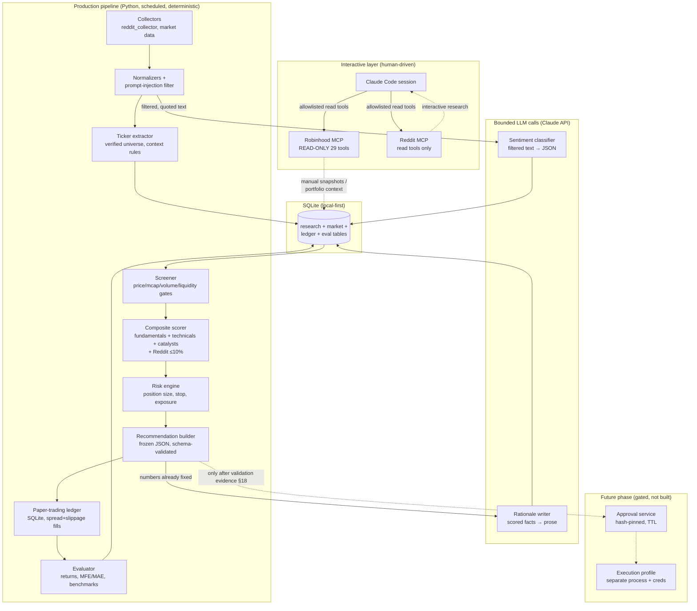

# AI-Driven Stock Trading Architecture

**Date:** 2026-07-11
**Status:** Recommended architecture (research complete; paper-trading phase not yet started)
**Scope:** Stock research → deterministic screening/scoring → paper trading → (much later, gated) human-approved real trades
**Hard rule:** Nothing in this document authorizes placing, previewing, preparing, or submitting a real order.

> Not financial advice — for research and evaluation only.

---

## 1. Executive summary

The safest, most effective, and most maintainable design is a **hybrid architecture (Option C)**:

- **Python is the production system.** All data collection, normalization, screening, scoring, risk math, paper-trade simulation, storage, and evaluation are deterministic Python with unit tests. The LLM never computes a number that Python can compute.
- **Claude Code is the development and manual-analysis interface**, not the production orchestrator. It is excellent for interactive, portfolio-aware research sessions using the Robinhood MCP (read-only) and for building/debugging the Python system — but interactive LLM sessions are not reproducible, schedulable, or cheap enough to be the daily production loop.
- **The Claude API is used for bounded reasoning tasks only** (summarizing filtered Reddit/news text, writing the natural-language rationale for a scored candidate), always with validated JSON output and never with authority over numbers, risk limits, or orders.
- **Robinhood MCP is used read-only** for portfolio-aware analysis and interactive market data. Its 17 write/order tools are denied at three layers (Claude Code permission allowlist, `config/tool_policy.yaml` classifier, and no execution path in the Python code).
- **Reddit is a supplementary signal, capped at 10% of the composite score**, computed deterministically in Python from stored raw records — never by the LLM reading raw feeds, and always treated as untrusted, injection-capable input.
- **Paper trading comes first** with its own SQLite ledger, frozen recommendations, realistic fills (spread + slippage), and a benchmark-based evaluation framework. Real trading remains prohibited until explicit statistical evidence criteria are met (§18, §25).

Key environment findings that shaped this: the official Robinhood MCP has **no paper-trading mode** and its write tools cannot be removed server-side; the configured Reddit MCP (jordanburke/reddit-mcp-server) is healthy but **anonymous Reddit API access is blocked (HTTP 403)** from this environment, so a registered read-only Reddit app credential is required for live collection.

---

## 2. Recommended architecture

**Option C — Hybrid**, with these components:

| Layer | Technology | Role |
|---|---|---|
| Interactive research & development | Claude Code + Robinhood MCP (read-only) + Reddit MCP (read-only) | Manual deep dives, portfolio-aware questions, building and debugging the system |
| Production pipeline | Python 3.10+ (this repo, `src/trading_research`) | Scheduled collection → screening → scoring → paper trades → evaluation |
| Bounded reasoning | Claude API (structured JSON output, small models for classification, larger for synthesis) | Sentiment classification of filtered text; rationale writing for already-scored candidates |
| Storage | SQLite (local-first), single file per concern | Audit trail, market data cache, Reddit records, paper ledger, evaluation results |
| Risk & order math | Deterministic Python (`risk/` module), unit-tested | Position size, stops, exposure, concentration — LLM may explain, never set |
| Human approval (future phase) | Hash-pinned approval records with TTL in SQLite + CLI confirmation flow | Required for every real order; auto-invalidated by state drift |

Why not the alternatives, briefly (full comparison in §9):

- **Option A (Claude Code as production orchestrator)** fails on reproducibility, scheduling, cost, and auditability. An interactive LLM session as the daily loop means every run is different, token costs scale with data volume, and the audit trail is a chat transcript rather than structured records.
- **Option B (pure Python service)** is close, but discards the genuinely valuable interactive layer: portfolio-aware Q&A through the Robinhood MCP and fast iteration in Claude Code. Option C keeps B's production core and adds A's strengths where they are safe.
- **Option D (adopt an existing framework)** — no evaluated framework fits. This repo's upstream (Oft3r/agentic-trading-desk) is a skill + three deterministic scripts, not a pipeline; Backtrader is in maintenance stall since ~2023; zipline-reloaded is maintenance-only; VectorBT is a research accelerator (useful later, §18), not an application skeleton; LEAN/NautilusTrader are production-grade but heavy and oriented to live execution — the wrong default posture for this project.

---

## 3. Architecture diagram

Solid arrows exist in phase 1–2. Dashed arrows are either manual (Claude Code snapshots) or a later gated phase (approval/execution).

---

## 4. Component responsibilities

| Component | Responsibility | Must NOT do |
|---|---|---|
| Collectors (`collection/`) | Fetch Reddit records (via MCP adapter or Reddit API), market data; store raw JSON with timestamps | Interpret content; call any write tool |
| Normalizer + injection filter (`collection/prompt_injection_filter.py`) | Annotate untrusted text with injection risk; normalize records to schemas | Delete/rewrite source text; act on embedded instructions |
| Ticker extractor (`analysis/ticker_extractor.py`) | Match cashtags/symbols against a verified universe with context rules for ambiguous symbols (AI, IT, ON, ALL, SO, A, FOR, ARE…) | Guess tickers; accept LLM-proposed symbols without universe validation |
| Screener (`analysis/screener.py`) | Apply configurable hard gates (price < $25, min mcap, min dollar volume, OTC exclusion, distress/dilution/going-concern flags) | Rank; make exceptions |
| Scorer (`analysis/scorer.py`) | Compute explainable composite score from stored factors; Reddit component capped at 10% | Use unverified data; let LLM adjust weights at runtime |
| Sentiment aggregator (`analysis/sentiment.py`) | Deterministic counts/rates/windows over classified records (mentions, unique authors, growth, engagement weighting, duplicate/promo detection) | Let the LLM count or aggregate |
| Risk engine (`risk/position_sizing.py`) | Position size, share quantity, stop, target, R:R, dollars at risk, concentration, exposure caps; fail closed on any missing input | Accept LLM-supplied sizes/stops; proceed with unknowns |
| Recommendation builder | Emit schema-validated, frozen recommendation JSON with data timestamps, score breakdown, model/prompt versions | Rewrite history; omit uncertainty |
| Paper ledger (`paper/ledger.py`) | Simulated orders/fills with spread + slippage assumptions, cash settlement (T+1), positions, snapshots | Touch any broker API |
| Evaluator (`evaluation/`) | 1/5/20-day returns, MFE/MAE, stop/target triggering, win rate, profit factor, Sharpe/Sortino, drawdown, benchmark comparisons | Look-ahead reads; retroactive edits |
| LLM tasks (Claude API) | Classify filtered text sentiment → JSON; write rationale from already-computed facts | Compute indicators, sizes, scores; see raw untrusted text unwrapped; call tools |
| Claude Code (interactive) | Development, debugging, manual portfolio-aware analysis via read-only MCPs | Be the scheduled production loop; call write tools |

---

## 5. Claude Code's role

1. **Development interface** — building and maintaining the Python system (this is where it is unambiguously the right tool).
2. **Manual analysis console** — "how is my portfolio positioned vs. this watchlist?", one-off deep dives on a ticker, using the read-only Robinhood MCP tools plus the repo's deterministic scripts (`scripts/indicators.py`, `scripts/score.py`, `scripts/macro_pillar.py` per `CLAUDE.md`).
3. **Not the production orchestrator.** Reasons: sessions are non-reproducible (same prompt ≠ same tool sequence); no native reliable scheduling; every daily run pays full LLM token cost over data that Python processes for free; audit trail is conversational rather than structured; permission prompts and context limits make unattended runs fragile. Community and vendor guidance on agentic HITL systems consistently separates the interactive agent from the scheduled deterministic loop (see Research Sources doc, S8).

Claude Code's permission system is also a **safety layer**: `.claude/settings.local.json` allowlists only read-only Robinhood tools, so even an instruction-injected session cannot invoke `place_equity_order` without an explicit interactive permission grant.

## 6. Robinhood MCP's role

Confirmed facts (live tool inventory captured 2026-07-11, `research-input/robinhood-tools.json`):

- Official hosted MCP at `https://agent.robinhood.com/mcp/trading`, OAuth-authenticated, 46 tools: 29 read, 17 write/order.
- Read tools cover accounts, positions, portfolio, P&L, tax lots, orders, quotes, historicals, fundamentals, technical indicators, tradability, earnings calendar/results, indexes, options chains/quotes, watchlists, scans, search.
- **No paper-trading tools.** Robinhood's Agentic Trading product routes agent-placed real trades into a dedicated "Agentic account"; reads span all accounts. Agents *can* be configured to trade without per-trade confirmation — a capability this architecture explicitly refuses to use.
- Write tools cannot be removed server-side; restriction must be client-side.

**Recommended usage:** account integration (positions, buying power, P&L for portfolio-aware analysis) **and** interactive market data (quotes, historicals, fundamentals, earnings calendar) in Claude Code sessions. For the *scheduled production* pipeline, do not build a hard dependency on the Robinhood MCP: it is OAuth/interactive-session-bound, rate limits are unpublished, and headless token refresh is not a supported integration path. Production market data should come from a stable programmatic source (see §19 and Open Questions §24); Robinhood MCP data manually snapshotted from sessions is fine as an interim cache.

## 7. Reddit MCP's role

Confirmed facts: the configured server is `jordanburke/reddit-mcp-server` v1.5.1 (stdio via `npx`), 23 tools (17 read / 6 write). Health check passes, but **every real Reddit API call returns HTTP 403 in anonymous mode from this environment** (verified live 2026-07-11, twice, in separate sessions). A registered Reddit app (`REDDIT_CLIENT_ID`/`REDDIT_CLIENT_SECRET`, no username/password needed for read-only) is required before any live collection works.

**Role:** read-only retrieval of posts/comments for (a) interactive research in Claude Code and (b) the production collector via the existing stdio adapter (`src/trading_research/mcp/reddit_adapter.py`). All retrieved text is untrusted input: it flows through the injection filter and is stored raw; deterministic Python computes every count and rate (§15); the LLM only ever sees filtered, explicitly-quoted excerpts for sentiment classification.

## 8. Comparison of Reddit MCP implementations

| Criterion | jordanburke/reddit-mcp-server (configured) | adhikasp/mcp-reddit | Stock-specific Reddit MCP | Custom read-only MCP (PRAW) |
|---|---|---|---|---|
| Search quality | Full search: subreddit scoping, 5 sorts, time filters, pagination (`after`), limit ≤100 | Minimal — hot threads focus; search not documented | None found with meaningful adoption during research | Whatever we build (Reddit API caps apply) |
| Comment coverage | `get_post_comments` ≤500 + `get_more_comments` | Basic post + comments | — | Full via PRAW |
| Structured output | Text-formatted results (parseable, not JSON) | Text | — | Exactly our schemas |
| Maintenance | Active; v1.5.1 Jul 2026; 182★; MIT; TypeScript | 16 commits, no releases; 413★; MIT; Python | — | Ours to maintain |
| Auth | Anonymous tier advertised (~10 req/min) but **403 in practice here**; client id/secret → 60–100 req/min | Reddit API creds via env | — | Reddit app creds |
| Read-only operation | Read tools work without user/pass; 6 write tools exist → deny-listed client-side | Read-only by design | — | Read-only by construction |
| Injection risk | Same as any Reddit content — content-level, not tool-level | Same | — | Same, plus we control wrapping |
| Deterministic processing fit | Moderate (text parsing needed) | Weak | — | Best |
| Verdict | **Keep** for interactive + adapter-driven collection | Not recommended — less capable, less maintained | N/A | **Defer** — not justified yet |

**Recommendation:** keep the configured `jordanburke/reddit-mcp-server` with read-only credentials (client id/secret, no username/password so write tools stay dead). Do **not** build a custom MCP now. If phase-2 mention analytics need higher volume or true JSON output, add a small **direct PRAW collector inside the Python pipeline** (not an MCP — the production pipeline doesn't need the MCP indirection; MCP value is in the interactive layer).

## 9. Comparison of architecture options

| Criterion | A: Claude Code orchestrator | B: Python service + Claude API | C: Hybrid (recommended) | D: Existing framework |
|---|---|---|---|---|
| Simplicity | High initially, degrades | Medium | Medium | Low (adaptation cost) |
| Reproducibility | Poor — nondeterministic sessions | Strong | Strong (production path = B) | Varies |
| Scheduling | Weak (interactive; cron via wrappers is fragile) | Native (cron/launchd) | Native | Varies |
| Cost | High — LLM tokens on every step | Low — LLM only where needed | Low | Varies |
| Auditability | Chat transcripts | Structured DB records | Structured DB records | Varies |
| Session persistence | Context limits | N/A | N/A | N/A |
| Interactive portfolio research | Excellent | None | Excellent (kept) | None |
| Testing | Hard | pytest | pytest | Framework-dependent |
| Security posture | Permission allowlist only | No MCP exposure in prod | Layered (allowlist + policy + no code path) | Unknown assumptions about live trading |
| Daily automation fit | Poor | Good | Good | Varies |

**Option D detail:** Oft3r/agentic-trading-desk (this repo's upstream) provides a good skill pattern and three solid deterministic scripts but no pipeline, tests, DB, or ledger — we extend it rather than adopt something else. Backtrader: maintenance stalled since ~2023. zipline-reloaded: maintained but maintenance-only; Pipeline API attractive for factor research, heavy elsewhere. VectorBT: excellent vectorized backtesting for *strategy research*, recommended as a phase-3 adjunct, not the application skeleton. LEAN/QuantConnect and NautilusTrader: production live-trading engines; adopting one now would import live-execution complexity and assumptions exactly where this project needs a read-only posture. (Sources: Research Sources doc, S7.)

## 10. Data flow

Daily production cycle (all times recorded in UTC, all rows immutable once written):

1. **Collect** — Reddit records for configured subreddits/queries (via MCP adapter with read-only creds, or PRAW later); market data snapshot (prices, volume, fundamentals) from the configured market-data source; earnings calendar. Every record stored raw with `retrieved_at`, source id, and dedup key.
2. **Normalize + filter** — injection annotation on all text; dedup (posts, cross-posts, repeated links); ticker extraction against the verified universe with context rules.
3. **Screen** — hard gates produce the day's candidate set from the universe. Gates and thresholds come from `config/screening.yaml`, never from the LLM.
4. **Enrich** — deterministic indicators (existing `scripts/indicators.py` logic), fundamental factors, catalyst flags (earnings proximity), Reddit aggregates (§15).
5. **Classify (LLM, bounded)** — batches of filtered, quoted Reddit excerpts → sentiment JSON (schema-validated, retried on invalid). Skipped entirely if no new text.
6. **Score** — composite score with published weights; every factor value and weight stored in `recommendation_factors`.
7. **Risk** — for each candidate above threshold: position size, stop, target, R:R from the risk engine. Any missing input (price staleness, unknown earnings date, missing buying power in paper account…) → `ANALYSIS_INCOMPLETE`, recorded, no recommendation.
8. **Recommend** — frozen JSON recommendation rows (schema `schemas/recommendation.schema.json`), including *not-acted-upon* candidates.
9. **Simulate** — paper ledger executes eligible recommendations at next-available price with spread/slippage model; records fills, cash settlement (T+1), positions, daily snapshot.
10. **Evaluate** — rolling metrics vs. SPY, equal-weight basket, random-from-screen baseline, and a simple technical baseline (§18).
11. **Report** — daily watchlist markdown generated from DB rows (LLM writes prose *from* the frozen numbers, never new numbers).

## 11. Security model

Threats and mitigations (full threat list from the requirement is covered; grouped):

| Threat | Mitigation |
|---|---|
| Prompt injection from Reddit/news/web | Injection filter annotates all text (`prompt_injection_filter.py`); HIGH-risk text never enters LLM context; everything else enters only as explicitly-quoted data blocks; LLM outputs are schema-validated JSON with no tool access |
| MCP tool poisoning / malicious server updates | Treat MCP servers as third-party code (pin versions: `npx reddit-mcp-server@1.5.1`); capability inventory snapshot diffed on change (`scripts/inventory_mcp_tools.py`); official Robinhood endpoint only |
| Excessive MCP permissions | Three layers: Claude Code allowlist (read tools only), `config/tool_policy.yaml` fail-closed classifier (unknown tool ⇒ prohibited), production code has no write-tool call path at all |
| Accidental real orders | No order code exists in phases 1–2; Robinhood write tools denied; future execution requires a separate process, separate credentials, and hash-pinned approvals (§12) |
| Duplicate orders | Idempotency keys on simulated (and any future real) orders; ledger uniqueness constraints |
| Stale approvals | TTL expiry + payload hash invalidation on any price/quantity/account-state change (§12) |
| Credential leakage | `.env` (gitignored) + `RedactingFormatter` scrubs secrets from all logs; no credentials in source control; **action item:** remove the stale user-scope reddit MCP entry in `~/.claude.json` that contains plaintext Reddit credentials for a deleted directory |
| Robinhood session compromise | OAuth scoped token (never raw credentials); read-only allowlist limits blast radius; Agentic-account isolation limits any future write exposure |
| Hallucinated tickers / symbol collisions | Verified ticker universe is the only symbol authority; ambiguous common-word symbols require cashtag or contextual confirmation (§15) |
| Tool-output manipulation / partial failures | Fail-closed: missing or stale critical state ⇒ `ANALYSIS_INCOMPLETE` / `NO_ACTION`; freshness timestamps checked before every risk calculation |
| Data-source outages | Same fail-closed behavior; incidents recorded in `errors` table; no silent fallback to stale data |
| Logging sensitive account info | Redaction formatter + policy: summaries describe positions qualitatively, never reproduce account numbers/balances |
| Dependency compromise / typosquatting | Minimal dependency set (5 runtime deps); pinned minimums in `pyproject.toml`; new deps require review; no global installs |
| Malicious repository instructions | `CLAUDE.md`/`SKILL.md` are version-controlled and reviewed; external content cannot modify them |

Real-world grounding: the mid-2025 Supabase/Cursor injection incident and the first malicious MCP package (Sept 2025) are documented in the Research Sources doc (S6) — these are not theoretical risks.

## 12. Human-approval workflow (future real-trading phase — design only)

1. Pipeline emits a **trade proposal**: ticker, side, quantity, order type, limit price, stop, target, total value, max loss, rationale, data timestamps, warnings — all deterministic outputs.
2. Proposal is written to `approvals` with `status=pending`, a **SHA-256 hash of the exact order payload**, and `expires_at` (configurable, default ≤ 24h; shorter intraday).
3. Human reviews the full proposal in an explicit CLI step and approves with an affirmative action tied to that hash. No standing instructions ("always approve if score > 8") are representable in the schema — approval references exactly one payload hash.
4. Before execution, the executor **recomputes the payload from live state**; if price, quantity, buying power, or account state changed → hash mismatch → approval invalidated, back to step 1. Expired approvals are unexecutable.
5. Execution (when eventually built) lives in a **separate process/profile with separate credentials**, never in the research pipeline, and writes an immutable audit record linking approval hash → order id → fills.
6. Casual language ("sure", "go ahead" in a chat) is never parsed as approval — approval is a structured artifact, not a conversational inference. This matches production HITL practice (hash-pinned payloads, TTLs, pre-execution gates — Research Sources S8).

## 13. Paper-trading design

- **Own ledger, own cash** — SQLite tables (§17): `simulated_orders`, `simulated_fills`, `simulated_positions`, `simulated_portfolio_snapshots`. Starting cash configurable.
- **Fills**: next available price after recommendation timestamp (no same-bar fills on the signal bar — prevents look-ahead), plus a spread/slippage model: fill = quote midpoint ± max(half-spread, slippage_bps × price). Wide-spread names get worse fills by construction.
- **Cash settlement**: T+1 tracking; unsettled cash cannot be re-deployed (matches the repo's existing T+1 guardrail in `SKILL.md`).
- **Corporate actions**: splits handled via adjustment factors on `price_bars`; dividends credited to cash where data is available (documented gap otherwise).
- **Every recommendation is preserved**, including ones the ledger didn't act on (`recommendations.acted = 0`), so evaluation can measure the full recommendation stream, not just executed trades.
- **No broker interaction of any kind.**

## 14. Screening and scoring model

**Hard gates (configurable, `config/screening.yaml`):** share price < $25; market cap ≥ floor (default $150M); average daily dollar volume ≥ floor (default $2M); operating history ≥ 1 year; exclude OTC; exclude going-concern warnings, distress/bankruptcy flags, obvious shells; flag reverse-split history, heavy dilution (share count growth > threshold), low cash runway (< 4 quarters at current burn), earnings within N days, abnormal volatility, recent halts, wide spreads (> threshold bps). Gate failures are recorded with reasons — "cheap because it's dying" names are excluded by these gates, not by price.

**Composite score (0–100, weights published and version-controlled):**

| Pillar | Weight | Factors |
|---|---|---|
| Fundamentals | 35% | Revenue growth, earnings trend, margin trends, FCF, cash vs. debt, dilution, valuation vs. sector |
| Technicals/momentum | 30% | Relative strength, price/volume trend, momentum, volatility (deterministic scripts) |
| Catalysts & risk | 25% | Upcoming catalysts, earnings risk, analyst-estimate changes (when available), SEC filing risk flags, verified news, sector/macro context (`scripts/macro_pillar.py`) |
| Reddit sentiment | **≤10%** | §15 aggregates only; cap changeable only with backtested evidence |

Every factor's raw value, normalized value, weight, and contribution is stored per recommendation (`recommendation_factors`) — the score is fully reconstructible.

## 15. Reddit-analysis methodology

Deterministic (Python) over stored raw records:

- Mention counts: unique posts, unique comments, unique authors, per subreddit, per time window; engagement-weighted counts (score/comment-weighted).
- Growth: mention velocity vs. prior 1/7/30-day windows; discussion-volume change; sentiment change over time; whether price moved before or after discussion growth (joined against `price_bars` timestamps).
- Quality/manipulation signals: duplicate-post detection (text similarity), cross-post detection, repeated-link detection, promotional-pattern flags, new-account concentration (where account age is retrievable), post-age distribution.
- **Ticker matching**: cashtags (`$ABC`) accepted from the verified universe directly; bare symbols require the symbol to be in the universe AND context confirmation for the ambiguous list (AI, IT, ON, ALL, SO, A, FOR, ARE, plus any universe symbol that is a top-5000 English word) — e.g. adjacent finance vocabulary or company-name co-mention. Ambiguity status stored per mention.

LLM (bounded): sentiment classification (bullish/bearish/neutral + catalyst/risk phrase extraction) on filtered, quoted excerpts, returning schema-validated JSON. Python aggregates the classifications; the LLM never sees the aggregate task.

Evidence basis: academic results on WSB/Reddit sentiment are mixed (some short-horizon signal in bull markets; other studies find weak or reverse-causal relationships) — hence supplementary-only, ≤10% weight, and an explicit with/without-Reddit evaluation split (§18). Reddit data is sentiment, not fact.

## 16. Deterministic risk-management design

`risk/position_sizing.py` (pure functions, unit-tested, fail-closed):

- Inputs (all required, all with freshness timestamps): account equity, settled cash, current price, ATR or stop distance, per-trade risk fraction, existing positions with sector tags.
- Outputs: max risk dollars = equity × per-trade risk (default 1%); stop price (technical level or ATR multiple); risk/share = entry − stop; shares = floor(max risk $ / risk per share), capped by max position fraction (default 5% of equity) and by settled cash; target from R:R floor (default ≥ 2:1); total dollars at risk; portfolio/sector concentration checks; correlated-exposure check (sector bucket cap); max daily loss and max drawdown circuit breakers (halt new paper entries when breached); earnings-window restriction (no new entry within N days of earnings unless explicitly configured); liquidity cap (position ≤ X% of avg daily dollar volume).
- Any missing/stale input ⇒ raise `IncompleteStateError` ⇒ recommendation becomes `ANALYSIS_INCOMPLETE`. The LLM can *explain* the outputs; it cannot supply or override any input or output.

## 17. Database schema

SQLite for all of phase 1–2 (single writer, local-first, trivially auditable, already in use). The trading schema lives alongside the existing research tables. DuckDB/Parquet become attractive only for later bulk factor research (§19); PostgreSQL only if this ever becomes multi-user/hosted.

Tables (columns abridged; full DDL in `src/trading_research/storage/trading_schema.py`):

- `securities` (symbol PK, name, exchange, sector, industry, first_seen, is_otc, is_active, universe_source)
- `price_bars` (symbol, ts, o/h/l/c, volume, adj_factor, source, retrieved_at; PK symbol+ts+source)
- `fundamentals` (symbol, as_of, revenue, eps, margins, fcf, cash, debt, shares_outstanding, source, retrieved_at)
- `corporate_events` (symbol, event_type [split/dividend/halt/reverse_split], event_date, payload_json)
- `earnings_calendar` (symbol, report_date, confirmed, source, retrieved_at)
- `sec_filings` (symbol, form_type, filed_at, url, risk_flags_json)
- `news_items` (id, symbol, published_at, source, url, headline, injection_risk)
- `reddit_posts` / `reddit_comments` (id PK, subreddit, author, created_utc, score, text, url, injection_risk, retrieved_at)
- `reddit_ticker_mentions` (id, record_type, record_id, symbol, is_cashtag, ambiguous, context_confirmed, ts)
- `screening_runs` (run_id, ran_at, config_hash, universe_count, passed_count)
- `candidate_scores` (run_id, symbol, pillar scores, reddit_component, total, rank)
- `recommendations` (rec_id PK, run_id, symbol, side, ts, price_at_rec, score, confidence, status [active/expired/analysis_incomplete], acted, rationale_text, model_version, prompt_version, frozen=1)
- `recommendation_factors` (rec_id, factor, raw_value, normalized, weight, contribution)
- `model_versions` / `prompt_versions` (version, created_at, description, content_hash)
- `simulated_orders` (order_id, rec_id, ts, symbol, side, qty, order_type, limit_price, stop_price, idempotency_key UNIQUE)
- `simulated_fills` (fill_id, order_id, ts, price, qty, spread_cost, slippage_cost)
- `simulated_positions` (symbol, qty, avg_cost, opened_at, stop, target, status)
- `simulated_portfolio_snapshots` (snap_date, equity, cash, settled_cash, positions_json, drawdown)
- `approvals` (approval_id, rec_id, payload_json, payload_hash, created_at, expires_at, status [pending/approved/expired/invalidated], approved_at, approved_by)
- `real_orders` — schema reserved, **no code writes to it** in any current phase
- `evaluation_results` (rec_id, horizon, ret, mfe, mae, stop_hit, target_hit, computed_at)
- `benchmark_results` (run_id, period, strategy_ret, spy_ret, equal_weight_ret, random_screen_ret, simple_tech_ret)
- `agent_runs` (run_id, started_at, finished_at, status, config_hash, git_sha)
- `tool_calls` (id, run_id, tool, args_hash, ok, latency_ms, error)
- `errors` / data-quality incidents (existing table, extended with severity + data_quality flag)

## 18. Evaluation and backtesting plan

**Recommendation freezing:** a recommendation row is immutable after insert (`frozen=1`; no UPDATE path in repositories; rationale text is written once, at creation, from data available at that timestamp). Later evaluation writes to *separate* tables keyed by `rec_id`. History is never rewritten.

**Per-recommendation metrics:** price at recommendation time; next tradable price (the fill logic's price = evaluation entry price); 1/5/20-day returns; MFE/MAE; whether stop or target would have triggered (using the frozen stop/target); simulated P&L.

**Portfolio metrics:** win rate, profit factor, average win/loss, Sharpe, Sortino, max drawdown, turnover, exposure, slippage cost totals.

**Slices:** by market regime (SPY trend/vol buckets), by sector, by score decile, by confidence band, **with vs. without the Reddit component** (re-rank with reddit weight = 0 and compare — this is the evidence that could justify changing the 10% cap).

**Benchmarks:** SPY; equal-weight basket of all screened candidates; random selection from the same screened universe (many seeds, distribution not point estimate); a simple technical baseline (e.g. 20/50-day MA crossover on the same universe).

**Bias controls:** entry = next available price after signal (no look-ahead); universe membership evaluated as-of date (no survivorship — delisted names stay in history); factor data joined on `retrieved_at` ≤ decision time (no timestamp leakage); evaluation code reads only data timestamped after the recommendation for outcomes and only data timestamped before it for inputs.

**Optional phase-3 adjunct:** VectorBT for vectorized factor/strategy research over the accumulated dataset; results feed weight changes through version-controlled config PRs, never runtime adjustments.

## 19. Deployment options

- **Phase 1–2 (recommended): local-first.** macOS launchd/cron runs the daily Python pipeline; SQLite on disk; Claude Code for interactive work. Zero hosting cost, credentials never leave the machine.
- **Phase 3 (optional):** a small always-on box (home server or single VPS) if laptop uptime becomes the bottleneck; same code, systemd timer; secrets via environment, not files in repo.
- **Not recommended now:** cloud-hosted multi-service deployment, managed schedulers, or containers-for-their-own-sake — they add attack surface and cost with no phase-1 benefit.
- **Market data:** Robinhood MCP is not a headless data dependency (§6). Use a programmatic source for the scheduled pipeline (candidates: free tiers of established market-data APIs, or exchange/SEC primary data; selection is an open question §24 to resolve at phase-1 start).

## 20. Cost and token-efficiency analysis

Where costs arise and how they're controlled:

| Cost center | Driver | Controls |
|---|---|---|
| Claude Code usage | Interactive dev/analysis sessions | Already subscription-based for this user; keep production out of sessions |
| Claude API | Sentiment classification + rationale writing | Deterministic preprocessing so only *new, filtered* text is classified; small model (Haiku-class) for classification, larger model only for daily rationale synthesis; prompt caching for stable system prompts; skip runs with no new data; never send raw price history or bulk feeds to the LLM |
| Reddit API | Collection volume | Read-only app tier; incremental collection (since last cursor); per-subreddit caps |
| Market data | Provider dependent | Cache all bars locally (immutable); incremental daily pulls only |
| SEC data | Free (EDGAR) | Local cache, polite rate limits |
| Storage | SQLite files | Negligible at this scale |
| Hosting/scheduling | Local | $0 in phase 1–2 |

The dominant controllable cost is LLM tokens; the architecture's "Python computes, LLM explains" split keeps token spend proportional to *new text volume*, not to universe size or run frequency. Batch API is an optional lever for non-urgent bulk classification (50% discount) — noted as optional, not core.

## 21. Implementation phases

Summarized (full breakdown in the Implementation Plan doc):

- **Phase 0 — Hardening (done/ongoing):** MCP inventories, tool policy, read-only allowlists, injection filter, config/logging/storage foundations.
- **Phase 1 — Deterministic core + paper ledger (build now):** ticker universe, screener, scorer, risk engine, recommendation schema + freezing, paper ledger, evaluation basics, CLI, tests. Reddit live collection once credentials exist; mocked adapters until then.
- **Phase 2 — Signal maturation:** SEC/news ingestion, full Reddit aggregates, sentiment classification via API, benchmark suite, regime slicing, daily watchlist report.
- **Phase 3 — Validation & research:** ≥ 6 months of frozen recommendations; VectorBT factor research; weight tuning via config PRs.
- **Phase 4 — Gated real-trading design (only if §25 evidence met):** approval service, separate execution profile, Agentic-account integration. Explicitly out of scope until then.

## 22. Testing strategy

- **Unit tests (pytest)** for every deterministic financial calculation: risk sizing (boundary cases: zero-risk-per-share, insufficient cash, cap collisions), screener gates, ticker extraction (ambiguous symbols, cashtags, false-positive words), sentiment aggregation windows, ledger fills (spread/slippage math, T+1 settlement), evaluation metrics (known-answer fixtures).
- **Property-based checks** where cheap (e.g., shares × risk-per-share ≤ max risk dollars always).
- **Integration tests with mock adapters** — `MockRobinhoodAdapter` / `MockRedditAdapter` replay recorded fixture JSON; no network in CI.
- **Schema validation tests** — every producer output validates against its JSON schema; invalid LLM output fixtures must be rejected and retried, not partially accepted.
- **Fail-closed tests** — missing/stale inputs must produce `ANALYSIS_INCOMPLETE`, never a default.
- **No test ever touches a real broker or Reddit write endpoint.**

## 23. Risks and mitigations

Top risks beyond the security model (§11):

1. **Reddit signal is noise or manipulation** (academic evidence mixed) → capped weight, manipulation detectors, with/without evaluation split; be ready to set weight to 0.
2. **Data quality of low-priced small caps** (spotty fundamentals, wide spreads) → hard liquidity/spread gates; fail-closed on missing fundamentals; conservative slippage model.
3. **Overfitting to a short paper period** → minimum evidence duration and sample size (§25); random-baseline distribution comparison; regime slicing.
4. **Scope creep toward automation of real trades** → phases are gated by written evidence criteria; execution code physically absent until phase 4; this document is the control.
5. **MCP/API instability** (Robinhood product is new; Reddit terms evolve) → adapters isolate integrations; local raw-data cache means history survives source loss; Reddit Responsible Builder Policy compliance (no training use, no redistribution) respected.
6. **Anonymous Reddit access blocked** (confirmed) → registered read-only app credential is a phase-1 prerequisite; mocked fixtures keep development unblocked.

## 24. Open questions

1. Which programmatic market-data source for the scheduled pipeline (coverage vs. cost for sub-$25 small caps)? — resolve at phase-1 start.
2. Robinhood MCP rate limits and headless-session behavior — unpublished; test empirically in interactive sessions, never assume for production.
3. Analyst-estimate data availability without a paid provider — may remain a documented gap.
4. Dividend/split completeness for small caps from free sources — affects ledger fidelity; document assumptions per source.
5. Whether Robinhood's Agentic account adds paper-trading or approval primitives later — re-evaluate §12 if their product grows one.

## 25. Final recommendation (decision criteria answered)

1. **Is Claude Code suitable as the production orchestrator?** No — non-reproducible, unschedulable, costly, weak structured audit trail (§5, §9).
2. **Should Claude Code be the development and manual-analysis interface?** Yes — that is where it is excellent and safe (read-only allowlists).
3. **Should production be a Python service?** Yes — scheduled deterministic pipeline (§2, §10).
4. **Robinhood MCP: account integration only, or also market data?** Both, in the interactive layer; neither as a hard headless dependency in the scheduled pipeline (§6).
5. **Is the configured Reddit MCP sufficient?** Functionally yes for interactive research and adapter-based collection, **but only after read-only app credentials are configured** (anonymous access is confirmed blocked).
6. **Which Reddit MCP is recommended?** Keep `jordanburke/reddit-mcp-server` (pinned version). adhikasp/mcp-reddit is less capable and less maintained (§8).
7. **Should a custom Reddit MCP be built?** No. If bulk analytics outgrow the MCP, add a direct PRAW collector in Python — not a new MCP (§8).
8. **Is multi-agent justified?** No. One deterministic pipeline + two bounded LLM roles (classifier, rationale writer) with validated JSON I/O. The "agents" in the requirement map to Python modules, not LLM agents. Revisit only if a bounded role demonstrably needs tool-using autonomy (§4).
9. **Phase one?** Deterministic core + paper ledger + tests + CLI (§21; Implementation Plan doc).
10. **Prohibited until paper results are validated?** All broker write tools; any real order path; any standing automation of execution; increasing Reddit weight; unattended LLM tool use.
11. **Evidence before real trading?** ≥ 6 months and ≥ 100 frozen recommendations; risk-adjusted outperformance vs. SPY *and* vs. random-from-screen distribution (not just point estimate); max drawdown within configured limit; slippage-adjusted profit factor > 1.3; stable results across at least two market regimes; written risk-review sign-off.
12. **How is human approval technically enforced?** Hash-pinned approval records with TTL, recomputed-state invalidation, separate execution process/credentials, no conversational approval (§12).
13. **How is performance measured?** Frozen recommendations, 1/5/20-day returns, MFE/MAE, stop/target simulation, portfolio metrics, four benchmarks, bias controls (§18).
14. **Reddit sentiment weight?** ≤ 10%, with a with/without evaluation split; changeable only by backtested evidence via config PR (§14, §15).
15. **Safest path from prototype to production?** Local-first Python + paper ledger → months of frozen-recommendation evidence → gated approval/execution design as a separate phase, only on the evidence in (11).

---

*Research and evaluation only. Not financial advice. No real orders were placed, prepared, previewed, or staged in producing this architecture, and none are authorized by it.*
