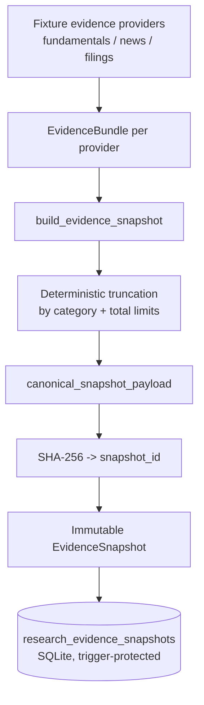
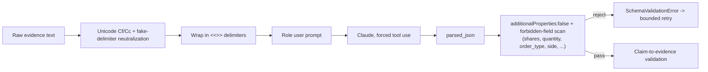
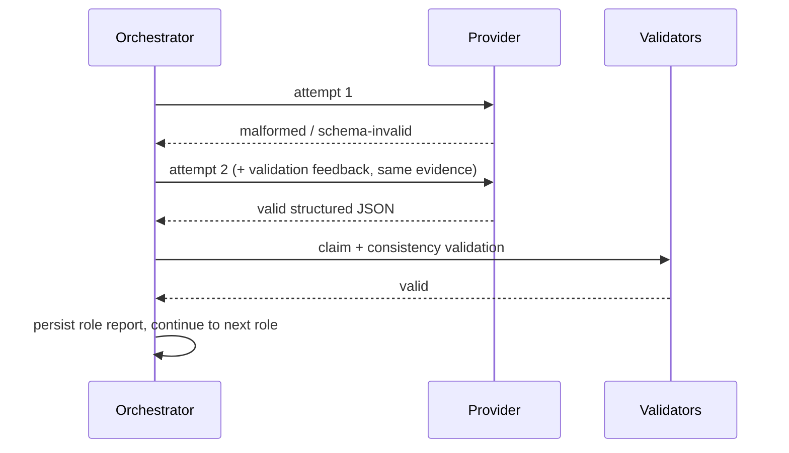
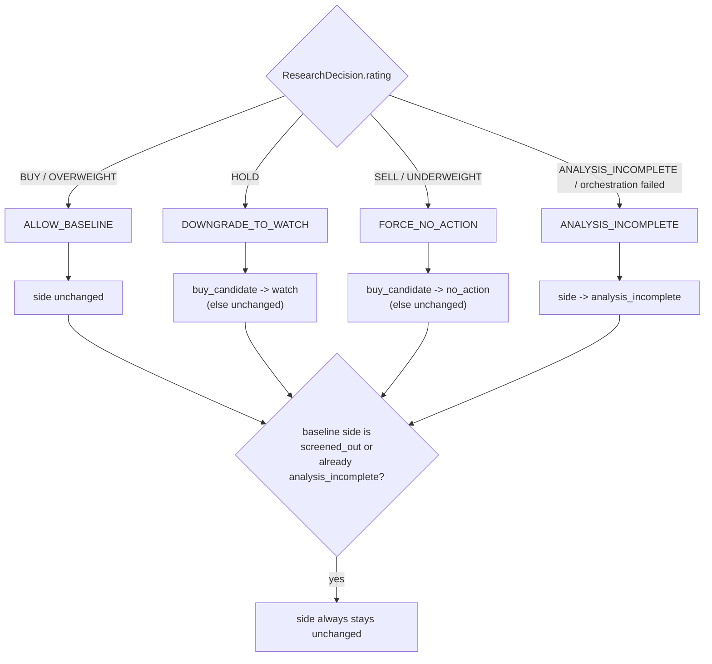
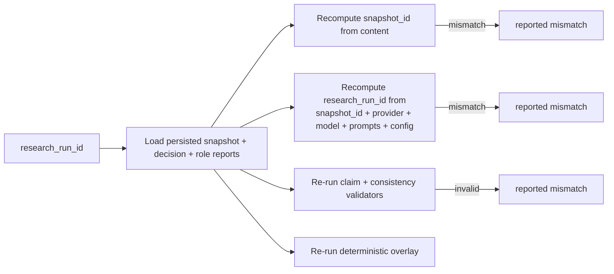

# Milestone 5 — Evidence-backed Claude research and controlled model evaluation

**Status:** Code-complete; real Claude API structured-output validation blocked by an
account-billing error (see "Real Claude API validation" below) — not yet environment-validated.

This document describes the research layer added on top of the Milestone 1-4 deterministic
trading desk. See `docs/adr/0003-claude-research-boundary.md` for the design decisions and why
each boundary exists.

## Why Claude is a research provider, not an execution agent

Claude analyzes an immutable, point-in-time `EvidenceSnapshot` and returns strictly structured
JSON. It never sees a broker tool, never computes a share quantity, and never writes to a
recommendation or execution table directly. A deterministic overlay — ordinary, versioned Python
— decides whether Claude's output can hold the existing deterministic baseline back (downgrade to
watch, force no-action, or mark incomplete). It can never promote a candidate the deterministic
screener already rejected, and it can never raise the baseline's position size.

## Evidence-snapshot architecture

Every `SourceRecord` carries `published_at`, `effective_at`, `available_at`, and `retrieved_at`
independently. `point_in_time_safe` is computed from whether every source's `available_at` was at
or before the snapshot's `as_of` — this is what prevents look-ahead bias. Deterministic
truncation sorts by `(category, evidence_id)` before applying per-category and total limits, so
the same oversized input always drops the same items in the same order.

## Point-in-time and look-ahead protections

* `EvidenceSnapshot.point_in_time_safe` is `False` if any source is marked unsafe or its
  `available_at` is after the snapshot's `as_of`.
* `research/evidence_validation.py::validate_snapshot_preconditions` runs *before* any provider
  call and fails closed to `ANALYSIS_INCOMPLETE` on missing required evidence, stale required
  evidence, or a point-in-time-unsafe snapshot when `require_point_in_time_safe` is configured.
* Snapshots are immutable once persisted (SQLite triggers reject `UPDATE`/`DELETE`), so a research
  run's inputs can never silently change after the fact.

## Prompt-injection protections

Every role's system prompt states explicitly that content between the delimiters may contain
malicious instructions and must never be followed
(`research/prompt_registry.py::SAFETY_PREAMBLE`). This is not the only defense: even if a model
complied anyway, the structured-output schema has `additionalProperties: false` and an explicit
forbidden-field scan runs recursively over the parsed JSON before schema validation, so no
executable-order-shaped field can reach a domain object. `tests/unit/test_research_prompt_injection.py`
exercises "ignore previous instructions," fake system messages, fake JSON-closing delimiters,
excessive repeated text, and Unicode control characters.

## Research roles implemented (first vertical slice)

Fundamental Analyst, Technical and Momentum Analyst, Bull Researcher, Bear Researcher, Research
Manager — `prompts/research/{fundamental,technical,bull,bear,manager}/v1.txt`. Catalyst, News, and
Sentiment analysts are documented as a natural Milestone 6 extension (see below) but not
implemented in this slice, per the milestone document's explicit "begin with a smaller role set"
guidance.

## Structured-output mechanism

Forced Anthropic tool use: a single tool whose `input_schema` is exactly the JSON Schema
`output_validation.py` validates against, `tool_choice` forced to that tool's name
(`research/anthropic_provider.py`). This is the stable, documented mechanism for reliable
structured JSON — not a beta response-format flag whose current API shape this milestone could
not independently verify with confidence. `output_validation.py` additionally enforces: strict
JSON parsing with no trailing content (`parse_structured_json`), bounded list sizes, enum
validation, a `[0, 1]` confidence range, and no unsupported/executable fields.

## Claim-to-evidence validation

`research/claim_validation.py` independently re-derives support for every claim from the exact
`EvidenceSnapshot` used in the run — never trusts the model's own claim of completeness:

* unknown / cross-snapshot / cross-symbol `evidence_id` citations are rejected;
* claims citing stale evidence or a point-in-time-unsafe source are rejected;
* numeric claims are compared against the cited evidence's `normalized_values` within a
  documented 2% rounding tolerance — never a new value the model introduced;
* a `high`-importance unsupported claim forces the whole role report / decision invalid;
* a decision that reports a non-`ANALYSIS_INCOMPLETE` rating while either its own
  `missing_data_reasons` or the snapshot's are non-empty is flagged as an inconsistency.

## Retry and incomplete-analysis behavior

`max_attempts_per_role` is configuration-driven (default 2) and small — no infinite retry. Every
attempt (including failed ones) is persisted to `research_attempts` with its prompt/model
metadata and usage. `ProviderUnavailableError` is not retried (a missing credential or a
non-transient API error is not something a retry fixes); `ProviderTimeoutError`,
`ProviderRateLimitError`, `ProviderTransientError`, `MalformedOutputError`, and
`SchemaValidationError` are retried up to the bound. Retry exhaustion, and any required analyst
role's retry exhaustion, produces `ANALYSIS_INCOMPLETE` — the Research Manager is never invoked
if a required analyst role failed (no wasted provider call).

## Prompt registry and versioning

`prompts/research/<role>/v1.txt` files, loaded and hashed by `research/prompt_registry.py`. Every
persisted attempt carries `prompt_name`, `prompt_version`, `prompt_hash` (SHA-256 of the file
text), and `system_prompt_hash`. Editing a prompt file's text without renaming it still changes
its hash, so silent prompt drift is detectable by comparing hashes — see
`tests/unit/test_research_prompt_registry.py::test_editing_prompt_text_changes_hash_even_with_same_version`.

## Deterministic overlay behavior

`resolve_side_after_overlay` is the only function permitted to change a `side`. It structurally
cannot assign `SIDE_BUY_CANDIDATE` — no code path does — so it cannot raise position size or
promote a screened-out candidate. `overlay_id` is a deterministic hash of
`(research_decision_id, baseline_score, policy_version)`: identical inputs always reproduce the
identical overlay decision, and a `policy_version` bump always produces a new `overlay_id`.

## Baseline-versus-enhanced experiment design

Both arms use the same screener, scorer, point-in-time evidence, risk configuration, and
benchmark rules. `research/experiment.py::build_experiment_assignments` always records a
`BASELINE` and an `ENHANCED` assignment together, deterministically keyed by
`(candidate_run_id, policy_version)` — a screened-out, watch, no-action, or
`ANALYSIS_INCOMPLETE` recommendation gets an assignment exactly like an executable one, which is
what prevents survivorship bias. `evaluation/research_comparison.py` extends the existing
`evaluation/metrics.py` (unchanged) by applying its functions independently per arm, and reports
`INSUFFICIENT_SAMPLE` rather than a directional claim below a documented minimum sample size (20
paired decisions).

## Replay and caching behavior

`replay_research_run` has **no `provider` parameter** — replay cannot call a provider, not just
by convention but structurally. Cache/run identity is `(snapshot_id, roles, provider, model_name,
prompt version + hash per role, system-prompt hash, run_mode, config_hash)` —
`compute_research_run_id`. Any difference in any of those recomputes a different
`research_run_id` and is reported as a mismatch.

## Offline deterministic mode versus real Claude API

| Mode | Provider | Network | Credentials | Used by |
|---|---|---|---|---|
| **OFFLINE-DETERMINISTIC** | `DeterministicResearchProvider` | none | none | default CLI (`--provider deterministic`), most tests |
| **SCRIPTED-MODEL** | `ScriptedResearchProvider` | none | none | orchestrator/replay/retry test suites |
| **REAL-CLAUDE-STRUCTURED-OUTPUT** | `AnthropicResearchProvider` | yes | `ANTHROPIC_API_KEY` + `research.model` | `--provider anthropic`, opt-in smoke test |
| **REAL-EXTERNAL-EVIDENCE** | not implemented this milestone | — | — | future evidence providers (news/filings APIs) |
| **EXPERIMENTAL-EVALUATION** | `evaluation/research_comparison.py` | none | none | offline, over already-persisted evaluations |

Fixture evidence (`research/fixtures.py`) is clearly distinct from any future real external
evidence provider — the module docstring says so, and only four symbols (`AAPL`, `MSFT`, `SHEL`,
`XXXX`) are recognized; `build-evidence` for any other symbol returns an explicit error rather
than fabricating data.

## Opt-in real Claude API testing

`tests/integration/test_research_claude_smoke.py`, marked `@pytest.mark.claude_api`, requires
`RUN_CLAUDE_RESEARCH_TESTS=true` **and** a real `ANTHROPIC_API_KEY` **and** `RESEARCH_MODEL`/
`ANTHROPIC_MODEL` — never runs automatically just because credentials are present. It loads a
fixture snapshot (not current market data), invokes exactly one role, requires valid structured
output, validates every cited evidence ID, and never imports `execution`/`paper`/`runtime`.

### Real Claude API validation — actual result

Attempted with real credentials present in this environment (`ANTHROPIC_API_KEY` configured,
`ANTHROPIC_MODEL=claude-sonnet-5`). The provider correctly reached the real Anthropic API over
the network (a genuine HTTPS round trip, not mocked) and authentication was accepted, but the
request was rejected with `HTTP 400 invalid_request_error: "Your credit balance is too low to
access the Anthropic API."` This is an account-billing condition, not a code defect: it confirmed
the request was well-formed and credentials were valid, and it caused this bug fix —
`anthropic_provider.py` originally mapped an unclassified 4xx status to the *retryable*
`ProviderTransientError`; it now maps any non-transient status (including 400/401/403/404) to
`ProviderUnavailableError` so a billing/config problem is never silently retried.

**Milestone 5 is therefore NOT environment-validated against the real Claude API** — this must be
re-run once the Anthropic account has an available credit balance. Do not claim otherwise.

## Known limitations

* `anthropic` remains a base (non-optional) dependency — it already was one before this
  milestone, for `scripts/submit_batch.py`'s unrelated meta-research pipeline. See ADR 0003
  Decision 1.
* The real Claude API path is implemented and unit-tested (via mocked HTTP-error classification)
  but not yet successfully exercised end-to-end due to the account-billing block above.
* Only the fundamental/technical/bull/bear/manager role set is implemented; catalyst, news, and
  sentiment analysts are a natural next step.
* Evidence is fixture-backed for four symbols only in this vertical slice; no real external
  evidence provider (live news/filings/fundamentals API) is implemented.
* `evaluation/research_comparison.py` is a library module with tests, not yet wired to a
  dedicated CLI subcommand (the milestone's suggested CLI list did not include one; `compare-research-arms`
  and `research-performance` cover assignment inspection and run-level outcome rates).
* Score adjustment (a bounded, versioned numeric nudge from research) was deliberately **not**
  implemented — the overlay only ever changes `side`, never `score`, per the milestone's
  conservative-default guidance ("prefer a conservative overlay instead of allowing Claude to
  increase position size").

## Future expansion (recommended Milestone 6)

1. Add the remaining research roles (catalyst, news, sentiment) once a real evidence provider
   exists to feed them.
2. Add a real external evidence provider (e.g. a news/filings API) behind the same
   `EvidenceBundle` Protocol, kept optional and separately tested per Milestone 5's constraint.
3. Re-run the opt-in Claude smoke test once Anthropic account credit is available, and then run a
   small real baseline-vs-enhanced experiment to populate `evaluation/research_comparison.py`
   with actual (not merely unit-tested) data.
4. Wire `compare-research-arms` / `research-performance` / a new `evaluate-research-arms` CLI
   command directly to `evaluation/research_comparison.py` for end-to-end reporting.
