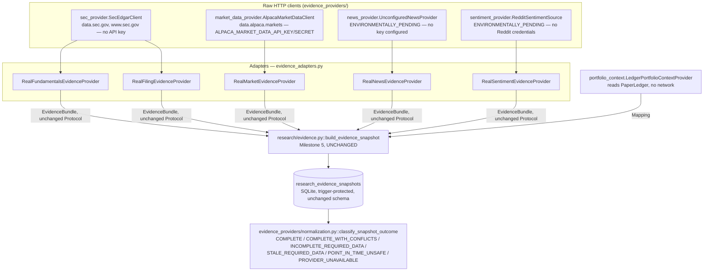
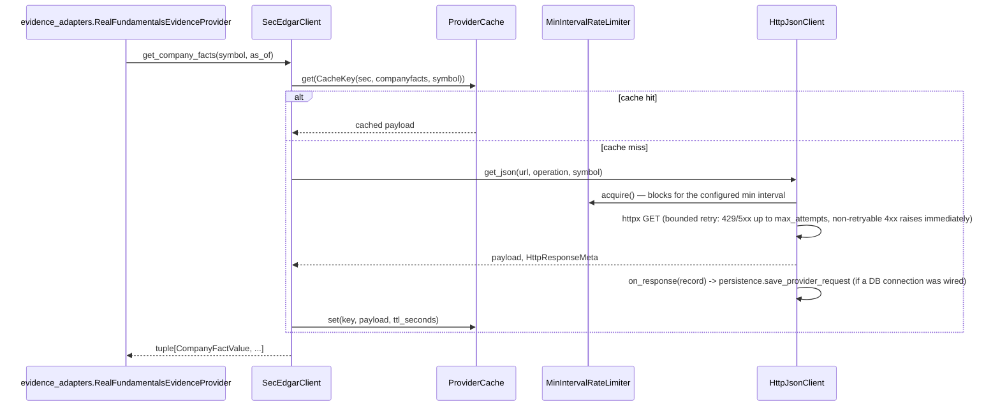
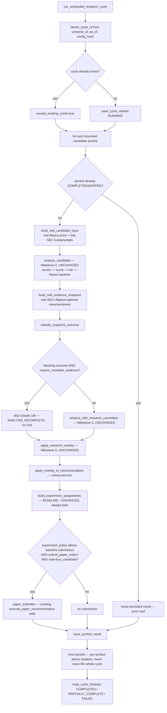
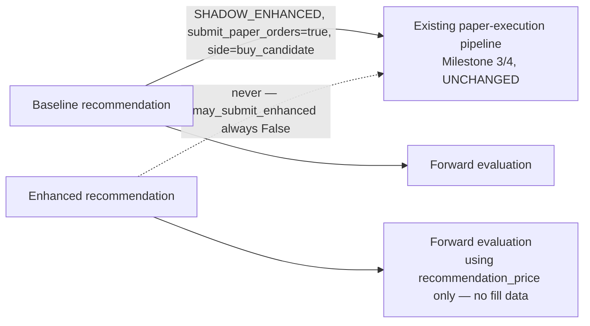
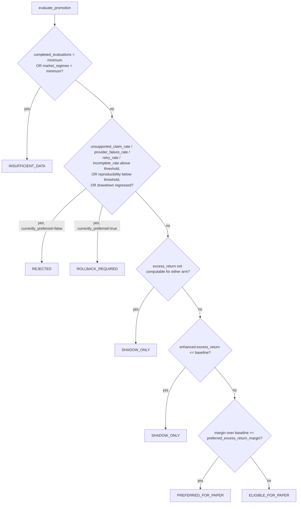

# Milestone 6 — Real evidence acquisition and continuous paper evaluation

**Status:** Code-complete. Real SEC EDGAR and real Alpaca market-data connectivity are
environment-validated (see "Real-provider validation" below) — actual HTTP round trips
against production endpoints, not just unit tests against mocks. A full real-evidence
scheduled cycle (real SEC + real Alpaca -> deterministic baseline -> deterministic-provider
research committee -> overlay -> shadow experiment, no paper submission) ran successfully
end-to-end. News and Reddit-sentiment real providers remain ENVIRONMENTALLY_PENDING — see
"Known limitations."

This document describes the real-evidence and continuous-evaluation layer added on top of
Milestones 1-5. See `docs/adr/0004-real-evidence-provider-boundary.md` for the design
decisions and why each boundary exists.

## Why the existing pipeline remains authoritative

Real evidence providers retrieve raw facts and nothing else. Claude analyzes supplied
evidence and nothing else. Every decision that touches money — screening, scoring, risk
sizing, recommendation freezing, execution eligibility, paper execution, ledger accounting,
broker reconciliation, and performance evaluation — is unmodified Milestone 1-5 deterministic
Python. `research/scheduled_cycle.py` is a *loop* over those existing services with real
inputs; it introduces no new decision authority.

## Evidence-provider architecture



Every adapter's `.fetch(symbol, as_of) -> EvidenceBundle` satisfies the *exact* Milestone 5
Protocol in `research/evidence.py` — no new Protocol layer, no change to
`build_evidence_snapshot`, `canonical_snapshot_payload`, or snapshot-ID hashing.

## Point-in-time protections (real providers)

* **SEC filings**: a `FilingRecord`'s `accepted_at` (from `acceptanceDateTime`, not
  `filingDate` or `reportDate`) is compared against the requested `available_by` — a filing
  accepted after that cutoff is excluded, never included with a backdated timestamp.
* **SEC company facts**: each `CompanyFactValue.filed_at` is compared against `as_of`; a
  restated or late-filed value is excluded from any request whose `as_of` precedes its
  `filed_at` — a real bug this exact check caught during implementation (see "Bugs found").
* **Market data**: `AlpacaMarketDataClient.get_price_history` rejects any bar whose
  `session_date` is after `as_of.date()`; `get_quote` rejects a quote whose provider
  timestamp is after `as_of`. `get_close` (the `PriceProvider` implementation used by
  forward evaluation) never substitutes a live quote for a missing historical close.
* **News**: `RealNewsEvidenceProvider` excludes any article whose `published_at` is after
  `as_of` (defense in depth — `UnconfiguredNewsProvider` never returns any article at all
  in this environment).

## Real bug found and fixed: SEC's `fp` field is not a reliable annual/quarterly discriminator

Discovered via a real SEC EDGAR request for AAPL during implementation, not a unit test:
Apple's 10-K XBRL data tags *quarterly* prior-period revenue comparatives with the same
`fp="FY"` a true annual figure carries. Filtering `fiscal_period == "FY"` alone let
`revenue_growth_yoy` divide the latest annual revenue by a quarterly figure, producing a
nonsensical 398% "growth" instead of the correct 15.9%. Fixed in
`evidence_providers/fundamentals.py::_is_annual_period` by checking period *duration*
(350-380 days) instead of trusting `fp` — re-verified against real AAPL data after the fix.
See the Milestone 6 scratchpad's "Bugs discovered and fixed" for the full account.

## Real bug found and fixed: Alpaca's free-tier subscription rejects the default SIP feed for recent data

Discovered via the real market-data-API smoke test: `GET /v2/stocks/AAPL/bars` with no
`feed` parameter returned `HTTP 403 {"message":"subscription does not permit querying recent
SIP data"}` for a range ending "yesterday" (an earlier ad-hoc check against 32-day-old data
had not hit this). Fixed by adding an explicit `feed="iex"` default to
`AlpacaMarketDataClient` — confirmed `200` on the identical request afterward.

## Provider caching and rate limiting



TTL policy (`evidence_providers/cache.py`): historical bars and filings are immutable within
a process run (`ttl_seconds=None`); company facts re-check hourly (`3600s`, restatements are
possible); current quotes use a 15s TTL; news 300s; portfolio context 5s (a local read).
`ProviderCache` fails closed on a corrupted entry (`CacheCorruptionError`) — never a silent
garbage read. `MinIntervalRateLimiter` enforces a documented minimum wall-clock interval
between requests (SEC: 150ms; Alpaca: 350ms) — no burst allowance, no thundering-herd retry.
`HttpJsonClient` bounds retries to `max_attempts` (default 2): 429/5xx are retried, any other
4xx raises immediately as non-retryable.

## Provider request/response persistence

`storage/evidence_provider_schema.py::evidence_provider_requests` — one row per HTTP attempt
(provider, operation, symbol, status, latency, cache status, retry count, success,
error_code, retryable, licensing classification). Raw payloads are only stored when
`licensing_classification == PUBLIC_DOMAIN` (SEC EDGAR only — public-domain US government
data) and capped at 200KB; Alpaca market data is `ACCOUNT_LINKED` and never has its raw
payload persisted (only normalized `SourceRecord`/`EvidenceItem` data, which already carries
a `content_hash`). No API key, authorization header, or account identifier is ever persisted.

## Scheduled research cycle



Idempotency: `cycle_id` is a deterministic hash of `(universe_id, as_of, config_hash)`.
Re-running the identical cycle reuses the same `cycle_id`, and every already-`COMPLETED`
symbol is a pure read — no duplicate evidence snapshot, research run, recommendation, or
experiment assignment (proven in `tests/integration/test_scheduled_research_cycle.py::
test_scheduled_cycle_rerun_is_idempotent`). Per-symbol failure isolation:
`continue_on_symbol_failure=true` (default) means one symbol's exception never aborts the
whole cycle — recorded `FAILED` with a `failure_reason`, cycle continues.

## Experiment execution policy

`SHADOW_ENHANCED` is the default and the only fully-supported policy that submits anything:
the baseline arm may submit to the existing paper-execution pipeline; the enhanced arm is
generated and persisted for evaluation but **structurally cannot** submit —
`experiment_policy.may_submit_enhanced()` returns `False` for every supported policy, and no
call site in `scheduled_cycle.py` ever calls a paper-submission function with an enhanced
`rec_id`. `ENHANCED_ONLY`/`BOTH_SEPARATE_PAPER_BOOKS` are recognized names that raise
`UnsupportedExperimentPolicyError` immediately — they require separate paper-portfolio
namespaces this milestone does not implement (see ADR 0004 Decision 6).



## Continuous evaluation lifecycle

`evaluate-research-cycle` computes forward evaluations for every baseline *and* enhanced
recommendation a cycle produced via the unchanged `evaluation/evaluation_service.py`.
No-action and incomplete outcomes are never dropped — `NEVER_EXECUTED` is a first-class,
persisted status exactly like `COMPLETED`. Since the enhanced arm never executes under
`SHADOW_ENHANCED`, its evaluations correctly and consistently report `NEVER_EXECUTED` — an
expected, honest outcome, not a defect (see `evaluation/turnover.py`'s module docstring for
the same point applied to turnover).

### Time-to-fill (`evaluation/time_to_fill.py`)

Anchors on the intent's `SUBMITTED` event; computes time-to-acknowledgement (first
`ACCEPTED`/fill event), time-to-first-fill, and time-to-full-fill (first `FILLED` terminal
event). Cancelled/rejected/still-open orders are `CENSORED_UNFILLED`, never a fabricated
zero fill time.

### Turnover (`evaluation/turnover.py`)

Explicitly defined as executed notional / average equity over a period — a documented
denominator. `daily_turnover`/`rolling_turnover`/`turnover_by_arm` all report
`INSUFFICIENT_DATA` rather than a misleading zero when the sample or denominator is
undefined.

### Confidence calibration (`evaluation/calibration.py`)

Buckets `ResearchDecision.confidence` (5 buckets: `[0,0.2) ... [0.8,1.0]`) against realized
`net_return`, reporting observed hit rate, average return, and incomplete-analysis rate per
bucket — but only when a bucket has at least `min_sample_size` (default 10) decisions;
otherwise `INSUFFICIENT_DATA`, never presented.

## Promotion and rollback gates



`research/promotion.py::PromotionGateConfig.__post_init__` raises if
`allow_live_promotion=true` is ever set — this is enforced at construction, not just by
convention, and the status enum (`PROMOTION_STATUSES`) contains no member that authorizes
live trading; there is no code path in this module that could produce one.

## Configuration

`config/evidence_providers.yaml` — every provider defaults `enabled: false` except SEC
(needs no credential). `config/scheduled_research.yaml` — `scheduled_research.enabled` and
`submit_paper_orders` both default `false`; `promotion.enabled` defaults `false`. Absent
credentials fail closed (`market_data.enabled=true` with missing
`ALPACA_MARKET_DATA_API_KEY`/`SECRET` excludes the market provider from the registry rather
than raising). Unknown provider/experiment-policy/promotion-status values fail closed at
load time.

## CLI usage

```bash
# Provider connectivity/health over persisted requests.
python -m trading_research.cli provider-health
python -m trading_research.cli evidence-provider-usage

# Build and persist one real (or fixture) point-in-time evidence snapshot.
python -m trading_research.cli fetch-evidence --symbol AAPL --as-of 2026-07-11T13:00:00Z --provider-mode real

# Run one scheduled cycle. Fixture mode needs no network/credentials.
python -m trading_research.cli run-research-cycle --as-of 2026-07-11T13:00:00Z --provider-mode fixture
python -m trading_research.cli run-research-cycle --as-of 2026-07-11T13:00:00Z --provider-mode real --symbol AAPL

python -m trading_research.cli resume-research-cycle --cycle-id <id>
python -m trading_research.cli evaluate-research-cycle --cycle-id <id>
python -m trading_research.cli compare-research-cycles
python -m trading_research.cli research-promotion-status --experiment-id <id>
```

No CLI command accepts a natural-language order instruction, exposes an arbitrary provider
operation, or has a `--live` flag. Every command prints its provider mode and never a
credential value. Non-zero exit code (2) on a command-level error.

## Real-provider validation — actual results

Ran on 2026-07-12 in this development environment.

**SEC EDGAR** (`RUN_SEC_API_TESTS=true`, no credentials required):
```text
tests/integration/test_sec_api_smoke.py::test_real_sec_edgar_connectivity_and_normalization PASSED
```
Validated: real CIK resolution (AAPL -> 0000320193), real recent-filings retrieval with
point-in-time filtering, real company-facts retrieval, normalization into the existing
`EvidenceBundle`/`EvidenceItem` shape.

**Alpaca market data** (`RUN_MARKET_DATA_TESTS=true`, real
`ALPACA_MARKET_DATA_API_KEY`/`SECRET`):
```text
tests/integration/test_market_data_api_smoke.py::test_real_alpaca_market_data_connectivity_and_normalization PASSED
```
Validated after fixing the `feed=iex` issue above: real historical daily bars for AAPL and
the SPY benchmark, real `get_close`, normalization into `EvidenceBundle`.

**News** (`RUN_NEWS_API_TESTS=true`):
```text
tests/integration/test_news_api_smoke.py::test_no_real_news_provider_is_configured_in_this_environment SKIPPED
```
Honestly reported ENVIRONMENTALLY_PENDING — no real news-provider API key exists in this
environment; this is not a failing test disguised as a pass.

**Real scheduled cycle, deterministic research provider** (`RUN_REAL_RESEARCH_CYCLE=true`):
```text
tests/integration/test_real_research_cycle_smoke.py::test_real_scheduled_research_cycle_shadow_no_paper_submission PASSED
```
One real end-to-end cycle for AAPL: real SEC + real Alpaca evidence, a
point-in-time-safe persisted snapshot, `SHADOW_ENHANCED` policy, `submit_paper_orders=False`
(structurally enforced by passing `paper_submitter=None`), no paper order submitted.

**Real scheduled cycle, real Claude research provider** (manual validation, not a committed
test — see "Known limitations" for why): a full cycle for AAPL using real SEC + real Alpaca
evidence and the real `AnthropicResearchProvider` (`claude-sonnet-5`, same forced-tool-use
structured-output path Milestone 5 validated) completed successfully end-to-end — real
evidence flowing into a real Claude research committee, through the unchanged deterministic
overlay, producing a real enhanced recommendation. Exact token/latency/cost figures are
recorded in the Milestone 6 scratchpad's "Environmental validation" section.

## Known limitations

1. **News and Reddit sentiment are ENVIRONMENTALLY_PENDING, not code-incomplete.** Both
   `evidence_providers/news_provider.py` and `sentiment_provider.py` implement the full
   fail-closed interface and are unit-tested; neither has a real API key/Reddit credential
   available in this environment to exercise a genuine round trip. `RealNewsEvidenceProvider`
   / `RealSentimentEvidenceProvider` correctly report explicit missing-data reasons rather
   than silently no-op'ing, and a future operator wires a real key/credential without
   touching any other code.
2. **Real baseline candidates commonly screen out or land on `analysis_incomplete`.** This
   milestone's minimum provider set (SEC + Alpaca) does not source
   `operating_history_years`, `bankruptcy_or_distress`, `going_concern_warning`, or
   `shell_company_flag`; `analysis/screener.py` (Milestone 2, unchanged) hard-fails a gate on
   unknown critical input by design. This is documented, expected behavior — see ADR 0004
   Decision 7 — not a bug to be worked around by fabricating favorable defaults.
3. **The real Claude-enhanced scheduled-cycle path was validated manually, not via a
   committed, CI-safe test.** Running five real Claude API calls per cycle costs real money
   and takes 1-2 minutes; `tests/integration/test_real_research_cycle_smoke.py` deliberately
   uses the deterministic research provider to validate the *evidence* path repeatably and
   without cost, while the Claude-enhanced path reuses Milestone 5's already-committed,
   already-gated `tests/integration/test_research_claude_smoke.py` for its own real-API
   validation. The one additional manual run in this milestone proves the two compose
   correctly end-to-end; it is not re-run automatically.
4. **Corporate-action metadata (splits/dividends) is not separately modeled** —
   `PriceBar.adjusted` records whether Alpaca's `adjustment` parameter was applied, but no
   separate corporate-action event stream is retrieved or persisted.
5. **`operating_history_years` and going-concern-type flags remain unavailable from any
   provider in this milestone's set** — see limitation 2.
6. **Portfolio-context weighting uses cost basis, not live market value** — no live-marking
   price source is wired into `LedgerPortfolioContextProvider` (documented in its own
   returned `note` field, not silently approximated as exact).
7. **`evidence_provider_requests` persistence covers only the raw-HTTP-client layer's own
   calls**, not cache hits (a cache hit never reaches `HttpJsonClient.get_json`, so it is not
   separately logged to this table) — cache hit/miss counts are still available via
   `ProviderCache.stats()` in-process, just not persisted across runs.
8. **Only one primary market-data provider (Alpaca) and one primary filing/fundamentals
   source (SEC EDGAR) are implemented**, per the milestone's explicit "avoid adding several
   overlapping providers without a justified need."

## IDEMPOTENT SCHEDULED-CYCLE IMPLEMENTATION vs. ACTUAL RECURRING DEPLOYMENT

`run_scheduled_research_cycle` is idempotent and resumable — proven by
`tests/integration/test_scheduled_research_cycle.py` and the real smoke test. **No cron job,
scheduler, or daemon exists in this repository.** `scheduled_research.enabled` in
`config/scheduled_research.yaml` gates whether a *future* external invoker (cron, a cloud
scheduler, a CI job) is permitted to treat a cycle run as sanctioned; it does not itself
cause recurring execution. Every invocation in this milestone was a single, explicit CLI or
test invocation.
