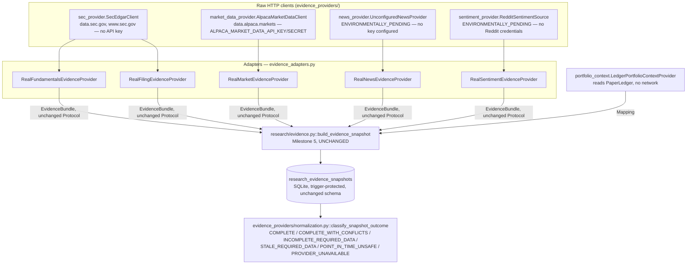
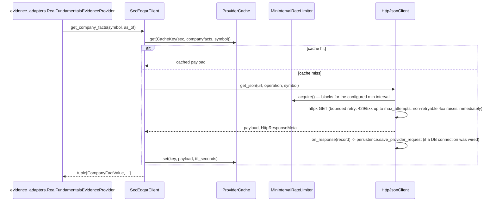
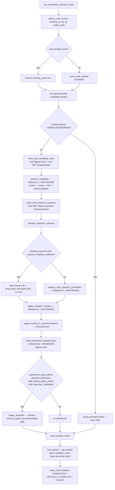
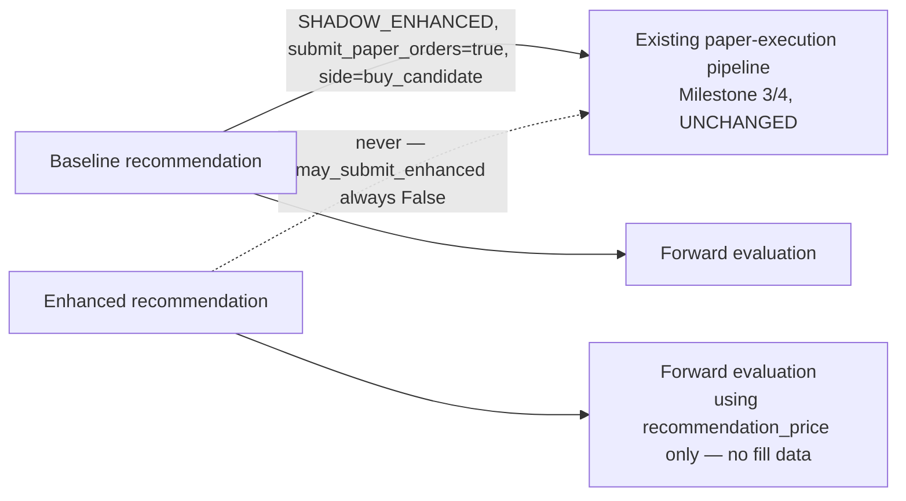
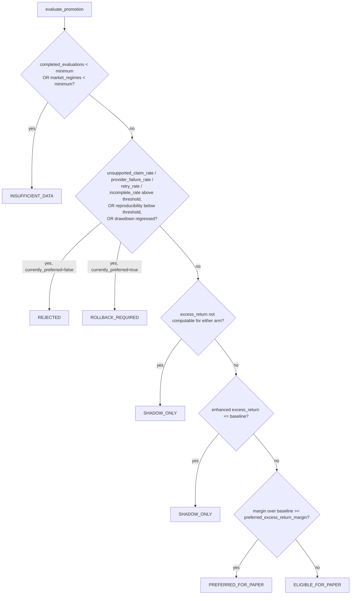

# Milestone 6 — Real evidence acquisition and continuous paper evaluation

**Status:** Code-complete. Real SEC EDGAR and real Alpaca market-data connectivity are
environment-validated (see "Real-provider validation" below) — actual HTTP round trips
against production endpoints, not just unit tests against mocks. A full real-evidence
scheduled cycle (real SEC + real Alpaca -> deterministic baseline -> deterministic-provider
research committee -> overlay -> shadow experiment, no paper submission) ran successfully
end-to-end. News and Reddit-sentiment real providers remain ENVIRONMENTALLY_PENDING — see
"Known limitations."

This document describes the real-evidence and continuous-evaluation layer added on top of
Milestones 1-5. See `docs/adr/0004-real-evidence-provider-boundary.md` for the design
decisions and why each boundary exists.

## Why the existing pipeline remains authoritative

Real evidence providers retrieve raw facts and nothing else. Claude analyzes supplied
evidence and nothing else. Every decision that touches money — screening, scoring, risk
sizing, recommendation freezing, execution eligibility, paper execution, ledger accounting,
broker reconciliation, and performance evaluation — is unmodified Milestone 1-5 deterministic
Python. `research/scheduled_cycle.py` is a *loop* over those existing services with real
inputs; it introduces no new decision authority.

## Evidence-provider architecture



Every adapter's `.fetch(symbol, as_of) -> EvidenceBundle` satisfies the *exact* Milestone 5
Protocol in `research/evidence.py` — no new Protocol layer, no change to
`build_evidence_snapshot`, `canonical_snapshot_payload`, or snapshot-ID hashing.

## Point-in-time protections (real providers)

* **SEC filings**: a `FilingRecord`'s `accepted_at` (from `acceptanceDateTime`, not
  `filingDate` or `reportDate`) is compared against the requested `available_by` — a filing
  accepted after that cutoff is excluded, never included with a backdated timestamp.
* **SEC company facts**: each `CompanyFactValue.filed_at` is compared against `as_of`; a
  restated or late-filed value is excluded from any request whose `as_of` precedes its
  `filed_at` — a real bug this exact check caught during implementation (see "Bugs found").
* **Market data**: `AlpacaMarketDataClient.get_price_history` rejects any bar whose
  `session_date` is after `as_of.date()`; `get_quote` rejects a quote whose provider
  timestamp is after `as_of`. `get_close` (the `PriceProvider` implementation used by
  forward evaluation) never substitutes a live quote for a missing historical close.
* **News**: `RealNewsEvidenceProvider` excludes any article whose `published_at` is after
  `as_of` (defense in depth — `UnconfiguredNewsProvider` never returns any article at all
  in this environment).

## Real bug found and fixed: SEC's `fp` field is not a reliable annual/quarterly discriminator

Discovered via a real SEC EDGAR request for AAPL during implementation, not a unit test:
Apple's 10-K XBRL data tags *quarterly* prior-period revenue comparatives with the same
`fp="FY"` a true annual figure carries. Filtering `fiscal_period == "FY"` alone let
`revenue_growth_yoy` divide the latest annual revenue by a quarterly figure, producing a
nonsensical 398% "growth" instead of the correct 15.9%. Fixed in
`evidence_providers/fundamentals.py::_is_annual_period` by checking period *duration*
(350-380 days) instead of trusting `fp` — re-verified against real AAPL data after the fix.
See the Milestone 6 scratchpad's "Bugs discovered and fixed" for the full account.

## Real bug found and fixed: Alpaca's free-tier subscription rejects the default SIP feed for recent data

Discovered via the real market-data-API smoke test: `GET /v2/stocks/AAPL/bars` with no
`feed` parameter returned `HTTP 403 {"message":"subscription does not permit querying recent
SIP data"}` for a range ending "yesterday" (an earlier ad-hoc check against 32-day-old data
had not hit this). Fixed by adding an explicit `feed="iex"` default to
`AlpacaMarketDataClient` — confirmed `200` on the identical request afterward.

## Provider caching and rate limiting



TTL policy (`evidence_providers/cache.py`): historical bars and filings are immutable within
a process run (`ttl_seconds=None`); company facts re-check hourly (`3600s`, restatements are
possible); current quotes use a 15s TTL; news 300s; portfolio context 5s (a local read).
`ProviderCache` fails closed on a corrupted entry (`CacheCorruptionError`) — never a silent
garbage read. `MinIntervalRateLimiter` enforces a documented minimum wall-clock interval
between requests (SEC: 150ms; Alpaca: 350ms) — no burst allowance, no thundering-herd retry.
`HttpJsonClient` bounds retries to `max_attempts` (default 2): 429/5xx are retried, any other
4xx raises immediately as non-retryable.

## Provider request/response persistence

`storage/evidence_provider_schema.py::evidence_provider_requests` — one row per HTTP attempt
(provider, operation, symbol, status, latency, cache status, retry count, success,
error_code, retryable, licensing classification). Raw payloads are only stored when
`licensing_classification == PUBLIC_DOMAIN` (SEC EDGAR only — public-domain US government
data) and capped at 200KB; Alpaca market data is `ACCOUNT_LINKED` and never has its raw
payload persisted (only normalized `SourceRecord`/`EvidenceItem` data, which already carries
a `content_hash`). No API key, authorization header, or account identifier is ever persisted.

## Scheduled research cycle



Idempotency: `cycle_id` is a deterministic hash of `(universe_id, as_of, config_hash)`.
Re-running the identical cycle reuses the same `cycle_id`, and every already-`COMPLETED`
symbol is a pure read — no duplicate evidence snapshot, research run, recommendation, or
experiment assignment (proven in `tests/integration/test_scheduled_research_cycle.py::
test_scheduled_cycle_rerun_is_idempotent`). Per-symbol failure isolation:
`continue_on_symbol_failure=true` (default) means one symbol's exception never aborts the
whole cycle — recorded `FAILED` with a `failure_reason`, cycle continues.

## Experiment execution policy

`SHADOW_ENHANCED` is the default and the only fully-supported policy that submits anything:
the baseline arm may submit to the existing paper-execution pipeline; the enhanced arm is
generated and persisted for evaluation but **structurally cannot** submit —
`experiment_policy.may_submit_enhanced()` returns `False` for every supported policy, and no
call site in `scheduled_cycle.py` ever calls a paper-submission function with an enhanced
`rec_id`. `ENHANCED_ONLY`/`BOTH_SEPARATE_PAPER_BOOKS` are recognized names that raise
`UnsupportedExperimentPolicyError` immediately — they require separate paper-portfolio
namespaces this milestone does not implement (see ADR 0004 Decision 6).



## Continuous evaluation lifecycle

`evaluate-research-cycle` computes forward evaluations for every baseline *and* enhanced
recommendation a cycle produced via the unchanged `evaluation/evaluation_service.py`.
No-action and incomplete outcomes are never dropped — `NEVER_EXECUTED` is a first-class,
persisted status exactly like `COMPLETED`. Since the enhanced arm never executes under
`SHADOW_ENHANCED`, its evaluations correctly and consistently report `NEVER_EXECUTED` — an
expected, honest outcome, not a defect (see `evaluation/turnover.py`'s module docstring for
the same point applied to turnover).

### Time-to-fill (`evaluation/time_to_fill.py`)

Anchors on the intent's `SUBMITTED` event; computes time-to-acknowledgement (first
`ACCEPTED`/fill event), time-to-first-fill, and time-to-full-fill (first `FILLED` terminal
event). Cancelled/rejected/still-open orders are `CENSORED_UNFILLED`, never a fabricated
zero fill time.

### Turnover (`evaluation/turnover.py`)

Explicitly defined as executed notional / average equity over a period — a documented
denominator. `daily_turnover`/`rolling_turnover`/`turnover_by_arm` all report
`INSUFFICIENT_DATA` rather than a misleading zero when the sample or denominator is
undefined.

### Confidence calibration (`evaluation/calibration.py`)

Buckets `ResearchDecision.confidence` (5 buckets: `[0,0.2) ... [0.8,1.0]`) against realized
`net_return`, reporting observed hit rate, average return, and incomplete-analysis rate per
bucket — but only when a bucket has at least `min_sample_size` (default 10) decisions;
otherwise `INSUFFICIENT_DATA`, never presented.

## Promotion and rollback gates



`research/promotion.py::PromotionGateConfig.__post_init__` raises if
`allow_live_promotion=true` is ever set — this is enforced at construction, not just by
convention, and the status enum (`PROMOTION_STATUSES`) contains no member that authorizes
live trading; there is no code path in this module that could produce one.

## Configuration

`config/evidence_providers.yaml` — every provider defaults `enabled: false` except SEC
(needs no credential). `config/scheduled_research.yaml` — `scheduled_research.enabled` and
`submit_paper_orders` both default `false`; `promotion.enabled` defaults `false`. Absent
credentials fail closed (`market_data.enabled=true` with missing
`ALPACA_MARKET_DATA_API_KEY`/`SECRET` excludes the market provider from the registry rather
than raising). Unknown provider/experiment-policy/promotion-status values fail closed at
load time.

## CLI usage

```bash
# Provider connectivity/health over persisted requests.
python -m trading_research.cli provider-health
python -m trading_research.cli evidence-provider-usage

# Build and persist one real (or fixture) point-in-time evidence snapshot.
python -m trading_research.cli fetch-evidence --symbol AAPL --as-of 2026-07-11T13:00:00Z --provider-mode real

# Run one scheduled cycle. Fixture mode needs no network/credentials.
python -m trading_research.cli run-research-cycle --as-of 2026-07-11T13:00:00Z --provider-mode fixture
python -m trading_research.cli run-research-cycle --as-of 2026-07-11T13:00:00Z --provider-mode real --symbol AAPL

python -m trading_research.cli resume-research-cycle --cycle-id <id>
python -m trading_research.cli evaluate-research-cycle --cycle-id <id>
python -m trading_research.cli compare-research-cycles
python -m trading_research.cli research-promotion-status --experiment-id <id>
```

No CLI command accepts a natural-language order instruction, exposes an arbitrary provider
operation, or has a `--live` flag. Every command prints its provider mode and never a
credential value. Non-zero exit code (2) on a command-level error.

## Real-provider validation — actual results

Ran on 2026-07-12 in this development environment.

**SEC EDGAR** (`RUN_SEC_API_TESTS=true`, no credentials required):
```text
tests/integration/test_sec_api_smoke.py::test_real_sec_edgar_connectivity_and_normalization PASSED
```
Validated: real CIK resolution (AAPL -> 0000320193), real recent-filings retrieval with
point-in-time filtering, real company-facts retrieval, normalization into the existing
`EvidenceBundle`/`EvidenceItem` shape.

**Alpaca market data** (`RUN_MARKET_DATA_TESTS=true`, real
`ALPACA_MARKET_DATA_API_KEY`/`SECRET`):
```text
tests/integration/test_market_data_api_smoke.py::test_real_alpaca_market_data_connectivity_and_normalization PASSED
```
Validated after fixing the `feed=iex` issue above: real historical daily bars for AAPL and
the SPY benchmark, real `get_close`, normalization into `EvidenceBundle`.

**News** (`RUN_NEWS_API_TESTS=true`):
```text
tests/integration/test_news_api_smoke.py::test_no_real_news_provider_is_configured_in_this_environment SKIPPED
```
Honestly reported ENVIRONMENTALLY_PENDING — no real news-provider API key exists in this
environment; this is not a failing test disguised as a pass.

**Real scheduled cycle, deterministic research provider** (`RUN_REAL_RESEARCH_CYCLE=true`):
```text
tests/integration/test_real_research_cycle_smoke.py::test_real_scheduled_research_cycle_shadow_no_paper_submission PASSED
```
One real end-to-end cycle for AAPL: real SEC + real Alpaca evidence, a
point-in-time-safe persisted snapshot, `SHADOW_ENHANCED` policy, `submit_paper_orders=False`
(structurally enforced by passing `paper_submitter=None`), no paper order submitted.

**Real scheduled cycle, real Claude research provider** (manual validation, not a committed
test — see "Known limitations" for why): a full cycle for AAPL using real SEC + real Alpaca
evidence and the real `AnthropicResearchProvider` (`claude-sonnet-5`, same forced-tool-use
structured-output path Milestone 5 validated) completed successfully end-to-end — real
evidence flowing into a real Claude research committee, through the unchanged deterministic
overlay, producing a real enhanced recommendation. Exact token/latency/cost figures are
recorded in the Milestone 6 scratchpad's "Environmental validation" section.

## Known limitations

1. **News and Reddit sentiment are ENVIRONMENTALLY_PENDING, not code-incomplete.** Both
   `evidence_providers/news_provider.py` and `sentiment_provider.py` implement the full
   fail-closed interface and are unit-tested; neither has a real API key/Reddit credential
   available in this environment to exercise a genuine round trip. `RealNewsEvidenceProvider`
   / `RealSentimentEvidenceProvider` correctly report explicit missing-data reasons rather
   than silently no-op'ing, and a future operator wires a real key/credential without
   touching any other code.
2. **Real baseline candidates commonly screen out or land on `analysis_incomplete`.** This
   milestone's minimum provider set (SEC + Alpaca) does not source
   `operating_history_years`, `bankruptcy_or_distress`, `going_concern_warning`, or
   `shell_company_flag`; `analysis/screener.py` (Milestone 2, unchanged) hard-fails a gate on
   unknown critical input by design. This is documented, expected behavior — see ADR 0004
   Decision 7 — not a bug to be worked around by fabricating favorable defaults.
3. **The real Claude-enhanced scheduled-cycle path was validated manually, not via a
   committed, CI-safe test.** Running five real Claude API calls per cycle costs real money
   and takes 1-2 minutes; `tests/integration/test_real_research_cycle_smoke.py` deliberately
   uses the deterministic research provider to validate the *evidence* path repeatably and
   without cost, while the Claude-enhanced path reuses Milestone 5's already-committed,
   already-gated `tests/integration/test_research_claude_smoke.py` for its own real-API
   validation. The one additional manual run in this milestone proves the two compose
   correctly end-to-end; it is not re-run automatically.
4. **Corporate-action metadata (splits/dividends) is not separately modeled** —
   `PriceBar.adjusted` records whether Alpaca's `adjustment` parameter was applied, but no
   separate corporate-action event stream is retrieved or persisted.
5. **`operating_history_years` and going-concern-type flags remain unavailable from any
   provider in this milestone's set** — see limitation 2.
6. **Portfolio-context weighting uses cost basis, not live market value** — no live-marking
   price source is wired into `LedgerPortfolioContextProvider` (documented in its own
   returned `note` field, not silently approximated as exact).
7. ~~`evidence_provider_requests` persistence covers only the raw-HTTP-client layer's own
   calls, not cache hits~~ — **fixed in Milestone 6.1**: `ProviderCache.get()` now notifies
   the same `on_response` callback `HttpJsonClient` uses on a genuine cache `HIT` (and on
   `CACHE_CORRUPT`), so cache activity is now visible in `evidence_provider_requests` and in
   `provider-health`'s `cache_hit_rate`. See `docs/milestone-6.1.md`'s documentation section
   below.
8. **Only one primary market-data provider (Alpaca) and one primary filing/fundamentals
   source (SEC EDGAR) are implemented**, per the milestone's explicit "avoid adding several
   overlapping providers without a justified need."

## IDEMPOTENT SCHEDULED-CYCLE IMPLEMENTATION vs. ACTUAL RECURRING DEPLOYMENT

`run_scheduled_research_cycle` is idempotent and resumable — proven by
`tests/integration/test_scheduled_research_cycle.py` and the real smoke test. **No cron job,
scheduler, or daemon exists in this repository.** `scheduled_research.enabled` in
`config/scheduled_research.yaml` gates whether a *future* external invoker (cron, a cloud
scheduler, a CI job) is permitted to treat a cycle run as sanctioned; it does not itself
cause recurring execution. Every invocation in this milestone was a single, explicit CLI or
test invocation.

## Milestone 6.1 — Bear-role failure diagnostics

**Status:** Code-complete. All 654 pre-existing tests still pass; 93 new tests added
(747 passed, 6 skipped total). Real-Claude revalidation was environmentally blocked (no
`ANTHROPIC_API_KEY` in this environment) — reported honestly, not fabricated. See
`.claude/scratchpads/milestone6-progress.md`'s "Milestone 6.1" section for the complete,
unedited working log.

### The original incident

The Milestone 6 manual real-Claude scheduled-cycle validation reported that the `bear`
analyst role exhausted both of its allowed attempts (`research_run_id=
run-e4544adb0ac3e1faf405846132bdcf3d`), the `manager` role was correctly never invoked
afterward, and the run correctly ended `ANALYSIS_INCOMPLETE` — but the exact failure
stage/code for each bear attempt was never recorded, only a free-text
`ResearchAttemptRecord.failure_reason` string.

### Historical persistence sufficiency

**Insufficient — OBSERVABILITY GAP.** `data/research.sqlite3` (this repository's real,
gitignored research database) contains zero rows in `research_committee_runs`; every other
`.sqlite3` file discoverable in this environment was also checked and none contains the
target `research_run_id`. This is consistent with the Milestone 6 document's own "Known
limitations" #3 (the real-Claude path was validated *manually*, not via a committed,
repeatable test) — the database that captured it did not survive. No root cause for this
*specific* historical run is claimed; see "Root-cause classification" below for what was
established instead.

### Root-cause classification

1. For `run-e4544adb0ac3e1faf405846132bdcf3d` itself: **OBSERVABILITY GAP** (see above) —
   the fix is this entire session's structured-persistence layer, which prevents the gap
   from recurring for any future run.
2. For the most evidence-backed *representative* failure category (a bear-role claim
   citing a fabricated numeric downside estimate not present in the evidence): **VALID
   EXPECTED REJECTION**, with a contributing **PROMPT DEFECT**. `claim_validation.py`'s
   numeric-tolerance rejection is correct, already-proven behavior (Milestone 5's own real
   Claude validation demonstrated the identical rejection on live output); the bear prompt
   never explicitly told the model not to invent a downside number, which is now fixed
   (see below).
3. Independently discovered while tracing the failure path (not from reproducing the
   historical incident): two **APPLICATION BUG**s — (a) `AnthropicResearchProvider`
   discarded `stop_reason`/token counts before raising a tool-use-extraction failure,
   which would have made a genuine `OUTPUT-TOKEN LIMIT` failure undiagnosable; (b)
   `orchestration.py` did not catch `EvidenceValidationError` around
   `build_decision`/`build_role_report`, so a manager decision with an empty
   `bear_case`/`bull_case` could crash the entire committee run instead of being retried.
   Both are fixed — see "Fixes" below.

No validator was weakened. `claim_validation.py`'s tolerance, evidence-citation rules, and
rejection criteria are byte-for-byte unchanged from Milestone 5.

### Failure taxonomy

`research/failure_taxonomy.py` — 14 validated stages (`PROVIDER_REQUEST` ...
`UNKNOWN`) and 31 validated codes (`PROVIDER_TIMEOUT` ... `UNCLASSIFIED_VALIDATION_FAILURE`),
matching the milestone document's suggested lists exactly. An unrecognized stage/code
raises `FailureValidationError` immediately — there is no silent fallback to a fabricated
specific classification.

### Failure model

`ResearchValidationFailure` (frozen dataclass): `failure_id` (deterministic SHA-256 of the
failure's own content — the same failure always produces the same ID, which is what makes
persistence idempotent), `research_run_id`, `attempt_id`, `role`, `attempt_number`,
`stage`, `code`, `message` (bounded, 2000 chars), `field_path` (bounded, 300 chars),
`claim_id`, `evidence_ids` (bounded, 50 entries), `retryable`, `model_name`,
`prompt_version`, `schema_version`, `occurred_at` (UTC-aware, enforced), and `metadata` — a
strictly allowlisted mapping (`stop_reason`, `input_tokens`, `output_tokens`,
`latency_ms`, `provider_status_code`, `expected_type`, `actual_type`,
`allowed_evidence_count`, `numeric_tolerance`, `max_output_tokens`, `tool_name`,
`tool_use_block_count`, `blocking_role_count`, `attempts_made`) with an additional
secret-like-value scan on every string. An unknown metadata key, or a value matching a
secret-like pattern, is rejected outright.

### Schema and migration changes

Additive only, applied idempotently from `storage/database.py::connect` (unchanged
convention): `storage/research_schema.py` gained `research_attempt_failures` (one row per
structured failure — `failure_id`, `attempt_id`, `research_run_id`, `role`,
`attempt_number`, `stage`, `code`, `message`, `field_path`, `claim_id`,
`evidence_ids_json`, `retryable`, `model_name`, `prompt_version`, `schema_version`,
`metadata_json`, `occurred_at`), append-only (UPDATE/DELETE trigger-rejected, matching
`research_attempts`'s own convention), plus five supporting indexes. A pre-existing,
completely unused `research_failures` stub table (no code ever wrote or read it) was left
untouched — not retrofitted, not deleted.

### Repository APIs

`storage/research_repositories.py`: `SQLiteResearchRepository.save_attempt_failure(s)`
(idempotent on the deterministic `failure_id`), `.list_run_failures(research_run_id)`
(used by replay); module-level `list_attempt_failures(conn, attempt_id)`,
`list_role_failures(conn, run_id, role)`, `list_run_failures(conn, run_id, *, role=,
attempt_number=, stage=, code=, retryable=)`, `summarize_run_failures(conn, run_id)`,
`list_attempt_rows_for_metrics(conn)`, `list_all_attempt_failures(conn)`.

### Provider and output-classification changes

`research/errors.py::ResearchError` gained optional `stage`/`code`/`field_path`/
`claim_id`/`evidence_ids`/`retryable`/`metadata` keyword arguments plus per-subclass
defaults — purely additive, no existing `raise XError("...")` call site changed behavior.
`research/anthropic_provider.py::generate_structured` now extracts
`stop_reason`/`input_tokens`/`output_tokens` immediately after receiving a response,
before any tool-use-extraction check runs, and distinguishes: no tool_use block at all
(`OUTPUT_TRUNCATED` when `stop_reason == "max_tokens"`, else
`EXPECTED_TOOL_USE_MISSING`), a tool_use block with the wrong name (`UNEXPECTED_TOOL_NAME`),
more than one matching tool_use block (`MULTIPLE_TOOL_BLOCKS`), and a non-dict
`tool_use.input` (`MALFORMED_TOOL_INPUT`) — previously these four cases collapsed into one
generic `MalformedOutputError` with no usage/stop_reason captured.
`output_validation.py::validate_against_schema` now attaches one structured entry per
underlying `jsonschema` violation (and per forbidden-field hit) to
`SchemaValidationError.schema_errors`, deterministically mapped via `classify_schema_error`
(`required`→`SCHEMA_REQUIRED_FIELD_MISSING`, `type`→`SCHEMA_TYPE_MISMATCH`,
`enum`→`SCHEMA_ENUM_INVALID`, `additionalProperties`→`SCHEMA_EXTRA_FIELD`,
`maxItems`/`minItems`→`SCHEMA_LIST_LIMIT_EXCEEDED`, unrecognized →
`UNCLASSIFIED_VALIDATION_FAILURE`).

### Claim-validation persistence changes

`claim_validation.py::classify_claim_rejection_reason` pattern-matches the module's own
prose reason strings into codes (`UNKNOWN_EVIDENCE_ID`, `STALE_EVIDENCE_REFERENCE`,
`POINT_IN_TIME_UNSAFE_EVIDENCE`, `UNSUPPORTED_NUMERIC_CLAIM`, `NUMERIC_VALUE_MISMATCH`,
`UNSUPPORTED_MATERIAL_CLAIM`) — the validator's own logic is unchanged; this only makes
its existing decisions queryable. `orchestration.py` now persists a
`ResearchValidationFailure` for **every** rejected claim, including a claim whose
importance was too low to invalidate the whole report — previously that case was silently
dropped (never persisted anywhere, not even in the free-text `failure_reason`).

### Retry-feedback changes

`failure_taxonomy.py::build_retry_feedback` groups failures by code (with an occurrence
count for duplicates), caps the number of distinct lines at 5, appends the exact allowed
`evidence_id` set when relevant, and always ends with an explicit "return a complete
replacement report" instruction — replacing the previous behavior of feeding the entire
raw exception string or the entire joined claim-rejection string back into the next
attempt's prompt unbounded.

### Prompt changes

`prompts/research/bear/v1.txt` rewritten to explicitly forbid invented numeric downside
percentages/price targets/probability estimates, require visible fact/inference/uncertainty
separation, require at least one `risks` entry, and require a complete replacement report
after retry feedback. Edited in place (not a new `v2.txt`) — `PromptRegistry` hashes the
prompt's *text*, so this edit alone changes `prompt_hash` and therefore
`research_run_id` for any future run, per Milestone 5's existing versioning design.

### Evidence-presentation changes

None. No change to `evidence_validation.py`'s rendering, delimiting, or injection-risk
annotation.

### Validator changes

None that weaken anything. `claim_validation.py`'s tolerance and rejection logic is
unchanged. `decision_json_schema`/`role_report_json_schema` are unchanged (a
`minLength: 1` addition for `bear_case`/`bull_case` was considered and rejected — it would
have incorrectly forced a non-empty `bear_case` even on a legitimate `ANALYSIS_INCOMPLETE`
decision, which the dataclass explicitly permits; the narrower, correct fix was catching
`EvidenceValidationError` in the orchestrator instead — see "Provider and
output-classification changes").

### CLI diagnostics

`python -m trading_research.cli research-failures --research-run-id <id> [--role] [--attempt] [--stage] [--code]`
— sanitized structured JSON (never a raw prompt, raw response, chain-of-thought, or
secret), counts by stage/code, non-zero exit code on an unknown run.
`python -m trading_research.cli research-failure-metrics` — see "Failure metrics" below.

### Replay changes

`replay_research_run` now re-runs `validate_role_report`/`validate_decision` against every
persisted role report/decision, normalizes the results into `(role, code, claim_id)`
signatures, and compares them against the persisted `research_attempt_failures` rows for
the same stage — reporting `matched`, `missing_persisted` (validator now flags something
not persisted at run time), `unexpected_persisted` (a persisted failure the validator no
longer reproduces — genuine validator-version drift), and `not_reconstructible` (a role
whose every attempt was rejected has no persisted `RoleResearchReport` to re-validate at
all — structurally different from "the validator changed its mind," and reported
separately so the two are never conflated). Still has no `provider` parameter — replay
remains structurally incapable of calling a provider or executing anything.

### Failure metrics

`research/failure_metrics.py::compute_research_failure_metrics` — failures by
role/stage/code, attempts-per-completed-role, retry-success/exhaustion rate,
required-role-failure rate, manager-skip rate, unknown-evidence-ID rate,
unsupported-numeric-claim rate, schema-failure rate, output-truncation rate,
provider-error rate, average failed-attempt input/output tokens and latency, tokens spent
on exhausted retries — every metric reports `OK`/`INSUFFICIENT_DATA`/`UNDEFINED`
explicitly, never a misleading zero. Wired to the new `research-failure-metrics` CLI
command.

### Fixes

1. **Prompt defect** — see "Prompt changes" above.
2. **Application bug (provider observability)** — `anthropic_provider.py` now captures
   token/stop_reason/latency before any tool-use-extraction failure is raised; a
   `max_tokens` stop reason with no tool_use block is now `OUTPUT_TRUNCATED`, not a
   generic malformed-output error.
3. **Application bug (uncaught exception)** — `orchestration.py` now catches
   `EvidenceValidationError` alongside `SchemaValidationError`, so an empty
   `bear_case`/`bull_case` is a retried, classified failure (`MISSING_BEAR_CASE` /
   `SCHEMA_REQUIRED_FIELD_MISSING`) instead of an unhandled crash. Regression test:
   `tests/unit/test_research_orchestration.py::
   test_manager_decision_with_empty_bear_case_is_retried_not_crashed`.
4. **Hardening (provider cache-hit persistence)** — `evidence_providers/cache.py::
   ProviderCache.get()` now notifies the same `on_response` callback `HttpJsonClient`
   uses on a cache `HIT`/`CACHE_CORRUPT` (deliberately not on `MISS`/
   `STALE_CACHE_REJECTED`, since those always fall through to a real HTTP call that
   already persists its own row — notifying there too would double-count real requests).
   A genuine bug found in the process: `sec_provider.py`'s `CacheKey.build(provider="sec",
   ...)` used a different provider-name string than its own `HttpJsonClient(provider=
   "sec-edgar", ...)`, which would have grouped cache-hit rows under the wrong provider —
   fixed to `"sec-edgar"` for both.
5. **Hardening (single-provider concentration)** — `provider-health` now returns a
   `concentration` object exposing `market_data_provider_count`/`filing_provider_count`/
   `fundamentals_provider_count`/`news_provider_count`/`sentiment_provider_count`/
   `redundancy_status` — a static, documented architectural fact (ADR 0004), not a metric
   derived from request volume, and no new provider was added.

### Correct rejections retained

Every existing Milestone 1-6 test still passes unmodified. The claim-to-evidence
validator's numeric tolerance, evidence-citation rules, point-in-time-safety checks, and
schema strictness are byte-for-byte unchanged. `tests/unit/test_research_claim_validation.py`
and `tests/unit/test_research_output_validation.py`'s pre-existing assertions were not
weakened — only new classification-focused tests were added alongside them.

### Real Claude revalidation outcome

**Not run — environmentally blocked.** No `ANTHROPIC_API_KEY` is configured in this
development environment (checked via `dotenv_values()` boolean presence only). All
revalidation this session used `ScriptedResearchProvider` against the real, unmodified
orchestration code path; the Anthropic-SDK-specific classification logic
(`anthropic_provider.py`) is instead unit-tested against locally-constructed real
`anthropic.*Error`/response-shaped objects
(`tests/unit/test_research_anthropic_provider_classification.py`), exercising the same
code paths a live call would trigger without requiring network access or credentials.

### Remaining limitations

1. `CROSS_SNAPSHOT_EVIDENCE`/`CROSS_SYMBOL_EVIDENCE`/`UNIT_MISMATCH`/
   `UNSUPPORTED_MATERIAL_CLAIM` (claim-level) are defined in the taxonomy but not
   currently reachable — the existing claim validator cannot yet distinguish "evidence_id
   never existed" from "belongs to a different snapshot/symbol," and does not compare
   units; extending it was out of this session's narrow, evidence-backed scope.
2. Real-Claude revalidation of the bear-role prompt fix could not be performed in this
   environment (no API key) — the fix is validated deterministically
   (`test_bear_role_failure_reproduction.py`) but not yet against a live model response.
3. Corporate-status/going-concern SEC metadata and portfolio-context market-value pricing
   remain deferred to Milestone 7 (see the M6.1 scratchpad's "Issues deferred" for the
   specific justification for each).
