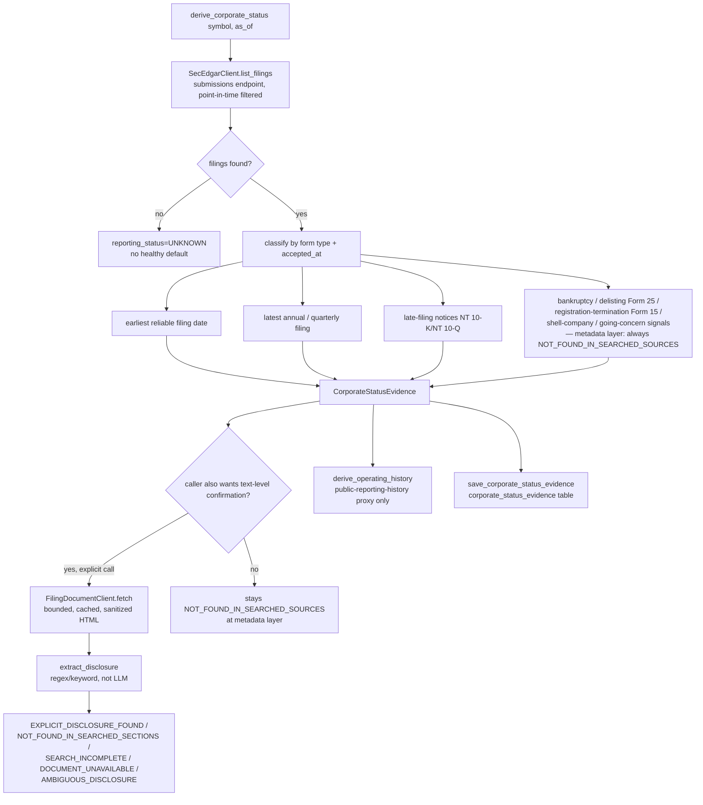
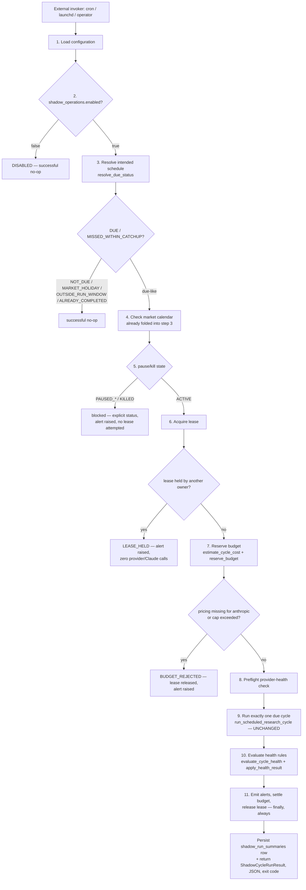
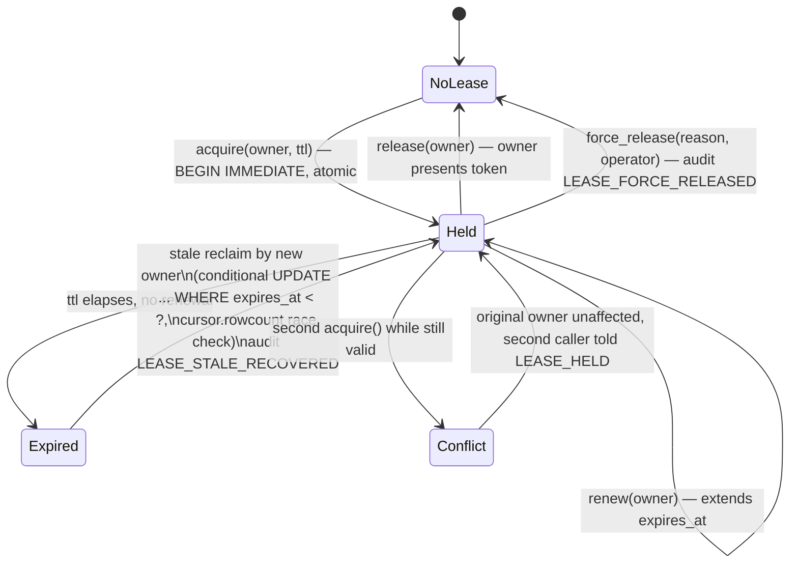
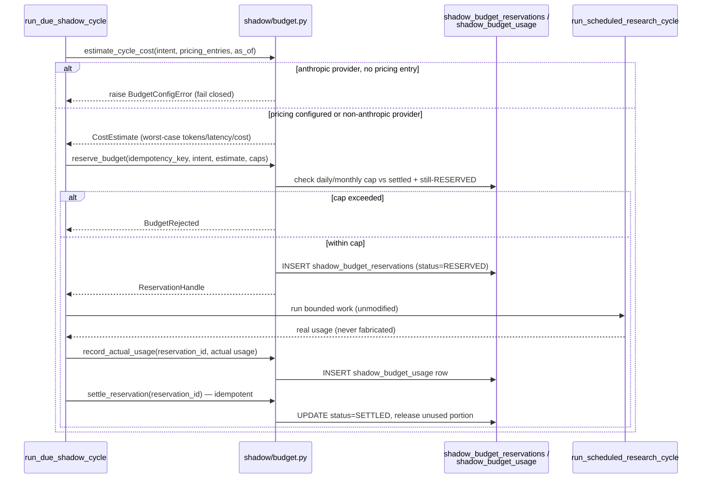
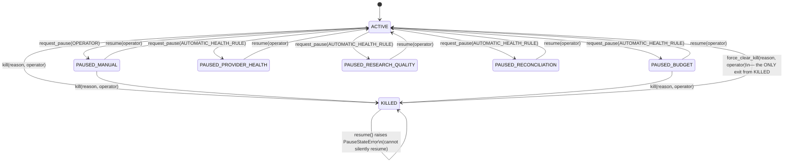
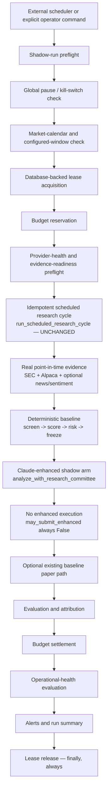
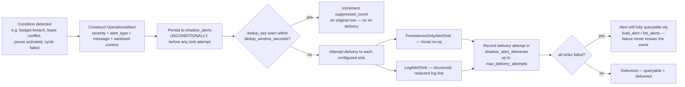
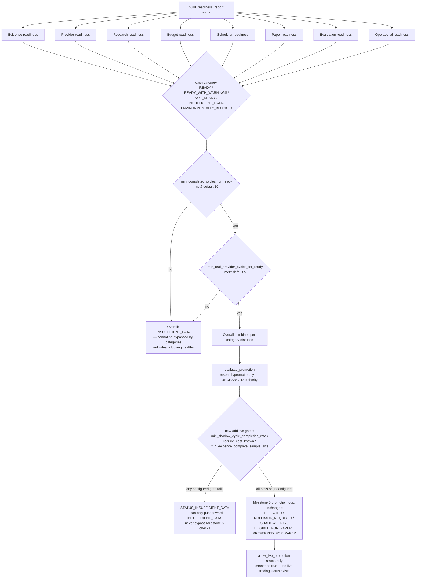

# Milestone 7 — Production shadow operations and evidence-completeness expansion

**Status:** Code-complete for the vertical slice defined in `docs/milestone-7.md`. Real
validation was performed where credentials/entitlements allow (SEC EDGAR corporate-status
data, a real end-to-end SEC-backed shadow cycle, and two real Claude API shadow-cycle runs).
Real news and real Reddit sentiment remain `ENVIRONMENTALLY_PENDING` — the required
credentials are absent from this environment's `.env`. **No recurring scheduler was
activated.** See "Scheduler support vs. deployment vs. activation" below for the exact,
unambiguous distinction.

> **Milestone 7.1 update (2026-07-13):** the runtime-integration gaps this document's own
> "Known limitations"/"Deferred work" sections named — corporate status not wired into the
> primary evidence snapshot, evidence-completeness not called from the scheduled-cycle
> path, per-role budget enforcement not wired end-to-end, `CycleIntent.model_name` always
> `None`, actual Claude usage never charged to the reservation — are now closed. See
> `docs/milestone7-1-shadow-integration-closure.md` for the full detail and
> `docs/adr/0005-production-shadow-operations-boundary.md`'s "Milestone 7.1 closure"
> section for the architecture-decision update. The content below is preserved as
> Milestone 7's own historical record and is not rewritten to imply these integrations
> existed at that time.

> **Milestone 7.2 update (2026-07-13):** field-level health diagnostics
> (`shadow_run_health_checks`), a diagnostic CLI (`shadow-health-explain`), a
> health-triggered pause/recommendation alert, and an activation-readiness decision
> (`shadow-readiness`'s `activation_readiness` block) were added. The
> `health_status=PAUSE_REQUIRED` this document's own Section "Real Claude validation"
> reported without explanation is now root-caused and fixed — see
> `docs/milestone7-2-shadow-health-diagnostics.md`.

This document describes the shadow-operations control layer and evidence-completeness
expansion added on top of Milestones 1-6.1. See `docs/adr/0005-production-shadow-operations-boundary.md`
for the design decisions and why each boundary exists, and
`docs/milestone6-real-evidence-continuous-evaluation.md` for the real-evidence architecture
this milestone builds on top of, unmodified.

## Why the existing pipeline remains authoritative

Nothing in this milestone changes who decides what. Evidence providers retrieve and
normalize facts. Claude analyzes supplied evidence and returns a structured decision object.
Deterministic application code screens, scores, sizes, freezes, executes, reconciles,
evaluates, schedules, budgets, pauses, alerts, and promotes. The scheduler
(`shadow/scheduler.py::run_due_shadow_cycle`) is a **wrapper** around the existing,
unmodified `research/scheduled_cycle.py::run_scheduled_research_cycle` — it adds preflight
gates (pause/kill, lease, budget, market-calendar) and post-cycle bookkeeping (health
evaluation, alerts, budget settlement), but never reimplements cycle logic, screening,
scoring, or execution eligibility.

## Corporate-status evidence

### Model

`src/trading_research/evidence_providers/corporate_status.py` defines `CorporateStatusEvidence`,
`FilingReference`, `CorporateRiskSignal`, and a local `SourceRecord`. Corporate-status
uncertainty uses an explicit six-value vocabulary, never collapsed to a boolean:

```text
CONFIRMED
NOT_FOUND_IN_SEARCHED_SOURCES
UNKNOWN
SOURCE_UNAVAILABLE
POINT_IN_TIME_UNSAFE
CONFLICTING
```

`NOT_FOUND_IN_SEARCHED_SOURCES` is never converted to `FALSE` — "we didn't find a
going-concern disclosure in the sections we searched" is a materially weaker claim than
"this company has no going-concern issue," and the model refuses to conflate the two.
`reporting_status` is tracked on a separate axis (`ACTIVE`/`INACTIVE`/`UNKNOWN`/
`SOURCE_UNAVAILABLE`).

### SEC provider extension

`src/trading_research/evidence_providers/corporate_status_adapters.py::derive_corporate_status(symbol, *, sec_client, as_of, cik=None)`
classifies deterministically over `SecEdgarClient.list_filings` (the SEC submissions
endpoint, already point-in-time-filtered by `accepted_at`) into: earliest reliable filing
date, latest annual/quarterly filing presence, late-filing notices (NT 10-K / NT 10-Q),
bankruptcy-adjacent signals, delisting signals (Form 25), registration-termination signals
(Form 15), shell-company signals, and going-concern signals. No new SEC HTTP endpoint was
needed — `list_filings` already targets the submissions endpoint (distinct from
`companyfacts`, which Milestone 6 already used for fundamentals).

**Metadata-layer honesty:** at this layer, bankruptcy/shell-company/going-concern signals
are derived from filing *metadata* (form types, dates, accession numbers) only — SEC
filing-history metadata genuinely cannot *confirm* these categories. They are therefore
always `NOT_FOUND_IN_SEARCHED_SOURCES` at this layer, never `CONFIRMED`. Reaching
`CONFIRMED`/`EXPLICIT_DISCLOSURE_FOUND` requires the separate filing-text extraction path
below. No code in this milestone wires the two together automatically — a caller wanting
the strongest possible signal must invoke both `derive_corporate_status` and
`extract_disclosure` explicitly.

### Filing-document retrieval

`src/trading_research/evidence_providers/filing_documents.py` — `FilingDocumentClient`,
`FilingDocumentCache`, `FilingDocument`, `sanitize_html`. Bounded retrieval
(`MAX_DOCUMENT_BYTES=2,000,000`, `MAX_RETAINED_TEXT_CHARS=500,000`), deterministic
HTML-to-text sanitization (script/style stripped, tags stripped, whitespace collapsed),
content hash, an immutable in-process cache that fails closed on corruption (never a silent
garbage read), and an explicit injection-risk/untrusted-input warning in the module
docstring — filing text is treated as untrusted third-party input, exactly like news and
Reddit text. The cache is in-process/per-run only, matching `evidence_providers/cache.py`'s
existing non-persistent scope; there is no cross-process filing-document cache.

### Deterministic disclosure extraction

`src/trading_research/evidence_providers/disclosure_extraction.py::extract_disclosure(document, *, disclosure_type, rule_version=EXTRACTION_RULE_VERSION)`
is regex/keyword-based — **not** an LLM call. Outcomes:

```text
EXPLICIT_DISCLOSURE_FOUND
EXPLICIT_DISCLOSURE_NOT_FOUND_IN_SEARCHED_SECTIONS
SEARCH_INCOMPLETE
DOCUMENT_UNAVAILABLE
AMBIGUOUS_DISCLOSURE
```

`EXTRACTION_RULE_VERSION = "disclosure-extraction-v1"` is recorded on every result. A
bounded snippet (≤200 chars) plus a sha256 excerpt hash is retained — never the full
excerpt. The module never claims a company has no going-concern issue merely because a
phrase was not found in the sections it searched.

### Operating-history semantics — what the proxy does and does NOT mean

`src/trading_research/evidence_providers/operating_history.py::derive_operating_history(evidence) -> OperatingHistoryResult`
is a pure function over an already-built `CorporateStatusEvidence`. It derives a value from
the **earliest reliable SEC filing date** — this is a **public-reporting-history proxy**,
explicitly and deliberately **not**:

- company age (a company can operate privately for years before its first SEC filing);
- exchange-listing history (a company can be SEC-reporting without being exchange-listed,
  or can re-list after a gap);
- a guarantee of continuous operation (a filing gap does not necessarily mean the company
  stopped operating).

The module docstring disclaims all three explicitly. `derive_operating_history` returns
`UNKNOWN` (never a fabricated `0`) when the earliest filing date cannot be established, or
when the underlying `CorporateStatusEvidence.reporting_status` is itself `SOURCE_UNAVAILABLE`.
An `INTEGRATION_NOTE` constant in the module documents exactly what a future task must prove
(screener gate semantics, the "IPO of an old company" edge case, `UNKNOWN`-outcome
visibility to the screener) before this value may safely feed
`FundamentalSnapshot.operating_history_years` or the screener. **This wiring has
deliberately not been done in Milestone 7** — `derive_operating_history` exists and is
tested, but `CandidateInput.operating_history_years` in the real evidence path is still
always `None`, exactly as in Milestone 6 (ADR 0004 Decision 7).

### Going-concern limitations

- Going-concern signals are always `NOT_FOUND_IN_SEARCHED_SOURCES` at the metadata layer —
  reaching a stronger signal requires the text-extraction path, which itself only searches
  bounded sections of a bounded-size document and reports `SEARCH_INCOMPLETE` rather than a
  false-negative when the document was truncated before a match was found.
- Corporate-status evidence is **not yet wired into `research/evidence.py::build_evidence_snapshot`'s
  provider list** — no `CorporateStatusEvidenceProvider` Protocol/adapter exists yet feeding
  it into the existing `EvidenceBundle`/`EvidenceSnapshot` pipeline that Claude and the
  screener ultimately see. The standalone model, SEC-derived provider function, and
  completeness-composition layer are built and tested; the pipeline integration is deferred
  (see "Deferred work").
- `evaluate_completeness` (the evidence-completeness policy, below) is not yet called from
  `research/scheduled_cycle.py` — also deferred.

### Persistence

`src/trading_research/storage/corporate_status_schema.py::apply_corporate_status_schema(conn)`
adds `corporate_status_evidence` and `evidence_completeness_results` (both idempotent
`CREATE TABLE IF NOT EXISTS`, registered in `storage/database.py::connect()`).
`src/trading_research/storage/corporate_status_repositories.py` provides round-trip
save/load/list functions for both tables.

## Corporate-action evidence

`src/trading_research/evidence_providers/corporate_actions.py::AlpacaCorporateActionsClient.list_corporate_actions(symbol, *, as_of, start=None, types=IMPLEMENTED_ACTION_TYPES)`
implements exactly three action types, verified field-for-field against the official
`alpaca-py` SDK source (`alpaca/data/models/corporate_actions.py`, fetched during this
session):

```text
IMPLEMENTED: forward_split, reverse_split, cash_dividend
```

Nine other Alpaca-documented action types are **explicitly deferred**, named in
`corporate_actions.py::DEFERRED_ACTION_TYPES`:

```text
unit_split, stock_dividend, spin_off, cash_merger, stock_merger,
stock_and_cash_merger, redemption, name_change, worthless_removal,
rights_distribution
```

Reason: mergers/reorganizations carry materially higher misclassification risk if this
session's field-shape verification missed an edge case (e.g. multi-leg exchange ratios) —
per this milestone's own instruction to stop rather than guess when a documented endpoint
cannot be verified safely within scope. `NameChange`/`SpinOff` and the remaining type keys
were not independently field-verified at all this session. A future task extending
`corporate_actions.py` must re-verify each remaining model class against the official SDK
source before adding it. The Broker API's separate `corporate_actions/announcements`
endpoint (different auth path, different response shape) was investigated and rejected as
out of scope — a different product surface than the Market Data API this repository already
uses.

`CorporateAction` fields are structurally distinct from `PriceBar` fields — adjusted price
bars (Alpaca's `adjustment` parameter) are never conflated with a separately modeled
corporate-action event, and no action is ever inferred from a price jump alone (asserted by
a structural test that the module never imports `market_data_provider`/
`AlpacaMarketDataClient`/`PriceBar`). `AlpacaCorporateActionsClient` is a standalone raw
client — **it is not wired into `research/evidence.py`'s Protocol pipeline**; no
`CorporateActionEvidenceProvider` Protocol exists yet.

## News provider — Alpaca News API

**Decision:** Alpaca's documented News API (`GET https://data.alpaca.markets/v1beta1/news`)
was selected because it uses the *same* credential pair (`ALPACA_MARKET_DATA_API_KEY`/
`ALPACA_MARKET_DATA_API_SECRET`) `AlpacaMarketDataClient` already uses — no new vendor
relationship, no new dependency.

`src/trading_research/evidence_providers/alpaca_news_provider.py::AlpacaNewsClient` is
`OFFLINE-DETERMINISTIC`-tested (httpx `MockTransport`, no real sockets by default) and
code-complete. It normalizes provider article ID, headline, source, publication time,
symbols, URL, category, a minute-bucketed `duplicate_group_key` (headline+source+
published-minute, so syndicated wire copies collapse to one record — never treated as
independent confirmation), a sha256 `content_hash`, `source_trust_classification=
"ALPACA_AGGREGATED"`, a `prompt_injection_risk_note` (headline/summary text is untrusted
third-party input), and `retention_classification="ACCOUNT_LINKED"` (never
`PUBLIC_DOMAIN`). Any article with `published_at > available_by` is excluded
(point-in-time safety). Caps: `MAX_ARTICLES_RETURNED=200`, `MAX_ARTICLES_PER_REQUEST=50`,
`MAX_SUMMARY_CHARS=4000`, `MAX_PAGES=5`.

Wired into `evidence_adapters.RealNewsEvidenceProvider` and `cli.py::_build_evidence_provider_registry`
via `config/evidence_providers.yaml`'s `providers.news.provider: alpaca_news`, validated
against a `KNOWN_NEWS_PROVIDERS` allowlist (fails closed on any other name). **Shipped
default config is unchanged**: `news.enabled: false`, `news.provider: null`. Enabling
`alpaca_news` is an explicit operator edit — it is never inferred from
`ALPACA_MARKET_DATA_API_KEY` presence, and even when enabled, absent credentials fail
closed to `news=None` (excluded from the registry), matching `market_data`'s posture.

**Status: `REAL-NEWS-DATA` = `ENVIRONMENTALLY_PENDING`.** `ALPACA_MARKET_DATA_API_KEY`/
`_SECRET` are absent from `.env` in this session. The wiring was verified offline
end-to-end (fixture credentials, fixture YAML) — `used_providers` correctly includes
`alpaca-news` and wraps a real `AlpacaNewsClient` instance — but no actual HTTP round trip
to `data.alpaca.markets/v1beta1/news` has occurred. `tests/integration/test_shadow_news_smoke.py`
(`RUN_NEWS_API_TESTS=true`) confirms a clean, honest skip rather than a fabricated pass.

## Reddit sentiment path

`src/trading_research/evidence_providers/reddit_fetch.py::make_fetch_records(config)` /
`build_reddit_sentiment_source(config)` completes the wiring from
`mcp/reddit_adapter.py::call_read_only_tool` into `RedditSentimentSource`. "Configured" is
determined by real credential presence (`bool(config.reddit_client_id) and
bool(config.reddit_client_secret)`) — **not** by the config-file `sentiment.enabled` flag
(see "Bugs discovered and fixed" for why this distinction mattered).

Requirements satisfied: calls only `search_reddit` (the read-only allowlisted tool) with
query `"$SYMBOL"` (literal cashtag); no mutation tool (`create_post`/`reply_to_post`/
`delete_comment`/`edit_post`/vote/etc.) is ever called — enforced both by
`call_read_only_tool`'s own `ReadOnlyPolicyError` and by an AST-based structural test;
cashtag disambiguation requires the literal `$SYMBOL` string (a bare word "it" never
matches `$IT`); duplicate/cross-post normalization via `record_id` deduplication and an
`is_cross_post` flag; bounded to `MAX_RECORDS_RETURNED=200`; every record is filtered
against `[window_start, window_end)` before being returned (historical cutoff); an
`INJECTION_RISK_NOTE` documents that post/comment text is untrusted. Nothing in this
repository registers `reddit_fetch.py`, the MCP adapter, or any `ClientSession` as a
Claude-callable tool — Claude never initiates a provider or MCP call itself (ADR 0003).

**Status: `REAL-REDDIT-SENTIMENT` = `ENVIRONMENTALLY_PENDING`.** `REDDIT_CLIENT_ID`/
`REDDIT_CLIENT_SECRET` are absent from `.env` in this session (anonymous Reddit API access
returns HTTP 403, per `.env.example`). `tests/integration/test_shadow_reddit_smoke.py`
(`RUN_REDDIT_SENTIMENT_TESTS=true`) confirms a clean, honest skip.

A known limitation: `reddit_fetch.py::_extract_raw_items` normalizes several *plausible*
MCP tool-result shapes defensively (plain list, dict with `results`/`posts`/`items`/`data`,
an object exposing `.structuredContent`/`.content`) because this session has no real Reddit
MCP server response to inspect. If the real server's shape doesn't match a handled case,
it fails closed to an empty result rather than crashing or fabricating — but this has not
been validated against a real server response.

## Evidence-completeness policy

`src/trading_research/research/evidence_completeness.py::evaluate_completeness(...) ->
EvidenceCompletenessResult` composes `classify_snapshot_outcome`'s existing Milestone 6
outcome with an optional `CorporateStatusEvidence` result under a versioned policy
(`POLICY_VERSION = "evidence-completeness-v1"`, persisted on every result). Full 11-value
status vocabulary from `docs/milestone-7.md` Step 11:

```text
COMPLETE_FOR_SCREENING          COMPLETE_FOR_RESEARCH
PARTIAL_NONCRITICAL             MISSING_CRITICAL_CORPORATE_STATUS
MISSING_CRITICAL_MARKET_DATA    MISSING_CRITICAL_FUNDAMENTALS
MISSING_NEWS                    MISSING_SENTIMENT
CONFLICTING_CRITICAL_DATA       POINT_IN_TIME_UNSAFE
PROVIDER_UNAVAILABLE
```

**Screening completeness and research completeness are two distinct fields.** News or
sentiment absence alone never blocks screening completeness. Corporate-status `None`,
`UNKNOWN`, `CONFLICTING`, or `SOURCE_UNAVAILABLE` always blocks screening completeness
(fail-closed). This is a pure, deterministic function — no model influence over the result.
It is **not yet wired into `research/scheduled_cycle.py`** as an automatic per-symbol gate
(deferred; the composition was proven end-to-end in
`tests/integration/test_shadow_end_to_end.py::test_critical_corporate_status_unknown_claude_skipped_explicit_reason`
via direct composition, not through `_run_symbol` itself).

## Shadow-operations configuration

`config/shadow_operations.yaml` + `src/trading_research/shadow/config.py::load_shadow_operations_config()`.
Ships disabled in every dimension:

```yaml
shadow_operations:
  enabled: false          # top-level kill switch for the whole slice
  mode: SHADOW_ENHANCED
  allow_baseline_paper_submission: false
  allow_enhanced_submission: false   # structurally cannot be true — see below

schedule:
  enabled: false
  cadence: DAILY_MARKET_DAY
  intended_local_time: "06:45"
```

`allow_enhanced_submission: true` is **structurally impossible**:
`ShadowOperationsSection.__post_init__` raises `ShadowOperationsConfigError` if it is ever
`true`, mirroring `PromotionGateConfig.allow_live_promotion`'s own construction-time guard.
Unknown `mode`/`cadence` values fail closed against `KNOWN_MODES`/`KNOWN_CADENCES`
allowlists. No environment variable can enable a capability anywhere in this module — `.env`
only ever supplies a credential, never a decision, matching the repository-wide convention.
Budget fields validate as positive (zero/negative rejected); rate fields validate to `[0,1]`.

## Persistence — six shadow-operations tables plus three alerts/summary tables

`src/trading_research/storage/shadow_operations_schema.py::apply_shadow_operations_schema(conn)`:

- `shadow_scheduler_runs` — one row per scheduler invocation: intended-schedule identity,
  scheduled/actual start/finish, `cycle_id`, config hash, mode, lease owner/expiry snapshot,
  status, pause-state snapshot, budget reserved/consumed, symbols attempted/completed/
  skipped, provider/research failure counts, paper-submission count, alert count, failure
  reason, operator action, deployment source.
- `shadow_run_leases` — owner, acquired/expires/renewed/released timestamps, status
  (`HELD`/`RELEASED`).
- `shadow_budget_reservations` — reserved vs. consumed cost/tokens/latency,
  `emergency_margin_breached` flag, status (`RESERVED`/`SETTLED`/`EXPIRED`), `UNIQUE`
  constraint on `idempotency_key`.
- `shadow_budget_usage` — append-only actual-usage rows, one per settlement call.
- `shadow_pause_state` — single current row (`is_current=1`) plus full append-only history
  in the same table.
- `shadow_operator_actions` — pure append-only audit trail (no `UPDATE`/`DELETE` anywhere
  in this repository targets this table): lease stale-recovery, lease force-release, pause
  resume, kill activation, kill force-clear.

`src/trading_research/storage/shadow_alerts_schema.py::apply_shadow_alerts_schema(conn)`
adds `shadow_alerts`, `shadow_alert_deliveries`, `shadow_run_summaries` (deliberately
separated from the core-slice schema, since the core-slice task's own scope explicitly
excluded these three by name).

All schema application is additive, idempotent (`CREATE TABLE IF NOT EXISTS`), registered
in `storage/database.py::connect()`. No Milestone 1-6.1 table was changed. No secrets or
account identifiers in any column; money columns are `TEXT` (stringified `Decimal`), never
`REAL`, to avoid floating-point drift.

## Leases

`src/trading_research/shadow/lease.py` — database-backed, over `shadow_run_leases`.
`acquire`/`renew`/`release`/`force_release` each wrap their read-then-write in an explicit
`BEGIN IMMEDIATE` transaction, taking a real SQLite file-level write lock — verified safe
across two independent `sqlite3.connect()` calls against the same on-disk file (not
`:memory:`) in concurrency tests. Stale reclaim uses a conditional
`UPDATE ... WHERE expires_at < ?` and inspects `cursor.rowcount` (not the unreliable
connection-lifetime `total_changes` counter — a bug caught and fixed before any test ran
against it) to detect a race against a second concurrent stale-reclaimer. A winning stale
reclaim always writes a `LEASE_STALE_RECOVERED` operator action — never a silent takeover.
`force_release` is the only way to release a lease without presenting the owner token, and
raises unless both `reason` and `operator` are non-empty; it always records a
`LEASE_FORCE_RELEASED` operator action.

A **lease** and **idempotency** (`derive_cycle_id` + the scheduler's own
`intended_schedule_id`) are two separate, complementary mechanisms (ADR 0005 Decision 3): a
lease prevents two *concurrent* processes from racing the same intended cycle; idempotency
prevents two *sequential* invocations (e.g. crash recovery) from redoing completed work.

## Pause and kill switch

`src/trading_research/shadow/pause.py`. States:

```text
ACTIVE  PAUSED_MANUAL  PAUSED_BUDGET  PAUSED_PROVIDER_HEALTH
PAUSED_RESEARCH_QUALITY  PAUSED_RECONCILIATION  KILLED
```

Exactly one current row (`shadow_pause_state.is_current=1`) plus append-only history in the
same table. `resume()` and `request_pause()` both raise `PauseStateError` while the current
state is `KILLED` — the **only** exit from `KILLED` is `force_clear_kill(reason, operator,
clock)`, a separate, explicitly-named function that always records a `KILL_FORCE_CLEARED`
operator action. `source` distinguishes `OPERATOR` from `AUTOMATIC_HEALTH_RULE`. A
structural, AST-based test (`test_pause_module_has_no_provider_or_research_imports`)
asserts `pause.py` imports nothing from `evidence_providers`, `research.orchestration`,
`research.scheduled_cycle`, or `anthropic` — no model or provider output can reach
pause/kill decisions because the module cannot see it.

`run_due_shadow_cycle` checks pause/kill state **before** lease acquisition, so a
paused/killed system never even attempts to acquire a lease or touch a provider.

## Budgets

Three tiers, all in `src/trading_research/shadow/budget.py` and
`src/trading_research/shadow/role_budget.py`:

1. **Cycle-level estimate and reservation.** `estimate_cycle_cost(intent, pricing_entries,
   as_of_date)` computes worst-case tokens/latency as `max_symbols_per_cycle *
   max_roles_per_symbol * max_attempts_per_role * max_{output,input}_tokens_per_cycle`,
   reusing `research/usage.py::select_pricing` (no second pricing table). When
   `intent.provider == "anthropic"` and no pricing entry matches, this raises
   `BudgetConfigError` — the structural block that stops a real-Claude estimate (and
   therefore any downstream reservation/call) before it can proceed. `deterministic`/
   `scripted` providers are exempt.
2. **Reservation and settlement.** `reserve_budget(...)` is idempotent on `idempotency_key`
   (`UNIQUE` constraint — a second call with the same key returns the existing row).
   Remaining daily/monthly budget = `cap - settled_usage_for_period - sum(still-RESERVED
   reservations)` — concurrent live reservations are counted, closing a race where two
   concurrent cycles could each see "budget available" against the same cap.
   `record_actual_usage` accepts caller-supplied real cost/tokens/latency (never fabricated).
   `settle_reservation` is idempotent. `expire_abandoned_reservations` sweeps stale
   `RESERVED` rows for crash recovery. `check_emergency_margin_breach` reports (never acts
   on) whether consumed cost exceeds reserved by more than the configured margin.
3. **Role-level pre-call gate.** `role_budget.py::check_role_budget(...)` checks allowed-role
   membership, role/attempt-count limits, and compares the role's *configured maximum
   possible* tokens/latency/cost against `remaining_reservation_budget`. Any check that
   would exceed remaining budget returns `SKIPPED_BUDGET_EXHAUSTED` — a distinct dataclass
   value with no `failure_code`/`provider_failure` attribute, so it can never be conflated
   with a provider failure in health/readiness metrics.

**Known limitation:** per-role runtime budget enforcement is **not wired end-to-end**.
`check_role_budget` is fully unit-tested but is never called from inside
`run_due_shadow_cycle` or `run_scheduled_research_cycle` — only the cycle-level reservation
is actually enforced today. Extending this would require modifying
`research/scheduled_cycle.py`/`research/orchestration.py`'s internals, which this milestone's
task boundaries explicitly did not authorize.

**Known limitation:** `CycleIntent.model_name` is hardcoded `None` in
`shadow/scheduler.py` regardless of the real model in use, because
`ScheduledResearchConfiguration` carries no model-name field. This means the scheduler's own
cycle-level pricing lookup always resolves against an empty model string — a real
`config/research_pricing.yaml` entry keyed on the actual model name (e.g.
`claude-sonnet-5`) is never matched by the scheduler's own estimate, even once populated.
Discovered during real-Claude validation (see "Real validation" below); fixing it requires
threading a new parameter through the scheduler's signature — explicitly out of this
milestone's "no design changes" bug-fix scope, and documented for a future task.

## Alerts

`src/trading_research/shadow/alerts.py`. `OperationalAlert` (frozen dataclass): severity
(`INFO`/`WARNING`/`ERROR`/`CRITICAL`), one of 17 exact alert types:

```text
CYCLE_FAILED  CYCLE_PARTIALLY_COMPLETE  LEASE_CONFLICT  LEASE_STALE_RECOVERED
BUDGET_NEAR_LIMIT  BUDGET_EXCEEDED  PROVIDER_UNAVAILABLE
PROVIDER_FAILURE_RATE_HIGH  EVIDENCE_COMPLETENESS_LOW
RESEARCH_RETRY_EXHAUSTION_HIGH  UNSUPPORTED_CLAIM_RATE_HIGH
OUTPUT_TRUNCATION  CLAUDE_COST_SPIKE  RECONCILIATION_MISMATCH
SCHEDULER_MISSED_RUN  PAUSE_ACTIVATED  KILL_SWITCH_ACTIVATED
```

message (bounded, 1000 chars), context (bounded dict, secret-shaped keys/values stripped via
`sanitize_context`), a deterministic `dedup_key` (SHA-256 over `alert_type` + a sorted
context subset). `AlertSink` is a `Protocol` (`send(alert) -> AlertDeliveryResult`), not
`runtime_checkable`. Two concrete sinks: `PersistenceOnlyAlertSink` (no-op, since
`raise_alert` already persisted) and `LogAlertSink` (structured log line via the existing
`logging_config.py`, subject to the same secret-redaction every log line gets). **No
webhook/email sink exists** — ADR 0005 Decision 8 declines to add an outbound-HTTP-notification
dependency without a concrete, already-authorized target.

`raise_alert(conn, alert, sinks, clock, dedup_window_seconds, max_delivery_attempts)`
persists to `shadow_alerts` **unconditionally before** touching any sink. A duplicate
`dedup_key` within the dedup window is not re-persisted or re-delivered, but increments
`suppressed_count` on the original row — never a silent drop. Each sink gets up to
`max_delivery_attempts` (default 2), every attempt persisted to `shadow_alert_deliveries`. A
`CRITICAL` alert whose delivery fails on every sink is still fully queryable — delivery
failure never erases the underlying operational event.

## Health rules

`src/trading_research/shadow/health.py::evaluate_cycle_health` is a pure function (no
DB/network access) taking `CycleHealthInputs` and `HealthPolicyConfig` (thresholds sourced
1:1 from `config/shadow_operations.yaml`'s `safety.*` section), producing:

```text
HEALTHY  DEGRADED  PAUSE_RECOMMENDED  PAUSE_REQUIRED
```

with exact reasons and `triggering_flags` naming which `safety.pause_on_*` dimension drove a
`PAUSE_REQUIRED` verdict. `None` inputs (e.g. no Claude roles ran) never fabricate a 0.0 or
1.0 — they simply do not contribute a failure signal. `DEGRADED` uses a fixed 0.6x fraction
of each configured pause threshold as its own "approaching the line" boundary — this
module's own versioned interpretation, not a value from `config/shadow_operations.yaml`.

`apply_health_result(conn, health_result, config, clock, source="AUTOMATIC_HEALTH_RULE")` is
the **only** function in this milestone's shadow package that calls
`shadow.pause.request_pause(...)` — and only when `status == PAUSE_REQUIRED` **and** the
corresponding `safety.pause_on_*` flag is configured truthy. It never calls `resume()`
(verified by an AST-walking structural test) — no automatic unpause after a critical event.

## Readiness report

`src/trading_research/shadow/readiness.py::build_readiness_report(conn, as_of, config,
thresholds=None)` aggregates 8 categories (evidence, provider, research, budget, scheduler,
paper, evaluation, operational) from already-persisted tables only. Every category status is
one of:

```text
READY  READY_WITH_WARNINGS  NOT_READY  INSUFFICIENT_DATA  ENVIRONMENTALLY_BLOCKED
```

A category with zero underlying rows is always `INSUFFICIENT_DATA`, never a fabricated
`READY`. **Hard requirement, explicitly tested**
(`test_single_successful_cycle_is_never_ready`): one perfect-looking completed cycle still
produces overall `INSUFFICIENT_DATA`, enforced by a configurable floor applied *after* all 8
categories are individually evaluated:

- `min_completed_cycles_for_ready` — default **10**
- `min_real_provider_cycles_for_ready` — default **5**
- `max_scheduler_miss_rate` — default **0.10**

These floors cannot be bypassed by every category individually looking healthy. This
milestone's own real/offline validation this session (a handful of manually-invoked cycles)
does **not** meet this floor — no claim of shadow-operations readiness is made anywhere in
this document.

## Retention

`src/trading_research/shadow/retention.py` classifies 17 table rules (`TableRetentionRule`)
covering the categories named in `docs/milestone-7.md` Step 26: immutable evidence, raw SEC
filing documents, provider request metadata, account-linked normalized market data, research
attempts, structured failures, scheduler runs, alerts, budget reservations, delivery logs.
Tier vocabulary: `PERMANENT_AUDIT`, `RETAIN_N_DAYS`, `RETAIN_N_DAYS_THEN_HASH_ONLY`,
`RETAIN_INDEFINITELY_ACTIVE_EVALUATION`.

`retention-plan` prints a read-only classification+count. `retention-apply --dry-run` prints
a read-only diff. **`apply_retention(conn, as_of, *, dry_run=False)` raises
`NotImplementedError` unconditionally** — real deletion is deliberately unimplemented, not
half-built, per ADR 0005 Decision 11. No `DELETE`/`UPDATE`/`INSERT` statement exists anywhere
in the module (grepped explicitly). This is recorded as deferred work, not a silent gap.
Coverage note: `RETENTION_PLAN`'s 17 rules cover exactly the categories this milestone named
— `paper_execution_*`/`simulated_*`/`benchmark_results`/other paper-runtime and
orchestration tables are not yet classified.

## CLI commands

All 14 new subcommands under `python -m trading_research.cli <command>`, structured JSON
output, non-zero exit code on actual errors, no credentials or raw payloads returned:

```text
run-due-shadow-cycle          Single-invocation scheduler entry point
shadow-status                 Current pause/kill state + recent scheduler runs
shadow-readiness              Shadow-operations readiness report
shadow-run-history             Recent shadow scheduler runs/summaries
shadow-budget-status           Daily/monthly budget usage vs caps
shadow-alerts                 Recent alerts and delivery status
shadow-pause    --reason      Request an operator pause
shadow-resume   --reason --operator   Resume — cannot override KILLED
shadow-kill     --reason --operator   Activate the kill switch
shadow-force-clear-kill --reason --operator   The only KILLED exit path
shadow-lease-status           Current shadow_run_leases state
corporate-status --symbol --as-of   Real SEC-derived corporate-status evidence
retention-plan                 Read-only retention classification
retention-apply [--dry-run]    Dry-run diff; without --dry-run, raises NotImplementedError
```

`shadow-resume`/`shadow-kill`/`shadow-force-clear-kill` all require `--operator` (argparse
`required=True`) — a deliberate, documented deviation from `docs/milestone-7.md`'s own
shorthand CLI example, because `pause.py`'s `resume`/`kill`/`force_clear_kill` structurally
require a non-empty operator string, and defaulting it to a hardcoded value would weaken the
audit trail's "who" field for the highest-stakes commands. `shadow-pause` alone does not
require `--operator` (matching the doc's example), since `request_pause`'s operator
parameter is genuinely optional.

## Scheduler support vs. deployment vs. activation

This is the single most important distinction in this document. The milestone doc's own
vocabulary, used exactly:

**CODE-COMPLETE SCHEDULER SUPPORT** — **TRUE.** `shadow/scheduler.py::run_due_shadow_cycle`
implements the full 11-step flow (below), is unit- and integration-tested (33 scheduler/
schedule tests + 5 end-to-end composed tests), and the `run-due-shadow-cycle` CLI subcommand
exists and was manually exercised against the shipped disabled-by-default config (`exit 0`,
`{"status": "DISABLED", "is_successful_no_op": true, ...}`).

**DEPLOYABLE SCHEDULER ARTIFACT** — **TRUE.** `deploy/launchd/com.agentic-trading-desk.shadow.plist.example`
(validated with `plutil -lint` → `OK`) and `deploy/launchd/run_shadow_cycle.sh.example`
(validated with `bash -n` → syntax OK) exist, are documented in `deploy/launchd/README.md`,
embed no credentials, and are inert by construction — `.example` suffix so `launchctl` never
picks them up by accident, `StartCalendarInterval` commented out, `RunAtLoad: false`.

**ACTUAL RECURRING DEPLOYMENT ACTIVATED** — **FALSE.** No `launchctl load` command was ever
run against these artifacts, in this session or any prior one. `launchctl list | grep
com.agentic-trading-desk` would print nothing. There is no cron entry, no CI scheduled
workflow, and no running daemon anywhere associated with this repository. Recurring
execution requires a separate, explicit operator step outside anything this milestone
performed — see the runbook for the exact activation procedure.

## Scheduler artifact — validation performed without activation

- `plutil -lint deploy/launchd/com.agentic-trading-desk.shadow.plist.example` → `OK`
- `bash -n deploy/launchd/run_shadow_cycle.sh.example` → syntax OK, not executed
- The plist has no `EnvironmentVariables` key; the wrapper script only sources the repo's
  own `.venv` activation script, never `.env` directly (the CLI process loads `.env` itself)
- `python -m trading_research.cli run-due-shadow-cycle` manually invoked against the shipped
  disabled config → exit code 0, `{"status": "DISABLED", "is_successful_no_op": true, ...}`

## Real validation — actual results this session

**`REAL-SEC-CORPORATE-STATUS` — CONFIRMED.**
`RUN_CORPORATE_STATUS_TESTS=true pytest tests/integration/test_shadow_corporate_status_smoke.py -v -s -m corporate_status_real`
→ `1 passed in 0.60s`. Genuine SEC EDGAR round trip (no mock, no fixture) for AAPL,
`as_of=2026-07-11T13:00:00+00:00`:

```text
reporting_status=ACTIVE
operating_history_years=11.126027397260273...
completeness_status=COMPLETE
source_count=1  signal_count=5  has_any_critical_uncertainty=False
```

Also manually confirmed via the real CLI: `corporate-status --symbol AAPL --as-of
2026-07-10T20:00:00Z` against the live SEC EDGAR API returned real filing-derived evidence
(`reporting_status: ACTIVE`, `earliest_reliable_filing_date: 2015-05-29`, real
accession-number-backed signal arrays).

**Real SEC-only shadow cycle through the real orchestrator — CONFIRMED.**
`RUN_REAL_SHADOW_CYCLE=true pytest tests/integration/test_shadow_real_cycle_smoke.py -v -s -m real_shadow_cycle`
→ `1 passed in 1.37s` (re-run: `0.81s`, stable):

```text
status=COMPLETED  symbols_attempted=1  symbols_completed=1
budget_reserved_usd=0  budget_consumed_usd=0
market_data_is_real=False   (Alpaca market-data credentials absent — reported honestly)
health_status=HEALTHY   paper_submitter_calls=0
```

A real, unmodified `run_due_shadow_cycle` driving a real, unmodified
`run_scheduled_research_cycle` against real SEC EDGAR fundamentals+filings,
`DeterministicResearchProvider` (no real Claude call in this test), `FixtureMarketDataClient`
for market data. Budget reservation genuinely settled, lease genuinely released, health
result genuinely `HEALTHY`, zero paper submissions.

**`REAL-CLAUDE-SHADOW` — CONFIRMED, run twice for repeatability.**
`RUN_REAL_CLAUDE_SHADOW_CYCLE=true pytest tests/integration/test_shadow_real_claude_cycle_smoke.py -v -s -m real_claude_shadow_cycle`

Run 1: `1 passed in 55.27s`
```text
status=COMPLETED  roles_invoked=['bear', 'manager']  attempt_count=2  failure_count=0
total_input_tokens=9954  total_output_tokens=5320  total_latency_ms=54761
total_estimated_cost_usd=0.10966200
budget_reserved_usd=0.48000  budget_consumed_usd=0.00000
paper_submitter_calls=0
```

Run 2: `1 passed in 59.66s`
```text
roles_invoked=['bear', 'manager']  attempt_count=2  failure_count=0
total_input_tokens=10007  total_output_tokens=5506  total_latency_ms=59193
total_estimated_cost_usd=0.11261100
paper_submitter_calls=0
```

Bounded `bear`+`manager` role set only (never any other role); zero failed attempts either
run; manager invoked (structurally required — `COMPLETED` could not happen without it);
zero paper submissions; budget reservation settled at/under the $0.50 test cap both times
(~$0.11 x 2 ≈ $0.22 real dollars spent total). `budget_consumed_usd=0.00000` at the
orchestrator level is a pre-existing, documented structural fact (`record_actual_usage` is
not yet wired to real per-cycle cost data at this orchestration layer) — the authoritative
real cost figures above (`$0.1097`/`$0.1126`) were confirmed directly from `research_attempts`.

**Environmentally pending — no claim of real validation made:**

- `REAL-NEWS-DATA` — `ENVIRONMENTALLY_PENDING`. `ALPACA_MARKET_DATA_API_KEY`/`_SECRET`
  absent. Clean skip confirmed, not run.
- `REAL-REDDIT-SENTIMENT` — `ENVIRONMENTALLY_PENDING`. `REDDIT_CLIENT_ID`/
  `REDDIT_CLIENT_SECRET` absent. Clean skip confirmed, not run.

## Test summary

Default suite (offline, network-free): **1174 passed, 12 skipped** (baseline 760 passed/7
skipped at milestone start; 12 skips = 7 pre-existing Milestone 4-6 opt-in tests + 5 new
Milestone 7 opt-in smoke tests, each skipping with a clear, actionable reason naming the
required env flag). `paper_runtime`: **33 passed**, unchanged throughout. Five opt-in real
smoke tests exist, gated by `RUN_CORPORATE_STATUS_TESTS`, `RUN_NEWS_API_TESTS`,
`RUN_REDDIT_SENTIMENT_TESTS`, `RUN_REAL_SHADOW_CYCLE`, `RUN_REAL_CLAUDE_SHADOW_CYCLE`
respectively, none run by default `pytest tests/ -q`.

## Bugs discovered and fixed (selected)

- `RedditSentimentSource` wiring in `cli.py` previously gated `credentials_configured` on
  the YAML `sentiment.enabled` flag, not on real credential presence — semantically wrong
  even though not exploitable (the downstream fail-closed check already covered the gap).
  Fixed by routing through `reddit_fetch.build_reddit_sentiment_source`.
- `corporate_status_adapters._latest_of` initially matched form types by exact string,
  causing a `10-K/A` amendment to never match the annual-filing category. Fixed with a
  `_base_form_type()` helper while preserving `is_amendment=True`.
- `shadow/lease.py`'s stale-reclaim race check initially used `conn.total_changes`
  (a connection-lifetime cumulative counter, unreliable per-statement) instead of
  `cursor.rowcount`. Fixed before any test ran against it.
- `shadow/schedule.py::resolve_due_status`'s first draft walked the catch-up window
  today-first, silently swallowing a genuinely missed prior-day slot. Fixed to walk
  oldest-first, plus two follow-on bugs (first-ever-run false `MISSED_TOO_OLD`, and
  reporting the oldest instead of nearest unresolved backlog slot) — all three caught and
  fixed during test-writing, before any test was reported passing.
- Real-Claude validation surfaced a genuine `BUDGET_REJECTED` false rejection: `scheduler.py`
  unconditionally maps `provider_mode="real"` to `"anthropic"` for pricing purposes even
  when the actual research provider is deterministic. Not a shipped defect in the sense of
  incorrect production behavior (no real-money cycle was mis-priced), but a real,
  test-exposed structural ambiguity, worked around at the test level and documented for a
  future fix.
- `evidence_providers/fixture_clients.py::FixtureSecClient.list_filings` unconditionally
  returns `()`, meaning any cycle wiring `RealFilingEvidenceProvider(FixtureSecClient())`
  always short-circuits Claude to `ANALYSIS_INCOMPLETE`. Pre-existing gap in a prior
  milestone's fixture file, reproduced independently of Claude, worked around at the test
  level (`filings=None`), not patched (shared fixture, out of this milestone's scope).

Full detail for every bug, including exact commands and root-cause chains, is in
`.claude/scratchpads/milestone7-progress.md`'s "Bugs discovered and fixed" section.

## Known limitations (this session)

1. Corporate-status evidence is not wired into the `EvidenceSnapshot` pipeline Claude and
   the screener actually see (no `CorporateStatusEvidenceProvider` Protocol yet).
2. `evaluate_completeness` is not called automatically from `research/scheduled_cycle.py`.
3. Per-role runtime budget enforcement (`check_role_budget`) is not called from inside a
   running cycle — only the cycle-level reservation is enforced today.
4. `shadow/health.py`/`shadow/readiness.py` results are computed and persisted per cycle,
   but the scheduler surfaces only `provider_success_rate`/`evidence_completeness_rate`
   honestly from real data — every other health input (retry rates, unsupported-claim rate,
   output-truncation rate, tokens, cost) is passed as `None` ("no data this cycle"), not
   fabricated, because `ResearchCycleResult` carries no per-role/per-attempt counters at
   this orchestration layer.
5. `CycleIntent.model_name` is hardcoded `None` in the scheduler — a real model-specific
   pricing entry will never be matched by the scheduler's own cycle-level estimate.
6. Corporate-action evidence covers only 3 of 12 documented Alpaca action types.
7. Real news and real Reddit sentiment are code-complete but environmentally pending —
   no credentials in this session's `.env`.
8. Readiness reporting correctly refuses to declare `READY` from this session's handful of
   real/offline cycles — the configured minimum-sample floors (10 completed cycles, 5 real-
   provider cycles) are far from met.
9. No production readiness claim is made anywhere in this milestone. One successful real
   Claude shadow cycle (run twice) is a point-in-time confirmation the wiring works, not a
   statistically repeated validation.

## Deferred work

- `CorporateStatusEvidenceProvider` Protocol/adapter wiring corporate-status evidence into
  `research/evidence.py::build_evidence_snapshot`.
- Wiring `evaluate_completeness` into `research/scheduled_cycle.py` as an automatic gate.
- Wiring `check_role_budget` into the live orchestration path (`research/orchestration.py`).
- Threading a real model name through `run_due_shadow_cycle`/`ScheduledResearchConfiguration`
  into `CycleIntent` so scheduler-level pricing lookups match real pricing entries.
- Surfacing per-role/per-attempt counters up to the scheduler so `evaluate_cycle_health`
  receives real retry/unsupported-claim/output-truncation/token/cost data instead of `None`.
- Remaining 9 Alpaca corporate-action types (see "Corporate-action evidence" above).
- Extending `retention.py`'s `RETENTION_PLAN` to cover the full repository schema (currently
  17 rules covering the named categories only; paper-runtime/orchestration tables
  unclassified).
- Implementing real (non-dry-run) retention deletion — currently `NotImplementedError` by
  design (ADR 0005 Decision 11); needs its own dedicated, separately-reviewed task.
- An actual outbound webhook/email alert sink.
- A GitHub Actions scheduled-workflow artifact as an alternative to launchd.
- `shadow-status`/`shadow-readiness` promotion-gate wiring: `research_promotion_status_cli`
  does not yet populate the three new additive `PromotionGateInputs` fields
  (`shadow_cycle_completion_rate`, `cost_known`, `evidence_complete_sample_size`) from real
  shadow-cycle data.

---

## Appendix: Mermaid diagrams

### 1. Corporate-status evidence flow



### 2. Scheduler invocation — the 11-step `run_due_shadow_cycle` flow



### 3. Lease lifecycle



### 4. Budget reservation and settlement



### 5. Pause and kill switch (state diagram)



### 6. Shadow-cycle flow (core architecture, from `docs/milestone-7.md`)



### 7. Alert flow



### 8. Readiness and promotion gating


