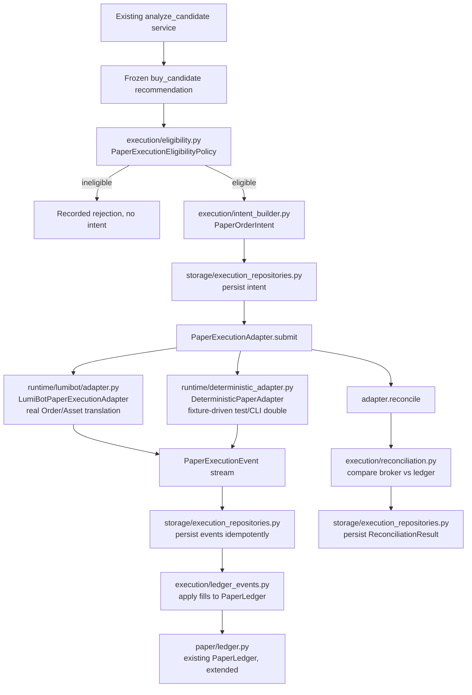

# Milestone 3 — LumiBot paper-trading integration (developer guide)

Covers `docs/milestones/milestone-3.md`: integrating LumiBot behind a clean adapter so
the existing trading desk can send eligible, frozen recommendations through
a deterministic paper-execution workflow. Everything described here runs
fully offline in the default test suite — no LumiBot import, no network, no
Robinhood/Reddit/Claude access required. See "Known limitations" below for
exactly which parts use a real LumiBot object vs. a deterministic
stand-in, and why.

## Why the existing trading desk remains the authority

LumiBot is a runtime and simulated-broker component only. It never creates
a recommendation, never decides risk sizing, never owns permanent portfolio
state, and never approves anything. The existing modules from Milestones
1–2 remain unchanged in their authority:

* `recommendations/builder.py` — the only place a recommendation is built,
  schema-validated, and frozen.
* `risk/position_sizing.py` — the only place share quantities are computed.
* `storage/trading_repositories.py` — the only place recommendations and
  their factors are persisted (extended in this milestone with a
  `payload_json` column, see below — not replaced).
* `paper/ledger.py` — the only ledger of paper cash/positions/fills (also
  extended, not replaced — see "Ledger integration").

Milestone 3 adds a *consumer* of frozen recommendations, not a new producer
of them.

## Why LumiBot is behind an adapter

LumiBot's own architecture is a `Strategy`/`Trader` event loop bound to a
`Broker` connected to a real (paper or live) brokerage API with
credentials. Importing it throughout the domain layer would leak that
framework's object model (`Order`, `Asset`, its own status enums) into
recommendation, risk, and ledger code that must stay framework-neutral —
and would make every one of those modules require LumiBot just to import.
Instead, exactly one package imports LumiBot:

```text
src/trading_research/runtime/lumibot/
├── __init__.py
├── adapter.py          # LumiBotPaperExecutionAdapter — the only place lumibot.entities is imported
├── configuration.py     # strategy name / time-in-force, paper-mode-only
├── errors.py             # LumiBotAdapterError, UnknownLumiBotStatusError
└── event_mapper.py       # LumiBot OrderStatus -> internal event_type (fail closed on unknown)
```

`tests/unit/test_lumibot_adapter.py::test_no_lumibot_import_outside_runtime_package`
walks the AST of every file under `src/trading_research/` (excluding
`runtime/`) and fails if any of them import `lumibot` — this is enforced,
not just documented.

## Dependency setup

LumiBot is an **optional** extra, not a base dependency:

```bash
pip install -e ".[paper]"
```

`pyproject.toml`:

```toml
[project.optional-dependencies]
paper = [
    "lumibot==4.5.74",
]
```

This is deliberate, not an oversight — see "Known limitations" for why
LumiBot cannot cleanly be a base dependency of this repository today.

## Architecture



## Paper-mode configuration

`config/execution.yaml`:

```yaml
trading_mode: paper
live_trading_enabled: false
human_approval_required: true
kill_switch_enabled: false
paper_execution:
  policy_version: "milestone3-0.1"
  execution_version: "lumibot-paper-0.1"
  recommendation_ttl_minutes: 60
  max_price_staleness_seconds: 900.0
```

Loaded by `execution/config.py::load_execution_config()`, which fails
closed (`ExecutionConfigError`) if `trading_mode` is anything other than
`"paper"`, if `live_trading_enabled` is `true`, or if any required key is
missing. **No environment variable can override `trading_mode` or
`live_trading_enabled`** — `load_execution_config` never reads
`os.environ` for those two fields (`tests/unit/test_live_gateway.py::
test_environment_variable_cannot_override_trading_mode` proves this).

## The recommendation-to-paper-fill lifecycle

1. Load the frozen recommendation (`storage.trading_repositories.
   load_recommendation` — new; reads the `payload_json` column added this
   milestone).
2. Check for an already-persisted intent for
   `(recommendation_id, execution_version)`. If a result already exists,
   return it — no adapter call, no ledger mutation (idempotent replay).
   If an intent exists with no result yet, resume from it.
3. Otherwise, evaluate eligibility (`execution/eligibility.py`). Ineligible
   → record the rejection reasons, stop; no intent is ever built.
4. Build a deterministic `PaperOrderIntent`
   (`execution/intent_builder.py`) and persist it.
5. Submit via the injected `PaperExecutionAdapter` → `(events, result)`.
6. Persist each event idempotently, apply fills to the `PaperLedger`
   (`execution/ledger_events.py`), persist the result.
7. Reconcile broker-reported state against the ledger's own position for
   that symbol (`execution/reconciliation.py`), persist the
   `ReconciliationResult`.

Implemented in `services/execute_paper_recommendation.py::
execute_paper_recommendation`.

## Eligibility rules

`execution/eligibility.py::PaperExecutionEligibilityPolicy.evaluate` rejects
(each with an explicit, recorded reason — never a bare boolean):
`screened_out`/`watch`/`no_action`/`analysis_incomplete` sides, non-`active`
status, unfrozen recommendations, missing/non-positive `risk_plan`, missing
`price_at_rec`, an expired recommendation (age vs.
`recommendation_ttl_minutes`), stale `data_timestamps.market` (vs.
`max_price_staleness_seconds`), symbols `TickerUniverse.require()` rejects,
an existing intent for the same `(recommendation_id, execution_version)`,
the global kill switch, and incomplete `config_hash`/`git_sha` provenance.
An injectable `portfolio_guardrail` callback provides an extension point for
a future live-portfolio re-check (see "Known limitations").

## Idempotency behavior

Three layers, deliberately redundant (belt-and-suspenders):

1. **Intent identity is derived, not random**: `derive_intent_id(rec_id,
   execution_version)` — the same recommendation always maps to the same
   `intent_id`.
2. **Database constraint**: `paper_execution_intents` has
   `UNIQUE (recommendation_id, execution_version)` — a second, *different*
   intent for the same pair raises `sqlite3.IntegrityError` rather than
   silently succeeding.
3. **Service-level short-circuit**: `execute_paper_recommendation` checks
   for an existing intent/result *before* doing anything else — a second
   invocation for an already-completed recommendation is a pure read (no
   adapter call, no ledger mutation).

Events are deduplicated by `event_id` (`paper_execution_events.event_id`
primary key + an idempotent-insert check before every ledger application);
the ledger itself deduplicates by `idempotency_key`
(`simulated_orders.idempotency_key` — Milestone 1's existing mechanism,
reused by setting `idempotency_key = event.event_id`).

## Event mappings

`runtime/lumibot/event_mapper.py::map_order_status` (LumiBot 4.5.74's
`Order.OrderStatus` → internal `PaperExecutionEvent.event_type`):

| LumiBot status | Internal event_type |
|---|---|
| `unprocessed`, `submitted` | `SUBMITTED` |
| `new`, `open` | `ACCEPTED` |
| `partial_fill` | `PARTIALLY_FILLED` |
| `fill` | `FILLED` |
| `canceled`, `cancelling`, `expired` | `CANCELLED` |
| `error` | `ERROR` |
| anything else (`cash_settled`, `assigned`, `exercised`, `unknown`, ...) | raises `UnknownLumiBotStatusError` |

LumiBot 4.5.74 has no distinct "rejected" status in this enum; `REJECTED` is
only reachable through the deterministic test/CLI adapter, which can script
it directly.

## Ledger integration

`paper/ledger.py::PaperLedger` gained one new public method,
`apply_external_fill(symbol, side, qty, price, idempotency_key, rec_id,
now)`, plus an internal `_apply_fill` helper that `submit_and_fill` (unchanged
behavior, unchanged tests) and `apply_external_fill` (new) both call. The
existing method still derives its fill price from a bid/ask quote via
`FillModel`; the new method takes an already-determined price (a
`PaperExecutionEvent.fill_price` from the adapter) directly — the only
difference, since Milestone-3 fills are priced by the broker/adapter layer,
not by the ledger's own spread+slippage model. Every other invariant (cash
debit, T+1 settlement, position averaging, `DuplicateOrderError` on a reused
idempotency key) is identical between the two paths — see
`tests/unit/test_paper_ledger.py` (unchanged, still 11/11 passing) and
`tests/unit/test_ledger_events.py` (new).

`execution/ledger_events.py::apply_paper_execution_event` is the narrow
adapter around the ledger: it persists the event (idempotently), decides
whether it represents a new positive fill, and — only if so — calls
`apply_external_fill`. Non-fill event types and zero-quantity fills never
reach the ledger.

## Reconciliation

`execution/reconciliation.py::reconcile_intent` is pure, framework-neutral
logic comparing a `BrokerExecutionSnapshot` (from
`adapter.reconcile(intent_id)`) against the ledger's own current position
for that symbol:

* both zero → `PENDING`
* both equal (quantity and notional) → `MATCHED`
* ledger has fills the broker snapshot doesn't report → `MISSING_BROKER_EVENT`
* broker reports fills the ledger hasn't applied → `MISSING_INTERNAL_EVENT`
* otherwise → `MISMATCH`, with explicit reasons

Reconciliation compares against the ledger's *symbol-level* aggregate
position (the only granularity `PaperLedger` tracks — it was not rewritten
to add per-order sub-ledgers, per docs/milestones/milestone-3.md Step 6's
"do not replace or rewrite it merely to resemble LumiBot"). For this
milestone's smallest safe slice (1–5 fixture symbols, one live intent per
symbol at a time), this is the correct level of ledger truth to reconcile
against.

## Failure recovery

* **Adapter failure** (`adapter.submit` raises): recorded to
  `paper_execution_failures`, outcome status `ADAPTER_ERROR` — no fill is
  invented.
* **Unknown broker status**: `UnknownLumiBotStatusError` propagates out of
  `adapter.submit` and is caught the same way — requires manual
  investigation/reconciliation rather than a guessed mapping.
* **Ledger failure after a broker fill** (e.g. a drifted, insufficient
  settled-cash state): the event stays persisted (already inserted before
  the ledger call) but is not marked `ledger_applied`; the failure is
  recorded, and reconciliation will surface `MISSING_INTERNAL_EVENT` on the
  next run.
* **Interrupted execution**: since the intent is persisted *before*
  submission, and the service checks for an existing intent/result before
  doing anything else, a resumed invocation picks up exactly where a prior
  one was interrupted rather than starting over or double-submitting.

## Offline testing

Every test in `tests/unit/test_execution_models.py`,
`test_intent_builder.py`, `test_eligibility.py`,
`test_deterministic_adapter.py`, `test_ledger_events.py`,
`test_execution_persistence.py`, `test_live_gateway.py`,
`test_lumibot_event_mapper.py`, and
`tests/integration/test_execute_paper_recommendation.py` runs on fixtures
against a temporary SQLite database — no network, no LumiBot import (except
where noted below), no Robinhood/Reddit/Claude calls.

`tests/unit/test_lumibot_adapter.py` is the one file that imports LumiBot,
guarded with `pytest.importorskip("lumibot")` — it is skipped (not failed)
if the `paper` extra is not installed, so the required 169+N baseline never
depends on it.

## How to run the vertical slice

```bash
python3 -m pytest tests/integration/test_execute_paper_recommendation.py -v
```

Or via the CLI, against a database that already has a frozen recommendation
(e.g. from `analyze_candidate`):

```bash
python -m trading_research.cli execute-paper --recommendation-id <rec_id>
```

Prints the selected mode, eligibility rejection reasons (if any), the
intent ID, the result status, and the reconciliation status — never a raw
database credential or a `--live` flag (there isn't one).

## Why live trading is disabled

`execution/live_gateway.py::LiveExecutionGateway` is a `Protocol` with
exactly one implementation, `DisabledLiveExecutionGateway`, every method of
which raises `LiveTradingDisabledError` unconditionally — there is no
constructor flag, environment variable, or code path that changes this.
`config/execution.yaml` additionally hard-codes `trading_mode: paper` and
`live_trading_enabled: false`, and `execution/config.py` raises
`ExecutionConfigError` if either is ever set to something else. See
`tests/unit/test_live_gateway.py`.

## Known limitations

These are honest boundaries, not oversights — read this section before
assuming "LumiBot integration" means a real broker round trip happened:

1. **LumiBot is not a base dependency.** Installing it (`pip install
   lumibot==4.5.74`, confirmed working in this environment) pulls roughly
   140 transitive packages unrelated to this project (`langchain`,
   `google-adk`, a Kubernetes client, `openai`, several other LLM/agent
   SDKs, ...) and downgrades this repository's own pinned floor —
   `jsonschema>=4.26.0` → `4.23.0`, `python-dotenv>=1.2.2` → `1.0.1` — via
   its own dependency pins. The 169-test Milestone 1/2 baseline was
   re-verified passing with those downgraded versions in this environment,
   but the conflict is real and unresolved upstream; treat `pip install
   -e ".[paper]"` as something to run in an isolated environment, not the
   project's default one.
2. **No real broker connection is exercised anywhere in this codebase or
   its tests.** LumiBot's own architecture requires a `Broker` connected to
   a credentialed paper-trading API (Alpaca paper, Tradier, ...); it has no
   bundled "simulate a fill with no credentials/network" broker (its
   backtesting broker replays data from a paid/free market-data provider —
   a live-network dependency Step 10 explicitly forbids in tests). What
   *is* real: `runtime/lumibot/adapter.py::_translate_intent` constructs a
   genuine `lumibot.entities.order.Order` with real `Asset`/`OrderSide`/
   `OrderType` enum values, and `LumiBotPaperExecutionAdapter` performs
   genuine LumiBot-status-to-internal-event mapping. What is injected: the
   `PaperBrokerGateway` that actually submits the order and yields status
   callbacks — a hand-written fake in tests, and a deterministic
   auto-fill-at-`price_at_rec` double in the CLI. A production deployment
   would need to implement `PaperBrokerGateway` against a real LumiBot
   `Trader`/`Strategy` bound to a credentialed paper broker; that
   implementation does not exist in this repository.
3. **LumiBot 4.5.74 has no distinct "rejected" order status** in its
   `Order.OrderStatus` enum — only `error`. The internal `REJECTED` event
   type is therefore reachable only through the deterministic adapter in
   this milestone.
4. **Portfolio-guardrail re-check at execution time is a no-op by
   default.** A full re-evaluation against *live* portfolio state (current
   sector exposure, daily-loss/drawdown circuit breakers, live buying
   power) would require re-fetching Robinhood account state at paper-order
   time, which is out of scope for this milestone (no live data anywhere in
   this slice). `PaperExecutionEligibilityPolicy.portfolio_guardrail` is an
   injectable extension point for a future milestone to wire a real check
   into, without touching any call site.
5. **Reconciliation compares symbol-level ledger state**, not a
   per-intent sub-ledger — see "Reconciliation" above.
6. **The illustrative `PaperExecutionAdapter`/`LiveExecutionGateway`
   snippets in `docs/milestones/milestone-3.md` use `pydantic.BaseModel`.** This
   codebase implements every contract as `@dataclass(frozen=True)` with
   `__post_init__` validation instead, matching 100% of the existing domain
   code (`models/trading_models.py`, `analysis/screener.py::
   ScreeningConfig`, `recommendations/builder.py::FrozenRecommendation`).
   Pydantic is not a dependency anywhere else in this repository; see
   `docs/adr/0001-lumibot-paper-runtime.md`.

## Future Robinhood MCP integration

`execution/live_gateway.py::LiveExecutionGateway` defines the shape a real
implementation would need (`review_order`, `place_order`, `cancel_order`,
`reconcile_order`) but ships none — a future milestone would implement it
against `mcp__robinhood-trading__place_equity_order` /
`review_equity_order` / `cancel_equity_order`, gated by real
`HumanApproval` records (the `approvals` table already exists,
trigger-protected, unused until then) and an explicit configuration flip
that does not exist yet.

## Future Claude research-agent integration

Nothing in this milestone gives an LLM the ability to create a
recommendation, size a position, or submit an order — `PaperOrderIntent`
construction is 100% deterministic Python over already-frozen data. A
future Claude-orchestrated research agent would still only ever produce
*inputs* to `analyze_candidate` (Milestones 1–2's existing boundary);
Milestone 3 does not change where that boundary is.
