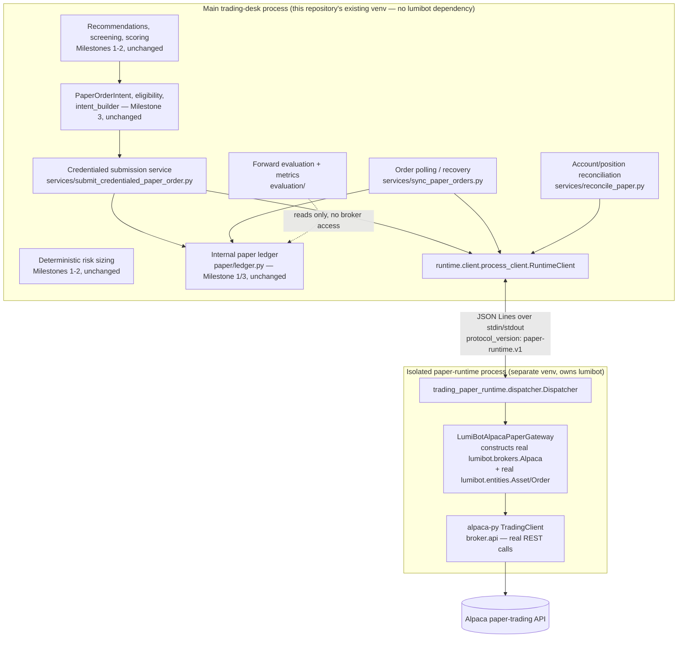
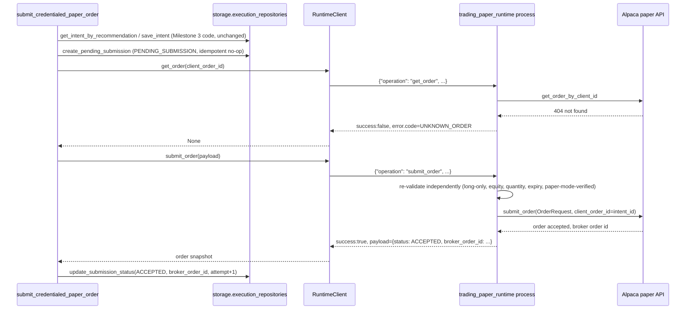
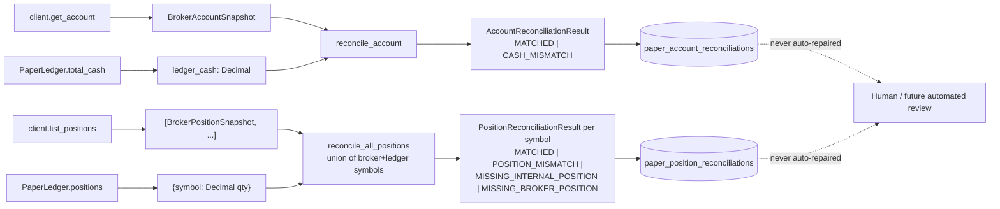
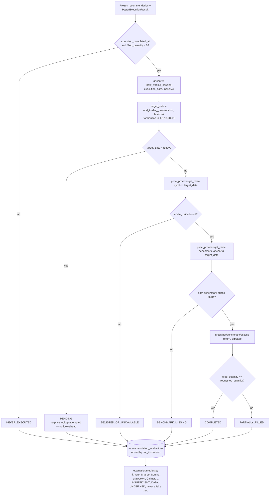

# Milestone 4 — Isolated credentialed paper broker and evaluation loop (developer guide)

Covers `docs/milestones/milestone-4.md`. Extends Milestone 3
(`docs/milestones/milestone3-lumibot-paper-integration.md`) with a process-isolated, credentialed Alpaca
paper-broker connection and a forward-performance evaluation/metrics layer. Read
`docs/adr/0002-isolated-lumibot-runtime.md` first for *why* each of these design choices was made;
this document is the *how it works* / *how to run it* guide.

Read this document's "Known limitations" section before assuming any part of this milestone
proves a live broker fill actually happened — it does not, in this environment, and says so
explicitly below.

## Why the process boundary exists

`lumibot==4.5.74` pulls roughly 140 transitive packages unrelated to this project and downgrades
this repository's own pinned dependency floor. Milestone 3 isolated LumiBot to one *package*
(`runtime/lumibot/`) within the same process; Milestone 4 isolates it to one *process*
(`paper_runtime/`, a separate installable package with its own virtualenv), reachable only through
a versioned JSON protocol. See ADR 0002 for the full rationale and the rejected alternatives.

## Process architecture



## Submit-order sequence



## Ambiguous-timeout recovery

```mermaid
sequenceDiagram
    participant Svc as submit_credentialed_paper_order
    participant Client as RuntimeClient
    participant Runtime as trading_paper_runtime process

    Svc->>Client: submit_order(payload)
    Client->>Runtime: {"operation": "submit_order", ...}
    Note over Client,Runtime: network/process hiccup — no response within request_timeout_seconds
    Client-->>Svc: RuntimeRequestTimeoutError(retryable=False)
    Note over Svc: Never resubmit blindly. One recovery lookup only.
    Svc->>Client: get_order(client_order_id)
    Client->>Runtime: {"operation": "get_order", ...}
    alt broker actually received the order
        Runtime-->>Client: success:true, payload={status: ACCEPTED, broker_order_id: ...}
        Client-->>Svc: order snapshot
        Svc->>Svc: update_submission_status(ACCEPTED) -> STATUS_SUBMITTED
    else broker never received it either
        Runtime-->>Client: success:false, error.code=UNKNOWN_ORDER
        Client-->>Svc: None
        Svc->>Svc: update_submission_status(SUBMISSION_UNKNOWN) -> STATUS_SUBMISSION_UNKNOWN
        Note over Svc: A later sync_paper_orders / manual retry can re-attempt;<br/>this call never submits a second order itself.
    end
```

## Reconciliation flow



## Evaluation lifecycle



## Protocol: `paper-runtime.v1`

JSON Lines over stdin/stdout — one JSON object per line, no pickle, no shared Python types across
the boundary (see ADR 0002 Decision 2). Every request and response carries `protocol_version`,
`request_id`, `operation`, and a `payload`; every response additionally carries `runtime_version`,
`success`, `retryable`, and `error` (`null` on success, `{"code": ..., "message": ...}` on failure).
Unknown protocol versions, unknown operations, malformed payloads, extra top-level fields, and
mismatched `request_id`/`operation` on the response are all rejected outright — see
`paper_runtime/src/trading_paper_runtime/protocol.py` and `src/trading_research/runtime/client/
protocol.py` (independently implemented, intentionally not shared — ADR 0002).

Operations: `health`, `capabilities`, `submit_order`, `get_order`, `list_open_orders`,
`list_recent_orders`, `get_account`, `list_positions`, `cancel_paper_order`. `health` and
`capabilities` always answer, even when credentials are missing or invalid — every other operation
requires the gateway to have proven paper mode first (`NOT_PAPER_MODE` otherwise).

## Credential and endpoint protections

* Read only from environment variables: `ALPACA_API_KEY`, `ALPACA_API_SECRET`, `ALPACA_IS_PAPER`
  (confirmed exact names via `lumibot.credentials.ALPACA_CONFIG` at implementation time).
* `ALPACA_IS_PAPER` must be the exact string `"true"` — absent, empty, or any other value is treated
  as *not proven paper*, which is stricter than LumiBot's own default (LumiBot silently assumes
  `PAPER=True` when the variable is unset; this repository does not trust that default for a hard
  safety requirement).
* The isolated runtime constructs a real `lumibot.brokers.Alpaca` broker, then verifies the
  underlying `alpaca-py` `TradingClient`'s `_base_url` equals `BaseURL.TRADING_PAPER` — an explicit,
  code-level proof the connection points at `paper-api.alpaca.markets`, not a guess from
  configuration alone. If this cannot be proven, every operation other than `health`/`capabilities`
  fails closed with `NOT_PAPER_MODE`.
* `health` reports `has_api_key`/`has_api_secret`/`paper_endpoint_verified` as booleans only — never
  a credential value. `paper_runtime/src/trading_paper_runtime/logging_config.py` additionally
  redacts any of the three secret environment variable *values* that happen to appear in a log
  message (defense in depth; no code path currently logs one).
* `config/paper_runtime.yaml`'s `paper_broker.mode`/`real_money_enabled` and
  `allow_fractional`/`allow_shorting`/`allow_margin`/`allow_extended_hours` are validated at load
  time by `runtime/paper_runtime_config.py` — an unrecognized mode or any of those flags set to
  anything other than the safe default raises `PaperRuntimeConfigError` and refuses to load. No
  environment variable can override any of these fields.
* `.env.example` carries placeholders only (`ALPACA_API_KEY=`, `ALPACA_API_SECRET=`,
  `ALPACA_IS_PAPER=true`); `.env` remains gitignored.

## Idempotency and ambiguous-submission behavior

The internal `intent_id` (already deterministically derived from `(recommendation_id,
execution_version)` since Milestone 3) is reused directly as the broker `client_order_id` — well
under Alpaca's 128-character limit and composed only of `[a-z0-9-]`. A new `paper_broker_submissions`
table tracks `PENDING_SUBMISSION → SUBMISSION_UNKNOWN/ACCEPTED/PARTIALLY_FILLED/FILLED/CANCELLED/
REJECTED/ERROR`. `submit_credentialed_paper_order` always looks the order up by `client_order_id`
*before* ever calling `submit_order` — see ADR 0002 Decision 4 for why this single rule covers fresh
submission, restart recovery, and ambiguous-timeout recovery without a separate flag for any of them.

## Order polling and restart recovery

`services/sync_paper_orders.py::sync_paper_orders` is one bounded pass over every unresolved
`paper_broker_submissions` row — no busy loop, no internal sleep/retry cadence (the CLI/operator
controls invocation frequency). It tracks "previously recognized filled quantity" as the sum of
`filled_quantity` across every `PaperExecutionEvent` already persisted for the intent, and applies
only the delta against the broker's (cumulative) reported fill — so re-polling an unchanged order is
a safe no-op, and a partially-then-fully-filled order produces two correctly incremental ledger
applications. A process restart is safe: unresolved submissions are read back from
`paper_broker_submissions`, not from in-memory state.

## Ledger integration

Unchanged from Milestone 3: `execution/ledger_events.py::apply_all_new_events` is the only code
path that ever calls `PaperLedger.apply_external_fill`, whether the event came from the Milestone 3
in-process adapter or Milestone 4's `sync_paper_orders`. `PaperLedger` itself is untouched.

## Reconciliation behavior

Extends Milestone 3's per-intent `execution/reconciliation.py::reconcile_intent` (untouched) with
account- and position-level comparisons in the new `execution/account_reconciliation.py`
(`reconcile_account`, `reconcile_position`, `reconcile_all_positions`). Statuses: `MATCHED`,
`CASH_MISMATCH`, `POSITION_MISMATCH`, `MISSING_INTERNAL_POSITION`, `MISSING_BROKER_POSITION`.
Configurable `Decimal` tolerance (`services/reconcile_paper.py::DEFAULT_TOLERANCE = Decimal("0.01")`)
absorbs broker rounding without ever silently repairing a real mismatch — every result (compared
values, difference, tolerance, reasons, timestamps) is persisted to
`paper_account_reconciliations`/`paper_position_reconciliations`, never just returned and discarded.

## Market-calendar behavior

`evaluation/market_calendar.py` is a fixed-rule US federal-holiday calendar (New Year's, MLK,
Presidents Day, Good Friday via the Meeus/Jones/Butcher Easter algorithm, Memorial Day, Juneteenth,
Independence Day, Labor Day, Thanksgiving, Christmas — with standard Saturday-observed-Friday/
Sunday-observed-Monday shifting) plus weekend skipping. `add_trading_days`/`next_trading_session`
are the only functions evaluation horizons use; `is_market_open` additionally checks regular
9:30-16:00 `America/New_York` hours for market-session validation. **Does not model early-close
half-days** (e.g. the day after Thanksgiving) — see "Known limitations."

## Evaluation and metrics implemented

Horizons 1/5/10/20/60 trading days, benchmark SPY by default (`config/paper_runtime.yaml:
evaluation.benchmark`), statuses `PENDING/COMPLETED/INCOMPLETE_MISSING_DATA/BENCHMARK_MISSING/
DELISTED_OR_UNAVAILABLE/NEVER_EXECUTED/PARTIALLY_FILLED`. Gross return, net return (fee drag),
benchmark return, excess return, slippage — see the evaluation-lifecycle diagram above.
`evaluation/metrics.py`: hit rate, average/median return, gain/loss ratio, cumulative return,
benchmark-relative cumulative return, Sharpe and Sortino ratios (annualized via `sqrt(252)` trading
days/year — a convention, not a measured constant), max drawdown, Calmar ratio,
recommendation-to-fill rate, and grouping by model version/prompt version/config hash/market regime.
Every metric returns an explicit `MetricsResult.status` (`OK`/`INSUFFICIENT_DATA`/`UNDEFINED`) —
never a misleading zero for an undefined or under-sampled metric. **Not implemented**: maximum
favorable/adverse excursion (requires intraday high/low price data the current `PriceProvider`
shape does not carry — see "Known limitations"), turnover, average time-to-fill, and confidence
calibration (deferred — see "Recommended Milestone 5" in the final report).

## CLI usage

```bash
# Health-check the isolated runtime (spawns it, then shuts it down).
python -m trading_research.cli paper-runtime-health

# Submit via the deterministic offline adapter (Milestone 3 behavior, unchanged default).
python -m trading_research.cli execute-paper --recommendation-id <id>

# Submit via the credentialed Alpaca paper broker (Milestone 4) — acknowledgement only.
python -m trading_research.cli execute-paper --recommendation-id <id> --adapter credentialed

# Poll for broker state changes and apply any new fills to the ledger. One bounded pass.
python -m trading_research.cli sync-paper-orders

# Reconcile account cash and positions against the broker.
python -m trading_research.cli reconcile-paper

# Compute forward-performance evaluations for specific recommendations.
python -m trading_research.cli evaluate-recommendations --recommendation-id <id> [--recommendation-id <id2> ...]

# Aggregate metrics over every persisted evaluation.
python -m trading_research.cli paper-performance
```

No `--live` flag exists anywhere in this CLI. No command can select Robinhood for order submission.
Every command prints its selected mode/adapter/broker and never a credential value. Non-zero exit
codes (`2`) on any command-level error.

Naming note: the milestone brief's illustrative `paper-runtime health` (two words) is implemented as
the single hyphenated token `paper-runtime-health`, matching this CLI's existing single-token
subcommand convention (`execute-paper`, `paper-status`) rather than introducing a second level of
subparsers for one command.

## Offline-test mode

The default suite (`pytest tests/ -q`) requires no LumiBot, no credentials, no network access, and
never spawns the isolated runtime process. Every Milestone 4 collaborator that would otherwise touch
a real broker is exercised through a fake:

* `paper_runtime/tests/`: `DeterministicBrokerGateway` (in-package fake broker) and the real
  `Dispatcher`/protocol code — run with `pytest` from `paper_runtime/`, independent of the main
  suite.
* `tests/support/runtime_client_fixtures.py::FakeTransport`: the main process's `RuntimeClient`
  against a scripted in-memory transport — no subprocess, no sockets.
* `tests/unit/test_lumibot_gateway.py` inside `paper_runtime/tests/` (not the main suite) is the one
  file that imports real LumiBot entities, guarded with `pytest.importorskip("lumibot")`.
* `evaluation/price_provider.py::DeterministicPriceProvider`: fixture-registered historical closes,
  no network.

## Opt-in credentialed smoke tests

`tests/integration/test_paper_broker_smoke.py`, marked `@pytest.mark.paper_broker`, is excluded from
the default suite by a `pytest.mark.skipif` gated on `RUN_PAPER_BROKER_TESTS=true` — never on
credential presence alone. It performs the exact 11-step sequence from `docs/milestones/milestone-4.md` Step
17: health → paper-endpoint/real-money verification → account snapshot → submit a $1.00 non-
marketable AAPL limit order (1 share) → confirm acknowledgement and broker order id → `get_order` →
cancel → confirm cancellation → reconcile no fill/no position change → persist the outcome (via the
real `reconcile_paper_account_and_positions` service against a temporary database).

## Known limitations

These are honest boundaries, read before assuming a real broker round trip happened:

1. **No credentialed round trip was executed in this environment.** `.env` had no `ALPACA_API_KEY`/
   `ALPACA_API_SECRET`/`ALPACA_IS_PAPER` at implementation time (confirmed absent before writing any
   code). `tests/integration/test_paper_broker_smoke.py` exists, is correctly gated, and is
   committed — it has not been run against a real Alpaca paper account.
2. **A real, credentials-free smoke test *was* performed** (`python -m trading_research.cli
   paper-runtime-health`): it proves the main process can spawn the isolated runtime, that the
   isolated runtime genuinely imports LumiBot 4.5.74 and reports its version, that credential
   presence is correctly detected as booleans, and that the main process correctly refuses to
   proceed without a proven paper connection. This is real process-boundary + real-LumiBot-import
   validation, not a broker acknowledgement.
3. **LumiBot's `Broker.submit_order`/`get_order`/`get_tracked_positions` API is designed around a
   `Strategy` instance inside a `Trader` event loop.** `LumiBotAlpacaPaperGateway` constructs a real
   `lumibot.brokers.Alpaca` broker for credential/paper-mode verification and real
   `lumibot.entities.Asset`/order translation, but delegates actual REST submission, status
   lookup, cancellation, account, and position reads to the same underlying `alpaca-py`
   `TradingClient` LumiBot itself wraps (`broker.api`) rather than adopting the full
   `Strategy`/`Trader` lifecycle — see ADR 0001 Decision 1 (reaffirmed) and the module docstring in
   `paper_runtime/src/trading_paper_runtime/lumibot_gateway.py`.
4. **No live historical-price data source ships.** `evaluation.price_provider.PriceProvider` has
   exactly one implementation, `DeterministicPriceProvider` (fixture-driven, offline). All evaluation
   logic, market-calendar horizon math, and metrics are fully implemented and tested against it; a
   future milestone wires in a real point-in-time provider without changing anything else in this
   path.
5. **Maximum favorable/adverse excursion are not computed** — they require an intraday high/low
   price series between execution and the horizon date; the current `PriceProvider` shape only
   supports daily closes. `RecommendationEvaluation.max_favorable_excursion`/
   `max_adverse_excursion` exist as fields (always `None` today) so a future provider can populate
   them without a schema change.
6. **The market calendar does not model early-close half-days** (e.g. the day after Thanksgiving,
   Christmas Eve in some years) — it affects only `is_market_open`'s intraday precision on those
   specific afternoons, never whole-day trading/holiday classification, and never evaluation horizon
   math (which only counts whole trading days).
7. **Turnover, average time-to-fill, and confidence calibration are not implemented** in
   `evaluation/metrics.py` — deferred, see the final report's "Recommended Milestone 5."
8. **A real bug was found and fixed via the manual smoke test, not by a unit test**: LumiBot prints
   an unguarded startup banner to stdout at import time. See ADR 0002's "Consequences" section for
   the fix and why the existing unit tests could not have caught it (they inject a fake gateway that
   never imports LumiBot in-process).
